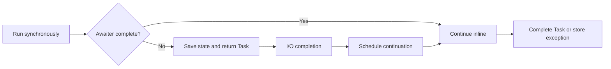

# 2. What are async and await doing internally, and how do you avoid deadlocks?

**Technology:** C# and .NET

**Source question:** 2. What are async and await doing internally, and how do you avoid deadlocks?

## 1. What problem does it solve?

Network, database, file, and broker operations spend most of their lifetime waiting. Blocking a thread during that wait wastes a scarce resource. In a desktop application it freezes the UI; in a server it reduces throughput and can cause thread-pool starvation, rising latency, and cascading timeouts.

Before `async`/`await`, developers used callbacks, events, or manually chained tasks. Those approaches work, but control flow, exception handling, cancellation, and cleanup quickly become difficult to reason about. `async`/`await` lets asynchronous code retain the structure of sequential code without reserving a thread while incomplete I/O is in flight.

It improves responsiveness and scalability for wait-heavy work. It does not make CPU work faster, make operations atomic, or automatically run them in parallel.

## 2. Explain it in simple language

Imagine a payment analyst requesting an archive record. Instead of standing at the archive desk, the analyst leaves contact details, works on something else, and resumes the review when notified. `await` is that pause-and-resume point; it does not require the analyst to remain blocked.

**One-sentence definition:** `async` enables a method to be compiled into a resumable state machine, while `await` asynchronously observes an awaitable and resumes the method when it completes.

**Memory rule:** await the work; do not block the thread waiting for it.

`async` does not mean “new thread,” and asynchronous execution is not parallel execution. For genuine asynchronous I/O, the OS and driver track completion; a thread is needed to start the operation and later run its continuation, but normally not while the operation is waiting.

## 3. How does it work internally?

The C# compiler rewrites an `async` method containing incomplete awaits approximately as follows:

1. It creates a state-machine type with a state field, an async method builder, and fields for locals that must survive suspension.
2. The method starts synchronously and runs until an await is reached.
3. It obtains the awaiter and checks `IsCompleted`. If already complete, execution continues synchronously—the fast path.
4. Otherwise it records the next state, stores required locals, registers the state machine's continuation through `OnCompleted` or `UnsafeOnCompleted`, and returns the method's `Task`/`Task<T>` to the caller.
5. When the operation completes, the continuation invokes `MoveNext`, which restores the logical flow and calls `GetResult`. `GetResult` returns the value or rethrows the original exception.
6. On normal completion or failure, the builder completes the returned task. An `async` method starts only once; it does not restart after every await.



By default, `await` captures the current `SynchronizationContext`, or in some cases the current non-default `TaskScheduler`, so the continuation can return to that environment. Classic ASP.NET and UI frameworks have constrained contexts. If their context thread is synchronously blocked using `.Result`, `.Wait()`, or `GetAwaiter().GetResult()`, while the awaited continuation needs that same context, neither can proceed: a sync-over-async deadlock.

ASP.NET Core deliberately has no request `SynchronizationContext`, so the classic request-context deadlock is generally absent. Blocking is still harmful: under load it can starve the thread pool and resemble a deadlock. `ConfigureAwait(false)` avoids context capture where capture is possible; it is useful in reusable libraries, but it is not a cure for every deadlock and is usually behaviorally redundant in ASP.NET Core. `ExecutionContext`—including `AsyncLocal` values such as correlation state—normally still flows; it is distinct from `SynchronizationContext`.

Incomplete awaits require state storage and continuation scheduling. `ValueTask<T>` can reduce allocations in measured, frequently synchronous paths, but has stricter consumption rules and should not be the default.

## 4. Realistic payment or banking example

Angular submits a payment command and may disable duplicate clicks, but its checks are only usability measures.

ASP.NET Core authenticates the caller, enforces account authorization, validates the command and idempotency key, then awaits the application service. The service awaits an EF Core transaction and an outbox write. The database ledger is the authoritative source of truth. A background publisher later awaits broker I/O and marks the outbox row published; broker consumers are not authoritative for the transfer balance.

While SQL Server works, the API thread returns to the pool. Any available pool thread may resume the continuation. Request-scoped services remain alive, but `DbContext` is not thread-safe.

## 5. Successful flow and failure flow

### Successful flow

1. Angular submits an idempotency key and correlation ID.
2. The API validates and authorizes, passing `RequestAborted` downward.
3. The service awaits its lookup, applies domain rules, and atomically stores the transfer, concurrency-protected balances, and outbox message.
4. It commits and responds; a worker later publishes the outbox event.

### Failure flow

- **Validation/authorization:** return 400/403 `ProblemDetails`; never trust Angular checks or disclose another account.
- **Cancellation/timeout:** propagate the token. It is cooperative and does not undo a commit. After an uncertain response, retry with the same key and retrieve the stored outcome.
- **Duplicate request:** a unique constraint on the key plus the recorded response prevents a second transfer. Retry protection alone is not true idempotency.
- **Concurrency conflict:** reject or retry a bounded number of times after reloading; never blindly overwrite a balance.
- **Database failure:** roll back and retry only classified transient errors; retrying without a stable key can double-charge.
- **Broker failure:** the committed outbox row remains pending. A worker retries with backoff; consumers deduplicate because delivery is normally at least once.
- **Partial completion:** the ledger and outbox are atomic locally; publication is eventually consistent. Reconciliation detects stuck records.

Exceptions surface when the task is awaited. Reserve uncomposable `async void` for required event handlers.

## 6. Practical C#/.NET implementation

Keep orchestration in an application service and stay async through every layer:

```csharp
public sealed record TransferCommand(
    Guid FromAccountId, Guid ToAccountId, decimal Amount, string IdempotencyKey);

public interface ITransferService
{
    Task<TransferResult> ExecuteAsync(
        TransferCommand command, ClaimsPrincipal user, CancellationToken cancellationToken);
}

public sealed class TransferService(
    BankingDbContext db, IAccountAuthorizer authorizer,
    ILogger<TransferService> logger) : ITransferService
{
    public async Task<TransferResult> ExecuteAsync(
        TransferCommand command, ClaimsPrincipal user, CancellationToken ct)
    {
        await authorizer.EnsureCanDebitAsync(user, command.FromAccountId, ct);

        var existing = await db.Transfers.AsNoTracking()
            .SingleOrDefaultAsync(x => x.IdempotencyKey == command.IdempotencyKey, ct);
        if (existing is not null) return TransferResult.From(existing);

        await using var transaction = await db.Database.BeginTransactionAsync(ct);
        var account = await db.Accounts
            .SingleAsync(x => x.Id == command.FromAccountId, ct);

        account.Debit(command.Amount); // Domain validation; RowVersion is a concurrency token.
        var transfer = Transfer.Create(command);
        db.Add(transfer);
        db.Add(OutboxMessage.For(transfer));

        try
        {
            await db.SaveChangesAsync(ct);
            await transaction.CommitAsync(ct);
        }
        catch (DbUpdateConcurrencyException ex)
        {
            logger.LogWarning(ex, "Transfer conflict {TransferId}", transfer.Id);
            throw new TransferConflictException(transfer.Id, ex);
        }

        return TransferResult.From(transfer);
    }
}
```

```csharp
app.MapPost("/transfers", async (
    TransferCommand command, ITransferService service,
    ClaimsPrincipal user, HttpContext http, CancellationToken ct) =>
{
    var result = await service.ExecuteAsync(command, user, ct);
    return Results.Accepted($"/transfers/{result.Id}", result);
}).RequireAuthorization("CanCreateTransfer");
```

ASP.NET Core binds `CancellationToken` to `RequestAborted`; EF Core async APIs accept it. Exception middleware should return sanitized `ProblemDetails`. Carry a validated correlation ID, but do not log payment payloads.

Integration-test transactions, unique constraints, cancellation, and row-version conflicts against the production database engine. Load-test for starvation. Async tests should return `Task` and await it.

## 7. Important design decisions

**Async boundary:** Propagate async I/O to the entry point. `Task.Run` over synchronous I/O still consumes a pool thread. It suits short UI CPU work; sustained server CPU work belongs in bounded background processing.

**Context capture:** UI code may need its context. Reusable libraries can use `ConfigureAwait(false)` when they do not. It adds little in ASP.NET Core. Never depend on thread identity for request state.

**Concurrency:** Use `Task.WhenAll` only for safe, independent operations. Never parallelize one EF Core `DbContext`; account for downstream limits and partial failure.

**Return type:** Prefer `Task`/`Task<T>`. Choose `ValueTask<T>` after measurement. Use `IAsyncEnumerable<T>` for streaming with cancellation and clear resource ownership.

**Cancellation and timeouts:** Pass tokens, set downstream timeouts, and distinguish cancellation from timeout in telemetry. Cancellation is not rollback; durable writes need idempotency and transactions.

## 8. When to use it and when not to use it

Use async for database, HTTP, stream, broker, and responsive UI flows, especially when many operations wait concurrently.

Do not add `async` for a small calculation. A method can often return an existing task directly, although local exception handling or resource lifetime may require `await`. Avoid fake async APIs using `Task.Run` over blocking I/O.

Warning signs include `.Result`, `.Wait()`, `async void`, fire-and-forget tasks, unbounded `WhenAll`, ignored cancellation, parallel scoped dependencies, and locks across awaits. Async cannot compensate for slow SQL or overloaded dependencies.

## 9. Compare it with related concepts

| Concept | Purpose/ownership | Lifecycle and performance | Reliability/limitations | Banking use |
|---|---|---|---|---|
| `async`/`await` | Language-level asynchronous composition | Suspends logical method; normally releases thread during I/O | Not atomic or automatically parallel | Await DB and broker APIs |
| `Task.Run` | Schedules delegate to thread pool | Occupies a thread; useful for CPU work | Does not make blocking I/O scalable | Rare in request path |
| `Task.WhenAll` | Coordinates independent tasks | Concurrent, possibly parallel | Must observe all failures; can overload dependencies | Independent risk lookups only |
| Background worker | Owns durable/deferred processing | Outlives HTTP request | Needs queue, retries, idempotency, shutdown handling | Publish outbox events |
| Synchronous call | Simple blocking flow | Holds caller thread while waiting | UI freeze/starvation under wait-heavy load | Fine for tiny CPU-only logic |

For the transfer, use end-to-end async I/O, a database transaction for ledger consistency, and a worker plus outbox for publication. Async does not replace consistency.

## 10. Common production mistakes

- **Sync over async:** legacy signatures can deadlock constrained contexts or starve servers. Detect `.Result`/`.Wait()` with analyzers and thread dumps; make the chain async.
- **Fire and forget:** `_ = SendAsync()` loses exceptions and request-scoped dependencies may be disposed. Use a durable queue and supervised `BackgroundService`.
- **Unbounded concurrency:** task-per-payment can exhaust sockets and databases. Use bounded channels and concurrency limits.
- **Assuming await is parallel or transactional:** this produces races or partial writes. Define transaction, outbox, and idempotency rules separately.
- **Ignoring cancellation:** abandoned work consumes capacity. Propagate tokens; shield only essential cleanup.
- **Overusing `ConfigureAwait(false)`:** it does not fix lock-order, database, or starvation problems. Diagnose the wait graph.
- **Losing observability:** continuations change threads, so use trace/activity IDs, structured logs, latency, queue, and error metrics.
- **Blocking locks across await:** `lock` cannot contain `await`; manually held locks can still cause deadlocks. Prefer short critical sections or `SemaphoreSlim.WaitAsync`, always released in `finally`.

## 11. Interview-ready answer

**30-second answer:** The compiler turns an async method into a state machine. It runs synchronously until an incomplete await, saves its state, registers a continuation, and returns a task. No thread normally waits during true asynchronous I/O. Deadlocks commonly arise when code blocks on a task while its continuation needs the blocked synchronization context, so I keep the call chain async, await tasks, avoid `.Result`/`.Wait()`, and use `ConfigureAwait(false)` appropriately in libraries.

**Two-minute senior-level answer:** `async`/`await` is compiler support over the task/awaiter pattern. On an incomplete await, locals and the resume point are stored in a state machine and control returns to the caller. Completion schedules `MoveNext`; `GetResult` produces the value or propagates the exception. It is about non-blocking composition, not creating threads or automatic parallelism.

The classic deadlock is sync-over-async in a single-threaded UI or legacy ASP.NET context: the caller blocks on `.Result`, while the continuation captured that same context and cannot run. My default is async all the way, cancellation-token propagation, and no blocking bridge. Reusable library code uses `ConfigureAwait(false)` when it does not require a context. ASP.NET Core has no request synchronization context, but blocking remains a scalability risk through thread-pool starvation. I also avoid fire-and-forget work, unbounded concurrency, concurrent EF `DbContext` use, and locks across awaits. For payments, async improves capacity, while transactions, optimistic concurrency, idempotency, and the outbox provide correctness.

**Likely follow-up questions:**

1. What exactly does `ConfigureAwait(false)` change, and what does it not change?
2. Why can `.Result` still be dangerous in ASP.NET Core if the classic deadlock is unlikely?
3. When would you choose `ValueTask<T>` or `IAsyncEnumerable<T>`?

**Keywords:** state machine, awaiter, continuation, `SynchronizationContext`, `ExecutionContext`, thread-pool starvation, async all the way, cancellation, idempotency, `ConfigureAwait(false)`.

**Red flags:** “async creates a new thread,” “await makes calls parallel,” “`ConfigureAwait(false)` prevents every deadlock,” “ASP.NET Core can safely block,” or “cancelling the token automatically rolls back the transfer.”

## 12. Test my understanding interactively

During revision, answer this scenario-based interview question:

> A shared payment library calls an HTTP fraud service asynchronously. A WPF client sometimes uses `.Result`; an ASP.NET Core API shows thread-pool starvation and duplicate transfers after timeouts. How would you diagnose the distinct causes and design for context deadlocks, starvation, cancellation, uncertain outcomes, and safe retries?

## Revision card

- **One-sentence definition:** `async`/`await` compiles asynchronous operations into a resumable state machine without normally blocking a thread during incomplete I/O.
- **Memory rule:** await the work; do not block the thread waiting for it.
- **Recommended use:** propagate async and cancellation end-to-end for I/O-bound work.
- **Main danger:** sync-over-async can deadlock constrained contexts and starve server threads; async alone does not ensure transactional correctness.
- **Interview takeaway:** explain the state machine and continuation, distinguish async from parallelism, then connect deadlock avoidance to production controls such as idempotency, transactions, and observability.
