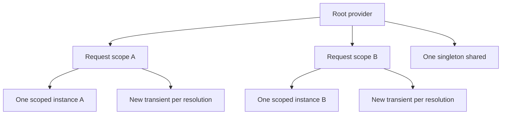

# 3. Explain Transient, Scoped, and Singleton dependency injection lifetimes with examples.

**Technology:** C# and .NET

**Source question:** 3. Explain Transient, Scoped, and Singleton dependency injection lifetimes with examples.

## 1. What problem does it solve?

Dependency injection (DI) separates creating an object from using it. Lifetimes answer a second problem: **how long should an instance be shared, and who disposes it?** Without explicit ownership, ad hoc construction creates hidden coupling, duplicated state, leaked resources, and inconsistent units of work.

Sharing too little wastes resources or loses consistency. Sharing too much can leak user state, race objects, or retain disposed dependencies. Lifetimes affect security, scalability, and maintainability.

## 2. Explain it in simple language

In a bank branch, transient is a fresh form each time, scoped is one case file for a payment request, and singleton is the clock shared by everyone.

**One-sentence definition:** A DI lifetime defines how long the container reuses a service instance and when the owning container or scope disposes it.

**Memory rule:** transient per resolution, scoped per scope, singleton per application container.

“Scoped” does not intrinsically mean HTTP request. ASP.NET Core creates a scope per request; workers and tests create their own boundaries.

## 3. How does it work internally?

At startup, registrations describe mappings and lifetimes. The built-in container builds a root `IServiceProvider` and resolves dependency graphs using a lifetime-specific cache:

1. A transient service is constructed for each resolution request. If the same transient is requested twice, two instances normally result.
2. A scoped service is constructed on first use within a scope and cached in that scope. Later resolutions in that scope return the same instance.
3. A singleton is normally constructed lazily once and cached by the root provider.
4. Constructor dependencies are resolved recursively. A long-lived service must not capture a shorter-lived one.
5. Container-created disposable instances are tracked and disposed in reverse creation order: scoped instances at scope end and root-owned instances at shutdown.



The container provides reuse, not synchronization. Singletons must be thread-safe; scoped services may also see concurrency from parallel tasks. EF Core `DbContext` is scoped by default and is not thread-safe.

A singleton depending on a scoped service is a **captive dependency**. In Development, `WebApplicationBuilder` enables dependency and scope validation by default; teams can explicitly enable `ValidateScopes` and `ValidateOnBuild`. Registrations are compile-time-valid C#, but lifetime validation occurs at runtime.

## 4. Realistic payment or banking example

Consider creating a bank transfer:

- Angular performs usability validation, sends an idempotency key, and displays status. It never decides authorization.
- ASP.NET Core authenticates, authorizes the debit account, resolves one request scope, and calls a scoped transfer application service.
- A scoped EF Core `BankingDbContext` tracks the transfer, account updates, and outbox event as one unit of work.
- The database ledger is the authoritative source of truth.
- A singleton, thread-safe currency-reference cache can serve all requests. A stateless validator may be transient.
- A singleton `BackgroundService` creates a scope per batch, resolves a scoped `DbContext`, and publishes pending outbox messages. The broker is transport, not ledger truth.

Lifetime follows ownership: transfer state belongs to one unit of work; shared reference data can live longer.

## 5. Successful flow and failure flow

### Successful flow

1. Angular sends a transfer with idempotency and correlation IDs.
2. ASP.NET Core creates a scope and resolves the application service and `DbContext`.
3. Backend validation and authorization run.
4. The service detects duplicates and stores account changes, transfer, and outbox row in one transaction.
5. It commits; request completion disposes the scope.
6. A worker creates a scope, publishes the outbox event, records success, and disposes the scope.

### Failure flow

- **Validation or authorization failure:** return sanitized `ProblemDetails` (400/403); no database mutation occurs.
- **Duplicate request:** a database unique constraint on the idempotency key returns the recorded outcome. Disabling a button or retry throttling is not true idempotency.
- **Concurrency conflict:** an EF concurrency token detects a stale account version; reload and retry only under a bounded policy, or return 409.
- **Database failure:** roll back the transaction. Scope disposal does not undo committed work.
- **Broker failure:** keep the committed outbox row pending and retry with backoff. Consumers deduplicate at-least-once delivery.
- **Timeout or cancellation:** propagate `RequestAborted`; cancellation is cooperative, not rollback. For an uncertain commit, retry with the same key and query status.
- **Captive dependency:** a singleton holding a request context may use stale state, race, or expose one customer's data to another. Fail startup through validation and redesign ownership.

## 6. Practical C#/.NET implementation

Registrations make the intended ownership visible:

```csharp
var builder = WebApplication.CreateBuilder(args);

builder.Host.UseDefaultServiceProvider(options =>
{
    options.ValidateScopes = true;
    options.ValidateOnBuild = true;
});

builder.Services.AddDbContext<BankingDbContext>(options =>
    options.UseSqlServer(builder.Configuration.GetConnectionString("Banking")));
builder.Services.AddScoped<ITransferService, TransferService>();
builder.Services.AddTransient<ITransferValidator, TransferValidator>();
builder.Services.AddSingleton<ICurrencyReferenceCache, CurrencyReferenceCache>();
builder.Services.AddHostedService<OutboxPublisher>();
```

`AddDbContext` is scoped by default, allowing one request unit of work. The singleton cache must be thread-safe and contain no customer state.

The API stays thin:

```csharp
app.MapPost("/transfers", async (
    TransferRequest request,
    ITransferService service,
    ClaimsPrincipal user,
    HttpContext http,
    CancellationToken ct) =>
{
    var result = await service.ExecuteAsync(request, user, ct);
    return Results.Accepted($"/transfers/{result.Id}", result);
}).RequireAuthorization("CanCreateTransfer");
```

Hosted services are singletons, so the worker creates a scope instead of injecting `BankingDbContext`:

```csharp
public sealed class OutboxPublisher(
    IServiceScopeFactory scopeFactory,
    ILogger<OutboxPublisher> logger) : BackgroundService
{
    protected override async Task ExecuteAsync(CancellationToken stoppingToken)
    {
        while (!stoppingToken.IsCancellationRequested)
        {
            await using var scope = scopeFactory.CreateAsyncScope();
            var publisher = scope.ServiceProvider
                .GetRequiredService<IScopedOutboxBatchPublisher>();

            await publisher.PublishPendingAsync(stoppingToken);
            logger.LogInformation("Completed outbox batch");
            await Task.Delay(TimeSpan.FromSeconds(2), stoppingToken);
        }
    }
}
```

The scoped publisher owns database work and retry classification. Middleware returns sanitized `ProblemDetails`; logs carry correlation IDs, never account secrets. Integration-test scope reuse, disposal, transactions, constraints, and concurrency.

## 7. Important design decisions

**Choose by state and ownership.** Transient is a simple default for cheap services; scoped suits a unit of work; singleton suits application-wide, thread-safe state. Longer lifetime reduces allocation but increases concurrency and stale-state risk.

**Do not promote dependencies to satisfy DI.** A singleton `DbContext` introduces races and cross-request tracking. Shorten the consumer lifetime or create scopes. `IDbContextFactory<TContext>` suits operations needing independent contexts.

**Control singleton state.** Prefer immutable data or concurrency-safe collections. Define cache expiry, refresh failure, memory limits, and multi-instance consistency. An in-memory singleton is per process and cannot be balance truth.

**Define the scope boundary.** One request may contain a unit of work, but long workflows should persist state rather than retain a scope. A nested scope is not a database transaction.

**Own disposal correctly.** Let the container dispose its objects. Disposable transients resolved from the root remain tracked until shutdown; use factories or bounded scopes.

## 8. When to use it and when not to use it

Use transient for lightweight validators and mappers; scoped for `DbContext`, request services, and units of work; singleton for immutable services, thread-safe caches, shared metadata, and hosted services.

Do not use scoped state as a distributed session, singleton memory as banking truth, or transient lifetime to disguise an object needing pooling. A pure function may need no registration. Obtain `HttpClient` from `IHttpClientFactory`; handler pooling is more nuanced than a raw singleton client.

Warning signs include service-locator calls, scopes inside ordinary business services, mutable singleton properties, request data in singleton fields, and parallel operations on one `DbContext`.

## 9. Compare it with related concepts

| Lifetime | Ownership/lifecycle | Performance | Reliability and limitations | Typical banking use |
|---|---|---|---|---|
| Transient | New per resolution; disposed by owning scope/provider | More construction/allocation | Simple isolation, but repeated expensive creation and root disposal capture | Validators, mappers |
| Scoped | One per explicit scope; disposed with scope | Reuses within unit of work | Not automatically thread-safe; scope is not inherently a request or transaction | `DbContext`, transfer service |
| Singleton | One per root provider; disposed at shutdown | Lowest repeated construction | Must be thread-safe; captive dependencies and stale/cross-user state are serious risks | Currency metadata cache |
| Factory/pool | Caller creates or borrows by policy | Controls expensive creation | Requires ownership and reset discipline | Independent contexts or buffers |

For the transfer, use scoped for the service and context, transient for validation, and singleton only for thread-safe reference data. Database constraints and transactions provide correctness.

## 10. Common production mistakes

- **Scoped service captured by singleton:** creates stale state, disposal errors, races, or leaks. Enable scope validation and create a scope per operation.
- **Mutable singleton without synchronization:** causes intermittent corruption. Prefer immutability or narrow synchronization; load-test it.
- **Assuming scoped means thread-safe:** `Task.WhenAll` over one context can fail or corrupt tracking assumptions. Use sequential access or independent contexts.
- **Root-resolving disposable transients:** retains resources until shutdown. Detect with memory profiles; use a scope or factory.
- **Using a service locator:** hides dependencies and defers errors to runtime. Prefer constructor injection or explicit factories.
- **User or tenant data in singletons:** breaches security boundaries. Keep identity scoped and pass identifiers explicitly.
- **Treating disposal as consistency:** cleanup is not rollback, idempotency, or cancellation. Design recovery separately.
- **Missing observability:** log scope-independent correlation IDs, dependency latency, pool pressure, cache refresh failures, and outbox backlog without logging sensitive data.

## 11. Interview-ready answer

**30-second answer:** Transient creates an instance per resolution, scoped reuses one within a scope—normally an ASP.NET Core request—and singleton reuses one for the root container. I use transient for cheap stateless behavior, scoped for `DbContext` and units of work, and singleton only for application-wide thread-safe state. The main danger is a singleton capturing a scoped dependency.

**Two-minute senior-level answer:** DI lifetimes define instance reuse, ownership, and disposal. Transients are created per resolution; scoped services are cached per scope and disposed when it ends; singletons are cached at the root and disposed at shutdown. ASP.NET Core creates a request scope, but a scope is a container concept, not inherently an HTTP request or database transaction.

In a transfer API, `DbContext` and the transfer service are scoped so they share a unit of work. A validator can be transient. A currency cache may be singleton only when thread-safe and free of request state. A singleton `BackgroundService` creates a scope for its outbox publisher; it never captures the scoped context.

I enable scope/build validation and test disposal boundaries. Lifetimes do not provide thread safety, transactions, idempotency, or cross-node consistency; database and messaging designs do.

**Likely follow-up questions:**

1. Why is injecting a scoped service into a singleton unsafe, and how would you redesign it?
2. Is a scoped service guaranteed to be thread-safe or limited to one HTTP request?
3. When would you use `IDbContextFactory<TContext>` instead of a scoped `DbContext`?

**Keywords:** root provider, scope, ownership, disposal, captive dependency, scope validation, thread safety, unit of work, `IServiceScopeFactory`, `IDbContextFactory`, idempotency, outbox.

**Red flags:** “singleton is always fastest,” “scoped always means per user,” “DI makes singletons thread-safe,” “scope disposal rolls back transactions,” or “make `DbContext` singleton to share it.”

## 12. Test my understanding interactively

During revision, answer this scenario-based interview question:

> A singleton `BackgroundService` currently constructor-injects a scoped EF Core `DbContext`, while the transfer API starts parallel fraud and limit checks that also use the request's context. Production shows startup validation failures, occasional concurrency exceptions, and concern about cross-customer data. How would you redesign the registrations, scope boundaries, database access, disposal, and tests?

## Revision card

- **One-sentence definition:** DI lifetimes define how long the container reuses an instance and when its owner disposes it.
- **Memory rule:** transient per resolution, scoped per scope, singleton per application container.
- **Recommended use:** transient for cheap stateless behavior, scoped for units of work, singleton for truly shared thread-safe state.
- **Main danger:** a long-lived service capturing shorter-lived or customer-specific state causes races, leaks, and security failures.
- **Interview takeaway:** choose lifetime from ownership and concurrency requirements, validate scopes, and remember that DI lifetime does not provide transactions or thread safety.
