# 4. How do you handle exceptions globally in a production ASP.NET Core API?

**Technology:** C# and .NET

**Source question:** 4. How do you handle exceptions globally in a production ASP.NET Core API?

## 1. What problem does it solve?

An API needs one reliable boundary for exceptions that escape endpoint and application code. Without it, every controller grows inconsistent `try/catch` blocks, clients receive different payloads, logs are duplicated or missing, and framework-generated HTML or sensitive stack traces may escape.

Global handling improves consistency, security, observability, and maintainability. It does **not** make failed business operations safe by itself: transactions, idempotency, concurrency control, and message recovery solve different problems.

## 2. Explain it in simple language

Think of airport incident control: individual teams handle expected situations locally, while one control centre catches unexpected incidents, classifies them, records operational detail, and gives passengers a safe, consistent message.

**One-sentence definition:** Global exception handling is pipeline-level translation of otherwise unhandled exceptions into sanitized HTTP responses and correlated telemetry.

**Memory rule:** catch once at the boundary, classify deliberately, log once, reveal little.

Exceptions represent exceptional failure, not every unsuccessful business result. Expected validation and duplicate outcomes are often clearer as typed application results.

## 3. How does it work internally?

`UseExceptionHandler` adds middleware early in the ASP.NET Core pipeline. On a downstream exception:

1. The exception unwinds awaited calls back to the middleware; `async` does not create a separate exception mechanism or imply parallelism.
2. The middleware invokes registered `IExceptionHandler` implementations in registration order.
3. Each handler can inspect the exception and `HttpContext`. Returning `true` means the response is handled; `false` allows the next handler or fallback behavior.
4. `IProblemDetailsService` serializes a standard `ProblemDetails` body. The handler must not expose stack traces, SQL, secrets, or internal identifiers.
5. If headers have already been sent, status and body generally cannot be replaced. Streaming endpoints therefore need their own protocol-aware failure design.

```mermaid
flowchart LR
    A[Request] --> B[Exception middleware]
    B --> C[Endpoint and application]
    C -->|throws| B
    B --> D{Classify}
    D --> E[Safe ProblemDetails]
    D --> F[Correlated logs and metrics]
```



`IExceptionHandler` was introduced in .NET 8 and its registrations are singleton, so handlers must not retain request or customer state. In .NET 8/9, handled exceptions still emitted middleware diagnostics. Starting with .NET 10, diagnostics are suppressed by default when `TryHandleAsync` returns `true`; configure `SuppressDiagnosticsCallback` or emit deliberate telemetry in the handler. Cancellation is cooperative: `RequestAborted` being signalled neither kills work nor rolls back a database transaction.

## 4. Realistic payment or banking example

Consider `POST /transfers`. Angular validates required fields for usability, creates an idempotency key, sends a correlation header, and displays the returned problem. It cannot enforce authorization or balance rules.

ASP.NET Core authenticates the caller, authorizes access to the debit account, performs authoritative validation, and invokes `TransferService`. The service writes the transfer, ledger entries, and an outbox event in one database transaction. The ledger database is the source of truth. A background publisher sends committed outbox records to the broker; the broker is not the balance authority.

The global handler translates a stale account version to 409, an unavailable dependency to 503, and an unexpected defect to 500. It does not turn every exception into 500 and does not disclose whether an inaccessible account exists.

## 5. Successful flow and failure flow

### Successful flow

1. Angular sends an authenticated request with an idempotency key.
2. The API validates, authorizes, and checks the existing idempotency record.
3. The application updates ledger state and inserts the outbox row atomically.
4. The database commits; the API returns 202 with a transfer identifier.
5. The outbox worker publishes, and consumers deduplicate possible repeated delivery.

### Failure flow

- **Validation:** return 400 with field errors without throwing for routine invalid input.
- **Authorization:** middleware or endpoint policy returns 401/403; avoid an exception that leaks account existence.
- **Duplicate:** the unique idempotency constraint identifies the stored outcome. Retry protection alone is not true idempotency.
- **Concurrency conflict:** translate a known optimistic-concurrency exception to 409; the client reloads or the service performs a bounded safe retry.
- **Timeout/database failure:** roll back active work and normally return 503 for a transient unavailable dependency. Do not retry blindly after an uncertain commit.
- **Broker failure:** the committed outbox stays pending and is retried with backoff; never roll back a completed ledger commit because immediate publication failed.
- **Cancellation:** stop cancellable work and usually avoid writing a response if the client disconnected. Cancellation does not guarantee rollback; verify transaction state.
- **Partial or uncertain result:** retry with the same idempotency key or query transfer status. Never create a second transfer merely because the first response was lost.

## 6. Practical C#/.NET implementation

Register the built-in problem-details service and an ordered handler:

```csharp
var builder = WebApplication.CreateBuilder(args);

builder.Services.AddProblemDetails(options =>
    options.CustomizeProblemDetails = context =>
        context.ProblemDetails.Extensions["traceId"] =
            context.HttpContext.TraceIdentifier);
builder.Services.AddExceptionHandler<ApiExceptionHandler>();

var app = builder.Build();
app.UseExceptionHandler();
app.UseAuthentication();
app.UseAuthorization();
app.MapControllers();
```

For .NET 10, decide explicitly whether handled exceptions should retain middleware diagnostics:

```csharp
app.UseExceptionHandler(new ExceptionHandlerOptions
{
    SuppressDiagnosticsCallback = context =>
        context.Exception is ValidationException
});
```

Here routine validation noise is suppressed while operational failures retain diagnostics. Avoid double logging if both middleware and the handler emit the same event.

```csharp
public sealed class ApiExceptionHandler(
    IProblemDetailsService problems,
    ILogger<ApiExceptionHandler> logger) : IExceptionHandler
{
    public async ValueTask<bool> TryHandleAsync(
        HttpContext http, Exception exception, CancellationToken ct)
    {
        var (status, title, type) = exception switch
        {
            TransferValidationException => (400, "Invalid transfer", "validation"),
            DuplicateTransferException  => (409, "Duplicate transfer", "duplicate"),
            ConcurrencyException        => (409, "Transfer changed", "conflict"),
            DependencyTimeoutException  => (503, "Service unavailable", "dependency"),
            _                           => (500, "Unexpected error", "unexpected")
        };

        logger.Log(status >= 500 ? LogLevel.Error : LogLevel.Information,
            exception, "Request failed: {FailureType}; TraceId {TraceId}",
            type, http.TraceIdentifier);

        http.Response.StatusCode = status;
        return await problems.TryWriteAsync(new ProblemDetailsContext
        {
            HttpContext = http,
            Exception = exception,
            ProblemDetails = new ProblemDetails
            {
                Status = status,
                Title = title,
                Type = $"https://api.example.com/problems/{type}"
            }
        });
    }
}
```

The controller should not catch and rethrow merely to log. Application code should catch only when it can recover, add meaningful context, translate an infrastructure exception without losing its cause, or guarantee cleanup. Use `throw;`, not `throw ex;`, to preserve the stack.

Test through `WebApplicationFactory`: assert status, content type, stable `type`, trace ID, and absence of sensitive details. Also test unknown exceptions, handler order, client cancellation, a response already started, and real database constraint/concurrency behavior. Unit-test classification, but integration tests prove pipeline wiring.

## 7. Important design decisions

**Exceptions versus results.** Typed results are a good default for expected validation and “not found”; exceptions keep rare failure paths uncluttered. Exceptions are relatively expensive and obscure normal control flow, but result plumbing can become verbose.

**Mapping policy.** Use a small explicit taxonomy owned by the API boundary. Map semantics, not raw CLR types: `ArgumentException => 400` globally can misclassify an internal programming defect. Keep public problem `type` values stable and versionable.

**Logging ownership.** Log once where classification and request context meet. Choose levels deliberately, attach trace/correlation IDs, metrics, and distributed trace status, and redact PII, tokens, card data, and request bodies. High-cardinality exception messages should not become metric labels.

**Information exposure.** Production responses contain actionable public detail, never stack traces. Developer Exception Page is development-only. Authentication and authorization should run in their normal middleware, not be recreated in the exception handler.

**Retry policy.** The handler should normally describe failure, not retry business operations. Retries belong near the dependency, must be bounded and cancellation-aware, and require idempotent semantics for writes.

## 8. When to use it and when not to use it

Use global handling in every HTTP API as the last safety boundary and for consistent translation of a limited set of known exceptions. Use local catches for a recoverable dependency failure, transaction cleanup, or adding domain-specific context.

Do not throw for ordinary model validation, use a global handler as a retry engine, or expect it to catch failures in detached background tasks. Hosted services need their own top-level supervision and shutdown policy. It also cannot reliably rewrite a response after streaming begins. Warning signs include huge exception-to-status switch statements, controllers full of duplicate catches, all failures returning 200, or clients depending on exception class names.

## 9. Compare it with related concepts

| Option | Purpose and owner | Lifecycle/performance | Reliability and limitation | Typical use |
|---|---|---|---|---|
| `IExceptionHandler` + middleware | API boundary translates escaped exceptions | Singleton handlers; exceptional path only | Consistent fallback; too late after response starts | Production API default |
| Controller/filter handling | MVC-specific endpoint concern | Runs within MVC; repeated or filter-scoped | Useful for MVC context; misses non-MVC pipeline failures | Action-specific policy |
| Local `try/catch` | Calling code recovers or enriches | Narrow scope; cheapest place to recover | Becomes duplication if used only for response mapping | Fallback, cleanup, translation |
| Typed result/discriminated outcome | Application models expected outcomes | Normal control flow; explicit contracts | More plumbing; cannot catch defects | Validation, duplicate, not-found |
| Status-code pages | Adds bodies to empty error responses | Pipeline middleware | Does not handle exceptions | Consistent 404/405 bodies |

For transfers, use typed outcomes for routine validation and duplicates, local catches around recoverable infrastructure calls, and `IExceptionHandler` as the final boundary.

## 10. Common production mistakes

- **Leaking details:** broad serialization exposes SQL or customer data. Security-test payloads and centralize sanitization.
- **Catching `Exception` and continuing:** corrupted assumptions survive. Return a safe 500 and let health/orchestration policies handle an unhealthy process where appropriate.
- **Wrong status mapping:** every exception becomes 500 or 400. Review a documented taxonomy and contract-test it.
- **Double logging:** local, handler, and middleware logs create alert storms. Define ownership and use trace IDs to correlate one event.
- **Ignoring .NET 10 diagnostics:** handled failures vanish from expected telemetry. Configure suppression consciously and verify logs, metrics, and traces.
- **Losing stacks:** `throw ex;` resets useful origin information. Use `throw;` or wrap with the original exception.
- **Swallowing cancellation:** treating `OperationCanceledException` as a server defect inflates errors and may continue work. Distinguish client abort, server timeout, and shutdown.
- **Assuming HTTP handling restores consistency:** a pretty 500 cannot undo a commit or broker publication. Test transaction, outbox, idempotency, and uncertain-result recovery independently.
- **Mutable handler state:** singleton handlers leak data or race. Keep them stateless and use request data only from the current context.

## 11. Interview-ready answer

**30-second answer:** I put `UseExceptionHandler` early in the pipeline, register ordered `IExceptionHandler` implementations, and write sanitized `ProblemDetails` with a trace ID. I map only known exception semantics, keep expected validation as typed results, and log once with structured context. The handler is the HTTP safety boundary; transactions, idempotency, retries, and outbox processing handle consistency and recovery.

**Two-minute senior-level answer:** In a production ASP.NET Core API, I avoid controller-level boilerplate and use the framework exception middleware with `IExceptionHandler` and `AddProblemDetails`. Known domain or application exceptions map to stable 400, 404, or 409 contracts; dependency availability may map to 503; unknown defects return a generic 500. I never return stack traces, SQL, tokens, or customer details.

I keep handlers stateless because they are singleton, propagate cancellation, and add a trace ID shared with structured logs and distributed tracing. I decide where an exception is logged so it is not duplicated. In .NET 10, handled exceptions suppress middleware diagnostics by default, unlike .NET 8/9, so I configure `SuppressDiagnosticsCallback` according to the observability policy and test it.

For a transfer API, normal validation and duplicate outcomes can be explicit results. A concurrency exception can become 409, but a lost response after commit requires idempotency/status lookup—not another blind attempt. Broker failure is recovered through an outbox. Global exception handling standardizes the response; it does not provide rollback, retry safety, or authorization.

**Likely follow-up questions:**

1. How do .NET 10 diagnostics differ for handled exceptions?
2. When would you return a typed result instead of throwing?
3. How do you handle an exception after response headers have started?

**Keywords:** exception middleware, `IExceptionHandler`, `ProblemDetails`, RFC 9457, trace ID, structured logging, sanitization, handler ordering, idempotency, optimistic concurrency, outbox, cancellation.

**Red flags:** “wrap every controller in `try/catch`,” “return the exception message to help clients,” “all exceptions are 500,” “the global handler rolls back work,” or “retrying makes a payment idempotent.”

## 12. Test my understanding interactively

During revision, answer this scenario-based interview question:

> A transfer request commits successfully, but the client disconnects before receiving the response; meanwhile the outbox publisher is temporarily unavailable. The client retries, and production is on .NET 10. How would you design exception mapping, cancellation handling, idempotency, transaction/outbox recovery, and diagnostics so no duplicate transfer occurs and operators can trace the incident?

## Revision card

- **One-sentence definition:** Global exception handling translates escaped exceptions into safe, consistent HTTP responses and correlated telemetry at the API boundary.
- **Memory rule:** catch once, classify deliberately, log once, reveal little.
- **Recommended use:** use `IExceptionHandler`, `UseExceptionHandler`, and `ProblemDetails` as the final production API safety boundary.
- **Main danger:** mistaking response formatting for transaction recovery, idempotency, or security.
- **Interview takeaway:** explain both the clean HTTP contract and the separate mechanisms that preserve banking correctness under uncertain failure.
