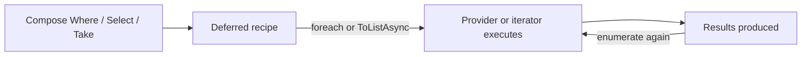

# 5. What is LINQ deferred execution, and when can it surprise developers?

**Technology:** C# and .NET

**Source question:** 5. What is LINQ deferred execution, and when can it surprise developers?

## 1. What problem does it solve?

LINQ needs to compose operations without doing unnecessary work. Deferred execution lets code describe a pipeline—filter, transform, order, limit—and run it only when a consumer asks for results. This enables streaming, avoids intermediate collections, and lets providers such as EF Core translate the complete expression into one database query.

Without it, every operator would eagerly allocate a collection or execute a database call. A chain of five operators could create several temporary collections, retrieve rows before all filters are known, and prevent the database from optimizing the complete query.

The trade-off is hidden timing. Creating a query usually does not read data, throw data-dependent exceptions, or take a snapshot. Those things happen during enumeration. That affects performance, reliability, consistency, resource lifetimes, and maintainability—especially when an apparently harmless sequence represents database or network I/O.

## 2. Explain it in simple language

Deferred execution means a LINQ expression is usually a recipe, not its results. For example, `payments.Where(p => p.Status == Pending)` creates a sequence that knows how to find pending payments. A `foreach`, `ToList`, `Count`, or similar consumer causes work to occur.

Think of writing instructions for a bank clerk. Writing “find approved payments, order by date, take 20” does not fetch any files. Each time someone hands those instructions to the clerk, the clerk checks the records as they exist then.

**One-sentence definition:** LINQ deferred execution postpones evaluating a query until the sequence is enumerated or a terminal operation requests a result.

**Memory rule:** a LINQ query is a recipe until you consume it; consume it twice, and it may cook twice.

## 3. How does it work internally?

For LINQ to Objects, operators such as `Where` and `Select` return iterator objects. Their predicates and selectors execute as the consumer repeatedly calls `MoveNext()`. Items commonly flow one at a time, so `Where(...).Take(10)` may stop after finding ten matches. This is lazy, streaming evaluation.

Some deferred operators must buffer before yielding. `OrderBy` must read and sort its input; `GroupBy` builds groupings. Deferred therefore does not mean constant memory. Immediate operators such as `ToList`, `ToArray`, `Count`, `First`, and `Any` trigger evaluation, although they consume different amounts of input.

With `IQueryable<T>`, operators build an expression tree. Enumeration or an async terminal operator such as EF Core's `ToListAsync` asks the provider to translate and execute it. The database performs the translated work and EF Core materializes results.



The iterator normally captures variables, not frozen values. If `minimumAmount` changes before enumeration, the predicate sees the changed value. Source collections can also change, and a database query sees data according to the transaction and isolation level at execution time. Enumerating a mutable `List<T>` while another thread modifies it is not made safe by LINQ and commonly throws `InvalidOperationException`.

Deferred execution is neither asynchronous nor parallel. LINQ to Objects normally runs synchronously on the enumerating thread. `ToListAsync` makes database waiting asynchronous; it does not parallelize SQL, and EF Core does not support concurrent operations on one `DbContext`.

## 4. Realistic payment or banking example

Consider an endpoint that previews corporate payments awaiting approval. Angular sends an account, currency, and minimum amount. It validates form shape for usability, but ASP.NET Core must authenticate the caller, authorize the account, validate limits, and enforce tenant boundaries.

The application service asks an EF Core reader to compose a query. The database ledger is authoritative. EF Core sends SQL only at `ToListAsync`, then returns immutable preview DTOs. A message broker may later publish approval events, but it is not involved in this read and is not the source of truth.

A surprise occurs if the service stores the `IQueryable`, disposes its scoped `DbContext`, and enumerates later: execution fails. Another occurs if logging calls `Count()` and response mapping calls `ToListAsync()`: that is two database queries, possibly observing different rows. For an approval decision, a preview is not a lock; the write must re-authorize and revalidate current database state inside its transaction.

## 5. Successful flow and failure flow

### Successful flow

1. Angular sends bounded filters and a correlation ID.
2. ASP.NET Core authenticates and authorizes access; frontend validation is not trusted.
3. The reader composes tenant/account predicates, a deterministic order, projection, and `Take`.
4. `ToListAsync(cancellationToken)` executes one parameterized SQL query while the scoped context is alive.
5. The database returns a consistent statement-level result, which is materialized once and returned as DTOs.

### Failure flow

- **Validation or authorization:** reject before query execution with sanitized 400/403 `ProblemDetails`; never apply security filtering only in Angular.
- **Timeout or cancellation:** pass the token to EF Core. Cancellation requests that ongoing work stop; it does not undo already committed work or guarantee immediate database cancellation.
- **Database failure:** the exception appears at enumeration, not composition. Log query identity, duration, and correlation ID without payment data. Retry only classified transient read failures within a budget.
- **Duplicate enumeration:** materialize once when multiple consumers need the same snapshot. Otherwise duplicated SQL increases load and may return different results.
- **Concurrency conflict:** another approver may alter a payment after the preview. The approval command must use optimistic concurrency, for example a version token, and return 409 on stale state.
- **Broker or partial completion:** irrelevant to preview execution. For approval, commit the state and outbox record atomically, then retry broker publication. Retrying an uncertain command requires an idempotency key; a retry policy alone is not idempotency.
- **Disposal:** never return a database-backed deferred sequence beyond the owning context's lifetime.

## 6. Practical C#/.NET implementation

Keep composition and execution inside infrastructure, and return a materialized application contract:

```csharp
public sealed record PendingPaymentQuery(
    Guid TenantId, Guid AccountId, decimal MinimumAmount, int Limit);

public sealed record PaymentPreview(
    Guid Id, decimal Amount, string Currency, DateTimeOffset CreatedAt);

public interface IPendingPaymentReader
{
    Task<IReadOnlyList<PaymentPreview>> ReadAsync(
        PendingPaymentQuery query, CancellationToken cancellationToken);
}

public sealed class EfPendingPaymentReader(BankingDbContext db)
    : IPendingPaymentReader
{
    public async Task<IReadOnlyList<PaymentPreview>> ReadAsync(
        PendingPaymentQuery request, CancellationToken ct)
    {
        if (request.Limit is < 1 or > 100 || request.MinimumAmount < 0)
            throw new ArgumentException("Invalid payment search criteria.");

        IQueryable<PaymentPreview> query = db.Payments
            .AsNoTracking()
            .Where(p => p.TenantId == request.TenantId &&
                        p.AccountId == request.AccountId &&
                        p.Status == PaymentStatus.Pending &&
                        p.Amount >= request.MinimumAmount)
            .OrderBy(p => p.CreatedAt)
            .ThenBy(p => p.Id)
            .Select(p => new PaymentPreview(
                p.Id, p.Amount, p.Currency, p.CreatedAt))
            .Take(request.Limit);

        return await query.ToListAsync(ct);
    }
}
```

The endpoint obtains `TenantId` from trusted claims, verifies account permission through an authorization policy, invokes this reader, and maps expected errors to `ProblemDetails`; centralized exception handling sanitizes unexpected failures. Do not accept a client-supplied tenant as authority.

`AsNoTracking` reduces read overhead, projection limits columns, stable ordering makes the limit deterministic, and `ToListAsync` deliberately creates one reusable snapshot. `CancellationToken` covers the database wait, but request cancellation is not transaction rollback.

Unit-test validation and application orchestration. Integration-test translation, generated SQL, tenant isolation, ordering, cancellation, and query count against the production database provider. Current supported .NET/EF Core versions provide these APIs, but expression translation and generated SQL are provider- and version-dependent; verify after upgrades rather than relying on the InMemory provider.

## 7. Important design decisions

**Stream or materialize.** Streaming reduces peak memory and can return early, but holds resources longer, permits late failures, and may repeat side effects. Materializing costs memory but gives a stable, reusable result and closes the reader sooner. Default to a bounded `ToListAsync` for API pages; consider `IAsyncEnumerable<T>` for deliberate large exports with backpressure and clear lifetime ownership.

**Expose a query or data.** Returning `IQueryable` offers flexibility but leaks provider rules, security predicates, and `DbContext` lifetime across layers. Prefer intention-specific reader methods returning DTOs. A specification/query-object pattern can preserve controlled composition when requirements justify it.

**Snapshot expectations.** Deferred execution sees state at execution, and separate enumerations are separate operations. If business logic requires one view, materialize once or use an appropriately scoped transaction. Stronger isolation improves consistency but can increase blocking, version-store use, or serialization failures.

**Side effects in delegates.** Predicates and selectors should normally be pure. Side effects can occur zero, once, or many times depending on enumeration. Perform required writes explicitly, transactionally, and observably rather than hiding them in `Select`.

**Async versus parallelism.** Use EF Core async terminal operators for scalable I/O. Do not run parallel queries through one context; use deliberate separate scopes only when consistency, connection-pool pressure, and failure aggregation have been considered.

## 8. When to use it and when not to use it

Use deferred execution for composable queries, early-stopping pipelines, large sequences processed incrementally, and EF Core queries whose filters should be translated together. It is particularly effective when consumers may need only `Any`, `First`, or a bounded subset.

Materialize when callers need repeated traversal, a point-in-time result, isolation from later source mutation, or freedom from an external resource lifetime. A small `List<T>` is simpler for fixed configuration or already-loaded data.

Warning signs include multiple enumeration of an unknown `IEnumerable`, returning `IQueryable` from a disposed scope, mutable captured variables, hidden I/O behind a property, unbounded queries, side effects inside selectors, or assuming `OrderBy` streams without buffering. Do not materialize enormous datasets merely to avoid thinking about lifetime; paginate or stream intentionally.

## 9. Compare it with related concepts

| Concept | Purpose / ownership | Lifecycle | Performance / reliability | Complexity, use, limitation |
|---|---|---|---|---|
| Deferred `IEnumerable<T>` | Pull-based LINQ-to-Objects pipeline | Runs on enumeration | Can stream; may repeat work or side effects | Simple composition; source must remain valid |
| `IQueryable<T>` | Provider-owned expression description | Executes through provider | Can push work to SQL; translation can fail or be costly | Database composition; leaks provider/lifetime if exposed |
| `List<T>` / array | Caller-owned materialized snapshot | Results already stored | Repeatable and fast to traverse; uses proportional memory | Best for bounded API results; no later query optimization |
| `IAsyncEnumerable<T>` | Asynchronous pull stream | Runs during `await foreach` | Supports asynchronous streaming; holds resources longer | Large exports; not parallel and late errors are possible |

For the payment preview, I would compose an internal `IQueryable` and materialize one bounded list. It preserves database-side optimization while giving the application a stable result and explicit resource boundary.

## 10. Common production mistakes

- **Multiple enumeration:** logging `Count()` and then iterating reruns work. Detect with analyzer CA1851, traces, or database command counts; materialize once or redesign the API.
- **Changing captures:** building predicates in a loop or mutating a filter before enumeration changes results. Prefer immutable request values and local copies; test execution timing explicitly.
- **Late exceptions:** a `try` around query construction catches nothing from later execution. Put handling around enumeration and keep it within the resource scope.
- **Disposed resources:** returning deferred EF, file, or reader sequences makes ownership ambiguous. Execute before disposal or return a stream whose owner and disposal contract are explicit.
- **Concurrent source mutation:** ordinary collections and `DbContext` are not made thread-safe by LINQ. Avoid shared mutation; snapshot or synchronize at the correct boundary.
- **Hidden database load:** repeated enumeration, N+1 access, premature `AsEnumerable`, or missing bounds increases latency and pool pressure. Inspect SQL, query plans, row counts, and traces.
- **Security filters applied too late:** materializing before tenant filtering may expose or log forbidden data. Enforce authorization and tenant predicates server-side before execution, ideally with defense-in-depth query filters where appropriate.
- **Misleading observability:** logging “query completed” after composition records no execution. Measure around the terminal operation and record duration, result count, cancellation, and a safe query name.

## 11. Interview-ready answer

### 30-second answer

LINQ deferred execution means operators such as `Where` and `Select` usually build a recipe and do not run until enumeration or a terminal operation such as `ToList`, `Count`, or EF Core's `ToListAsync`. It enables composition and streaming, but surprises developers because each enumeration can rerun work, observe changed data or captured variables, throw later, and require resources such as a live `DbContext`. I materialize bounded results when I need one stable, reusable snapshot.

### Two-minute senior-level answer

There are two important forms. LINQ to Objects creates iterators whose delegates execute as `MoveNext` is called. `IQueryable` builds an expression tree that a provider such as EF Core translates when a terminal operation executes it. Some deferred operators stream, but `OrderBy` and `GroupBy` must buffer, so “deferred” does not automatically mean memory-efficient.

The production risks are execution timing and ownership. Enumerating twice may issue two SQL queries, repeat side effects, and observe two database states. Captured variables are evaluated later. Exceptions occur while consuming the sequence. A database-backed query fails if its context has already been disposed, and neither LINQ nor async makes a collection or `DbContext` thread-safe.

For a pending-payment preview, I keep `IQueryable` inside infrastructure, enforce tenant and account filters before execution, project DTOs, order and bound the result, then call `ToListAsync` once with cancellation. That creates an explicit snapshot and resource boundary. I verify generated SQL, command count, provider translation, and authorization with integration tests. For a large export I may stream deliberately, accepting longer-held resources and late failure handling. Async is about non-blocking I/O, not parallel execution, and a read preview never replaces transactional concurrency checks on approval.

### Three follow-up questions an interviewer may ask

1. Which LINQ operators stream, buffer, or execute immediately?
2. Why can enumerating the same EF Core query twice produce different results?
3. How do `IEnumerable<T>`, `IQueryable<T>`, and `IAsyncEnumerable<T>` differ in execution ownership?

### Important keywords

Lazy evaluation, enumeration, iterator, `MoveNext`, expression tree, query provider, terminal operation, materialization, multiple enumeration, captured variable, buffering, `DbContext` lifetime, cancellation, snapshot, generated SQL.

### Red-flag answers

Saying all LINQ executes immediately; claiming every deferred operator streams; treating `IEnumerable` as an in-memory collection; assuming `ToListAsync` makes work parallel; exposing `IQueryable` without lifetime or security controls; or ignoring repeated queries, mutation, and delayed exceptions.

## 12. Test my understanding interactively

During revision, answer this scenario-based interview question:

> A payment-preview service builds an EF Core query, logs `query.Count()`, returns the `IQueryable` from a scoped repository, and the controller later calls `ToListAsync`; production shows two SQL commands, occasional different counts, and intermittent disposed-context errors. How would you redesign it, and which correctness, security, performance, and observability checks would you add?

## Revision card

- **One-sentence definition:** LINQ deferred execution postpones query evaluation until enumeration or a terminal operation requests results.
- **Memory rule:** the query is a recipe; every consumption may run it again.
- **Recommended use:** compose close to the source, keep resources alive through execution, and materialize one bounded result when a stable snapshot is required.
- **Main danger:** hidden execution timing can repeat I/O or side effects, observe changed state, delay exceptions, and outlive required resources.
- **Interview takeaway:** explain not only when LINQ runs, but also who owns execution, whether it streams or buffers, and how you control consistency, lifetime, security, and repeated work.
