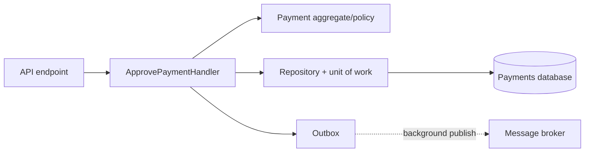

# 6. How would you refactor a large service class with too many dependencies?

**Technology:** C# and .NET

**Source question:** 6. How would you refactor a large service class with too many dependencies?

## 1. What problem does it solve?

A service with fifteen injected dependencies usually owns too many reasons to change: validation, authorization, persistence, notifications, exchange rates, auditing, and workflow rules. Constructor size is the symptom; low cohesion and blurred boundaries are the problem.

Left alone, every change risks unrelated behavior, mocks multiply, and transactions become unclear. Reliability, security, and performance suffer when authorization, idempotency, and I/O are hidden or inconsistently applied.

Refactoring creates cohesive use cases with explicit boundaries and testable domain policies. Hiding dependencies behind `IServiceProvider` or a facade only makes the graph smaller on paper.

## 2. Explain it in simple language

Group behavior that changes for the same reason. Put business rules in domain objects, orchestration in use-case handlers, I/O behind narrow ports, and cross-cutting concerns in established pipelines.

It is like replacing one employee doing every bank task with a team whose authority and handoffs are explicit.

**One-sentence definition:** Refactoring a dependency-heavy service means decomposing it along cohesive business capabilities and moving each responsibility behind an explicit, narrow boundary.

**Memory rule:** Count reasons to change, not constructor parameters.

## 3. How does it work internally?

Characterize existing behavior with tests and traces. Inventory each method, dependency, side effect, transaction, and failure contract. A dependency-to-method matrix exposes clusters: dependencies used only by `ApprovePayment` suggest a use-case boundary.

Create a thin application handler for one vertical slice. It coordinates authorization context, repositories, domain decisions, transaction boundaries, and durable event publication. Pure rules move into domain entities or policies; EF Core, broker, clock, and external risk-provider code remain infrastructure. Cross-cutting validation, logging, metrics, and exception mapping can use ASP.NET Core endpoint filters, middleware, or decorators where their lifecycle fits.



ASP.NET Core resolves the handler and its explicit dependencies. Scoped `DbContext` must not be captured by singletons. Async I/O releases the request thread; it is not parallel execution, and one context does not support concurrent operations.

Migrate callers incrementally, using an adapter if necessary. Extraction alone is not improvement: pass-through classes or a “manager” facade merely redistribute complexity.

## 4. Realistic payment or banking example

Assume a `PaymentService` creates, approves, searches, exports, sends notifications, screens fraud, and publishes events.

Refactor approval into `ApprovePaymentHandler`, a `Payment` aggregate, narrow infrastructure ports, and an outbox. Query handlers use projections; notifications consume committed events outside the approval transaction.

Angular collects an idempotency key and version, validates for usability, and displays `ProblemDetails`; it never enforces authorization. ASP.NET Core authenticates, authorizes, validates, and invokes the use case. A database transaction stores state and outbox atomically. The broker transports events; consumers tolerate duplicates. The payments database owns payment status; the risk system owns its decision.

## 5. Successful flow and failure flow

### Successful flow

1. Angular submits payment ID, expected version, and idempotency key.
2. ASP.NET Core authenticates the approver and enforces a policy; backend validation remains authoritative.
3. The handler checks the idempotency record, loads the payment, and obtains a risk decision.
4. The domain object verifies state, amount limits, segregation of duties, and expected version, then transitions to approved.
5. One database transaction saves the payment, response record, audit data, and outbox message.
6. The API returns the stored result. A worker later publishes the outbox event, and notification consumers act independently.

### Failure flow

- **Validation/authorization:** return sanitized 400/403 before mutation. Do not bury authorization solely inside a repository or trust Angular.
- **Duplicate request:** the same scoped idempotency key and payload returns the original result; the same key with different input is rejected. A retry policy alone is not idempotency.
- **Concurrency conflict:** a mismatched row-version causes 409; reload and make the user reconsider rather than blindly retrying a business decision.
- **Risk timeout:** do not approve. Propagate cancellation; retry only when safe, or enter pending review.
- **Database failure:** rollback the transaction and return a transient failure. Request cancellation asks work to stop; it does not itself roll back unless the transactional operation observes it and exits.
- **Broker failure:** the committed outbox row remains pending and is retried with backoff. Consumers deduplicate by message ID. This avoids database-committed/broker-missing partial completion.
- **Cancellation after commit:** the response may be lost although approval succeeded; an idempotent retry retrieves it.

## 6. Practical C#/.NET implementation

The endpoint remains small; the application handler owns the use-case transaction:

```csharp
public sealed record ApprovePaymentCommand(
    Guid PaymentId, byte[] ExpectedVersion, string IdempotencyKey);

public interface IApprovePayment
{
    Task<ApprovalResult> ExecuteAsync(
        ApprovePaymentCommand command, Actor actor, CancellationToken ct);
}

public sealed class ApprovePaymentHandler(
    IPaymentRepository payments,
    IRiskScreeningGateway risk,
    IApprovalUnitOfWork unitOfWork,
    IIdempotencyStore idempotency,
    TimeProvider clock,
    ILogger<ApprovePaymentHandler> logger) : IApprovePayment
{
    public async Task<ApprovalResult> ExecuteAsync(
        ApprovePaymentCommand command, Actor actor, CancellationToken ct)
    {
        if (await idempotency.FindAsync(command.IdempotencyKey, ct) is { } prior)
            return prior.MatchPayloadOrThrow(command);

        var payment = await payments.GetAsync(command.PaymentId, ct)
            ?? throw new PaymentNotFoundException(command.PaymentId);

        var decision = await risk.ScreenAsync(payment.ToRiskRequest(), ct);
        payment.Approve(actor, decision, command.ExpectedVersion,
            clock.GetUtcNow());

        var result = ApprovalResult.From(payment);
        await unitOfWork.CommitAsync(payment, result,
            command.IdempotencyKey, payment.DequeueEvents(), ct);

        logger.LogInformation(
            "Payment {PaymentId} approved by {ActorId}", payment.Id, actor.Id);
        return result;
    }
}
```

`Payment.Approve` is synchronous because it performs in-memory rules. `CommitAsync` uses an EF Core transaction and concurrency token to persist state, idempotency result, audit, and outbox events atomically.

```csharp
app.MapPost("/payments/{id:guid}/approval", async (
    Guid id, ApproveRequest body, ClaimsPrincipal user,
    IApprovePayment handler, CancellationToken ct) =>
{
    var actor = Actor.FromClaims(user);
    return Results.Ok(await handler.ExecuteAsync(
        new(id, body.ExpectedVersion, body.IdempotencyKey), actor, ct));
}).RequireAuthorization("CanApprovePayments");
```

Use `IExceptionHandler` and `AddProblemDetails` to map known exceptions and sanitize unexpected errors. These exist in supported ASP.NET Core releases; verify registration and EF provider behavior for the deployed version. Propagate trace IDs without logging financial secrets.

Unit-test aggregate rules and handler orchestration. Integration-test authorization, DI, real-provider transactions, concurrency, outbox recovery, and simultaneous idempotent requests.

## 7. Important design decisions

**Boundary:** default to use-case slices when workflows change independently. Microservices require ownership, scaling, deployment, or isolation justification; a network boundary adds latency and operational cost.

**Domain model:** put meaningful invariants in the aggregate but keep CRUD simple. Overengineering slows delivery; scattered rules are easily bypassed.

**Cross-cutting behavior:** middleware, filters, or decorators reduce repetition. Business authorization and transactions often remain use-case-specific; test pipeline ordering.

**Consistency:** prefer a local transaction plus outbox. Direct publication risks lost events; eventual delivery requires deduplication and monitoring.

**Migration:** move one characterized slice behind the existing contract. Temporary duplication limits blast radius and permits rollback.

## 8. When to use it and when not to use it

Refactor when dependencies cluster, reasons to change are unrelated, tests need irrelevant mocks, or transaction ownership is unclear.

Do not extract merely to meet a parameter limit. A cohesive service may need several collaborators. Stable CRUD may be clearer with a handler and `DbContext` than repositories, events, and a mediator.

Warning signs are pass-through wrappers, service location, cycles, a universal `CommonService`, and premature microservices that add consistency problems without cohesion.

## 9. Compare it with related concepts

| Option | Purpose/ownership | Lifecycle/performance | Reliability | Complexity and best use |
|---|---|---|---|---|
| Use-case handlers | One business workflow | Usually scoped; in-process | Explicit transaction/failure boundary | Low–medium; recommended approval slice |
| Domain services/entities | Business rules and invariants | Usually transient/in-memory; fast | Deterministic, no I/O ideally | Medium; rules spanning concepts |
| Facade | Simplify an API | Depends on wrapped services | May hide failure boundaries | Low initially; useful at a subsystem edge |
| Mediator/CQRS | Dispatch separate commands and queries | In-process dispatch overhead | Pipeline behavior must be explicit | Medium; many independently evolving use cases |
| Microservice extraction | Independent ownership/deployment | Network call and serialization | Requires timeouts, retries, idempotency | High; bounded capability with operational need |

For approval, I would choose an in-process handler, aggregate, EF Core transaction, and outbox. Separate read projections help; a mediator is optional. Constructor size alone never justifies a remote service.

## 10. Common production mistakes

- **Service locator:** injecting `IServiceProvider` hides compile-time-visible dependencies and creates runtime failures. Detect resolution calls in business code; restore constructor injection and validate DI on startup.
- **Mechanical extraction:** classes retain the same reasons to change. Analyze dependency clusters and change history.
- **Wrong lifetimes:** a singleton captures scoped `DbContext` or user context, causing exceptions, stale state, or tenant leakage. Enable scope validation and test registrations.
- **Leaky transactions:** independent `SaveChanges` or network calls under locks cause partial writes and contention. Make transactions explicit and short.
- **Lost/duplicate events:** direct broker publication around a commit creates partial completion. Use a monitored outbox, stable message IDs, idempotent consumers, and dead-letter handling.
- **Mock-heavy tests:** call-order assertions miss SQL, authorization, and concurrency. Add realistic integration tests.
- **Unbounded parallelism:** shared `DbContext` use is unsafe; limit concurrency and cancellation budgets.
- **Poor observability/security:** generic logs hide the use case, while verbose logs leak financial data. Emit structured outcome, latency, trace ID, retry, outbox age, and conflict metrics with redaction.

## 11. Interview-ready answer

**30-second answer:** I would treat too many dependencies as a cohesion warning, not blindly split the constructor. I would map dependencies and side effects to methods, characterize behavior with tests, then extract one vertical use case at a time. Business invariants go into domain objects, I/O behind narrow interfaces, and cross-cutting concerns into appropriate pipelines. I would keep transactions explicit, use an outbox for broker publication, validate DI lifetimes, and measure behavior throughout the migration.

**Two-minute senior-level answer:** Suppose one payment service creates, approves, searches, notifies, and exports. I inventory dependencies, commits, network calls, security checks, and failure contracts. Tests and traces establish behavior; a dependency-to-method matrix reveals workflow clusters.

I would extract payment approval as an application handler rather than manufacture a facade. The handler coordinates an aggregate, a narrow repository, risk gateway, idempotency store, and transaction. The aggregate enforces state and segregation-of-duties rules. The database commit includes the new state and outbox record; broker delivery is asynchronous and consumers are idempotent. Queries can use direct projections rather than loading the write model.

I would migrate incrementally behind the existing API, verify scoped lifetimes, cancellation, optimistic concurrency, logs, and error contracts, and compare production metrics. The goal is cohesive ownership and explicit failure boundaries—not an arbitrary dependency count, universal interfaces, a mediator, or microservices. I accept some constructor dependencies when they all serve one cohesive workflow.

**Likely follow-up questions:**

1. How do you find the correct boundaries rather than creating many tiny services?
2. Where should transaction and authorization responsibilities live?
3. When would you extract the capability into a microservice?

**Keywords:** cohesion, single reason to change, vertical slice, aggregate invariants, explicit dependencies, scoped lifetime, idempotency, optimistic concurrency, outbox, characterization tests, incremental migration, observability.

**Red flags:** “More than five dependencies always violates SOLID”; “inject `IServiceProvider`”; “put a facade over everything”; “make every class an interface”; “move each method to a microservice”; or proposing a rewrite without tests, transaction analysis, or rollout controls.

## 12. Test my understanding interactively

During revision, answer exactly this one question: A legacy `PaymentService` has 18 dependencies and its `ApproveAsync` method calls a risk API, updates EF Core entities, publishes to a broker, writes an audit record, and sends email. Production sometimes commits approval but returns a timeout, and retries occasionally approve twice. How would you discover the correct boundaries and refactor this flow incrementally while preserving authorization, consistency, idempotency, and observability?

## Revision card

- **One-sentence definition:** Decompose a dependency-heavy service into cohesive use cases, domain rules, and explicit infrastructure boundaries.
- **Memory rule:** Count reasons to change, not constructor parameters.
- **Recommended use:** Extract one characterized vertical slice when dependency clusters, unrelated changes, or unclear transactions reveal low cohesion.
- **Main danger:** Hiding or redistributing complexity through facades, service location, excessive interfaces, or premature microservices.
- **Interview takeaway:** Explain boundary discovery, safe incremental migration, explicit transactions, idempotency, outbox delivery, DI lifetimes, tests, and production observability.
