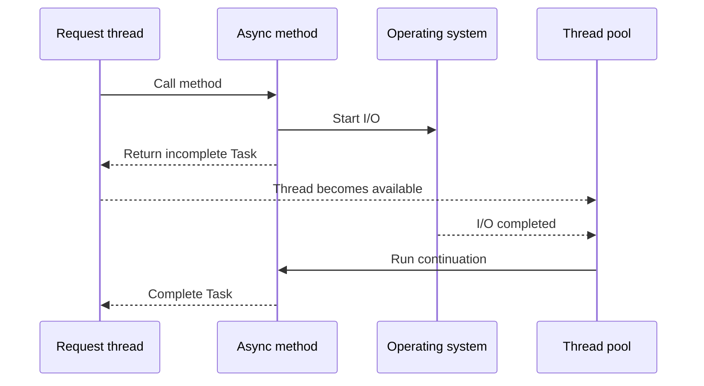
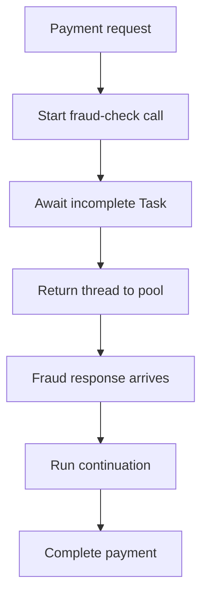
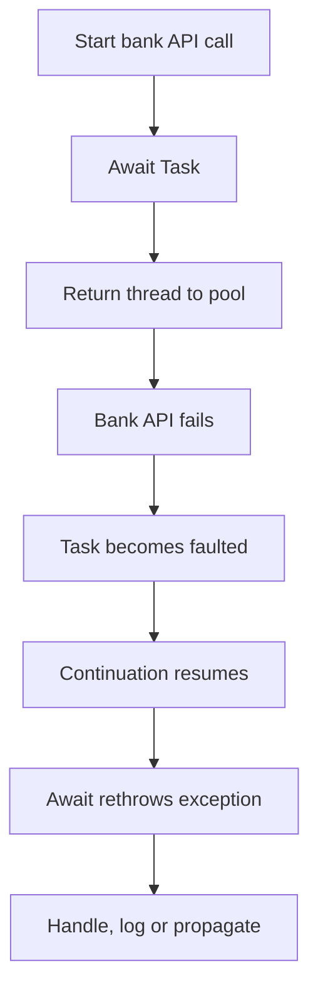

# Does `await` Create a Thread? — .NET Interview Revision Guide

> **Short answer:** No. `await` does not create a new thread.

`await` pauses an asynchronous method until an operation completes. For true asynchronous I/O—such as HTTP or database calls—no thread normally remains blocked during the wait.

## 1. What problem does it solve?

Without asynchronous programming, a thread may remain blocked while waiting for:

- A database query
- An HTTP response
- A file operation
- A message from an external service

In ASP.NET Core, blocked threads reduce scalability. Under high traffic, the thread pool can become exhausted, causing slow responses and timeouts.

`await` allows the request thread to return to the thread pool while the application waits for I/O.

## 2. Simple explanation

Consider ordering coffee.

### Synchronous approach

You place the order and stand at the counter doing nothing until it is ready.

```text
Place order -> Stand and wait -> Receive coffee
```

### Asynchronous approach

You place the order, receive a token, and sit down. The staff notify you when the coffee is ready.

```text
Place order -> Free the counter -> Get notified -> Continue
```

Similarly, `await` does not create another worker to stand and wait. It registers what should happen after completion and releases the current thread.

## 3. How does it work internally?

The C# compiler transforms an `async` method into a **state machine**.

```csharp
public async Task<Payment?> GetPaymentAsync(int id)
{
    var payment = await repository.GetAsync(id);
    return payment;
}
```

Conceptually:

1. The method starts synchronously on the current thread.
2. It calls `repository.GetAsync(id)`.
3. The returned `Task` is checked.
4. If the task is already complete, execution continues immediately.
5. Otherwise, the state machine stores local variables and its current position.
6. It registers a continuation with the task.
7. Control returns to the caller.
8. For true asynchronous I/O, the current thread returns to the thread pool.
9. The operating system monitors the I/O operation.
10. When it completes, an available thread runs the continuation.



The thread that continues the method may not be the same thread that started it.

### Important distinction

`await` does not decide whether the underlying operation uses a thread.

- `HttpClient.SendAsync()` uses asynchronous I/O and normally does not hold a waiting thread.
- `Task.Delay()` uses a timer and does not block a thread.
- `Task.Run()` schedules work on a thread-pool thread.
- A fake asynchronous method that internally performs synchronous work can still block a thread.

## 4. Banking example

Suppose a Payment API calls a Fraud Service. The fraud check takes 500 milliseconds.

### Blocking implementation

```csharp
var result = fraudClient.CheckAsync(request).Result;
```

The request thread remains blocked. With many concurrent requests, numerous threads may be occupied while doing no CPU work.

### Asynchronous implementation

```csharp
var result = await fraudClient.CheckAsync(request);
```

While the Fraud Service processes the request:

- The ASP.NET Core request thread returns to the thread pool.
- That thread can process other work.
- When the response arrives, an available thread continues the payment method.

This improves **scalability and resource usage**. It does not necessarily make one payment faster.

## 5. Successful and failure flows

### Successful flow



### Failure flow

An asynchronous operation can still fail. The exception is stored in the returned task and rethrown at the `await` point.



## 6. Practical C#/.NET example

```csharp
public sealed class PaymentService(
    HttpClient bankClient,
    ILogger<PaymentService> logger)
{
    public async Task<PaymentResult> ProcessAsync(
        PaymentRequest request,
        CancellationToken cancellationToken)
    {
        try
        {
            using var response = await bankClient.PostAsJsonAsync(
                "/payments",
                request,
                cancellationToken);

            if (!response.IsSuccessStatusCode)
            {
                return PaymentResult.Failed(
                    $"Bank returned {(int)response.StatusCode}");
            }

            var result = await response.Content
                .ReadFromJsonAsync<BankPaymentResult>(cancellationToken);

            return result is null
                ? PaymentResult.Failed("Bank returned an empty response.")
                : PaymentResult.Success(result.TransactionId);
        }
        catch (OperationCanceledException)
            when (cancellationToken.IsCancellationRequested)
        {
            logger.LogInformation(
                "Payment {PaymentId} was cancelled.",
                request.PaymentId);

            throw;
        }
        catch (HttpRequestException exception)
        {
            logger.LogError(
                exception,
                "Bank API failed for payment {PaymentId}.",
                request.PaymentId);

            return PaymentResult.Failed(
                "The bank service is temporarily unavailable.");
        }
    }
}
```

The controller should also remain asynchronous:

```csharp
[HttpPost]
public async Task<ActionResult<PaymentResult>> ProcessPayment(
    PaymentRequest request,
    CancellationToken cancellationToken)
{
    var result = await paymentService.ProcessAsync(
        request,
        cancellationToken);

    return result.IsSuccessful
        ? Ok(result)
        : StatusCode(StatusCodes.Status503ServiceUnavailable, result);
}
```

This is known as **async all the way**.

## 7. Important design decisions

### Keep the whole call path asynchronous

```csharp
// Bad: blocks a thread
var result = paymentService.ProcessAsync(request).Result;

// Bad: blocks a thread
paymentService.ProcessAsync(request).Wait();

// Good
var result = await paymentService.ProcessAsync(request);
```

`.Result` and `.Wait()` can cause thread-pool starvation. In environments with a synchronization context, they can also cause deadlocks.

### Pass cancellation tokens

If the client disconnects or the request is cancelled, downstream work should also be cancellable.

```csharp
await bankClient.SendAsync(message, cancellationToken);
```

### Configure timeouts

`await` avoids blocking a thread, but it does not prevent an operation from waiting indefinitely.

### Do not use `Task.Run` for normal ASP.NET Core I/O

```csharp
// Unnecessary: HttpClient already provides asynchronous I/O
await Task.Run(() => bankClient.PostAsync(url, content));
```

### Preserve payment idempotency

If an awaited payment call times out, the bank may still have processed it. Do not retry blindly. Send an idempotency key and provide a transaction-status lookup.

## 8. When to use and when not to use it

### Use `async` and `await` for

- HTTP calls
- Database queries
- File and stream operations
- Queue and message-broker operations
- Other naturally asynchronous I/O

### It may not help with

- Small calculations
- Simple object mapping
- In-memory collection operations
- CPU-intensive calculations by themselves

For CPU-bound work, `await` alone cannot make the work asynchronous. In a desktop application, `Task.Run` can keep CPU work off the UI thread. In ASP.NET Core, using `Task.Run` usually just moves the work to another thread-pool thread and does not increase server capacity.

## 9. Comparison with related concepts

| Concept | What it does | Creates or uses another thread? |
|---|---|---|
| `await` | Suspends the method until a task completes | No, not by itself |
| `async` | Enables `await` and state-machine generation | No |
| `Task` | Represents an operation and its eventual completion | Not necessarily |
| `Task.Run` | Schedules work on the thread pool | Uses a thread-pool thread |
| `Thread` | Represents a dedicated operating-system thread | Yes |
| `Task.Delay` | Completes after a timer interval | No thread blocks while waiting |
| `Thread.Sleep` | Blocks the current thread | No new thread, but the current one is occupied |
| Parallel processing | Executes CPU work concurrently | Usually uses multiple threads |

A `Task` is not a thread. It represents work that may run on a thread, wait for I/O, already be complete, or complete later through a timer or callback.

## 10. Common production mistakes

1. Using `.Result`, `.Wait()`, or `.GetAwaiter().GetResult()` in request paths.
2. Wrapping every asynchronous call in `Task.Run`.
3. Forgetting to pass `CancellationToken`.
4. Assuming `await` makes CPU-heavy work faster.
5. Believing every task owns a dedicated thread.
6. Using `async void` except for event handlers.
7. Starting tasks without awaiting or observing them.
8. Adding `async` when there is no asynchronous operation.
9. Awaiting independent operations sequentially when safe concurrency is possible.
10. Retrying timed-out payment operations without idempotency.
11. Assuming asynchronous code eliminates race conditions.
12. Omitting timeouts because the method is asynchronous.

## 11. Interview-ready answer

> No, `await` does not create a new thread. The compiler converts the async method into a state machine. When an awaited I/O task is incomplete, the method stores its state, registers a continuation, and returns control to its caller. The current thread is then free to process other work. When the I/O completes, an available thread normally executes the continuation. `Task.Run`, by contrast, schedules work on the thread pool. A Task represents an operation; it does not necessarily represent a thread.

## 12. Quick revision

```text
await             = does not create a thread
async             = enables await and state-machine generation
Task              = represents future completion, not a thread
Task.Run          = schedules work on the thread pool
Thread.Sleep      = blocks the current thread
Task.Delay        = waits without blocking a thread
I/O-bound work    = use async/await
CPU-bound work    = await alone does not make it asynchronous
ASP.NET Core goal = improve scalability, not necessarily single-call speed
```

## 13. Scenario-based interview question 1

Your ASP.NET Core payment endpoint contains:

```csharp
[HttpPost]
public IActionResult Pay(PaymentRequest request)
{
    var result = paymentService
        .ProcessAsync(request)
        .Result;

    return Ok(result);
}
```

During peak traffic, response times increase significantly and the server's thread-pool queue grows, although CPU usage remains moderate.

**Question:** What is happening internally, and how would you fix it?

