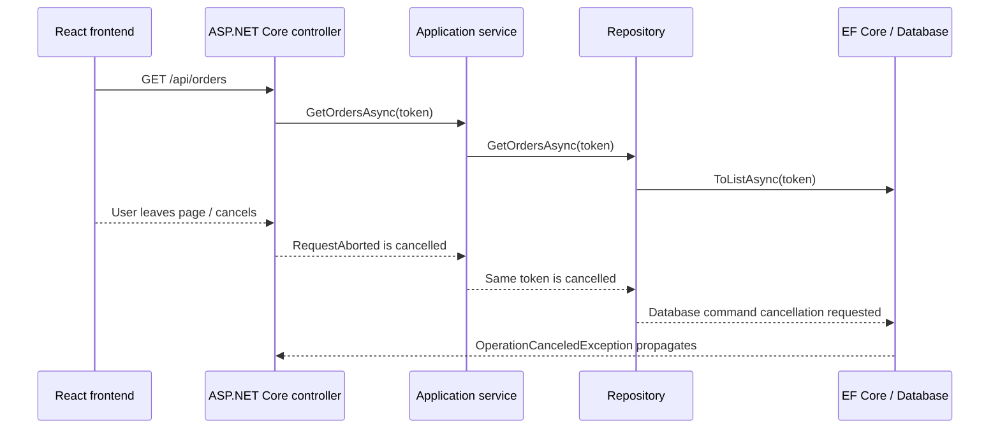

# CancellationToken: Frontend to Backend to Database

## 1. What is a CancellationToken?

A `CancellationToken` is a signal that says:

> The caller no longer needs this work. Stop it if it is safe to do so.

Cancellation is **cooperative**. It does not forcibly kill a thread or guarantee that completed work will be rolled back. Every application layer must accept the token, pass it forward, and use APIs that support cancellation.

## 2. End-to-end flow



The frontend does not send a .NET `CancellationToken`. It aborts the HTTP request. ASP.NET Core detects the aborted request and cancels `HttpContext.RequestAborted`.

## 3. Frontend: React with AbortController

```tsx
import { useEffect, useState } from "react";

type Order = {
  id: string;
  amount: number;
  status: string;
};

export function OrdersPage() {
  const [orders, setOrders] = useState<Order[]>([]);
  const [loading, setLoading] = useState(true);

  useEffect(() => {
    const controller = new AbortController();

    async function loadOrders() {
      try {
        const response = await fetch("/api/orders", {
          signal: controller.signal
        });

        if (!response.ok) {
          throw new Error(`Request failed: ${response.status}`);
        }

        const result: Order[] = await response.json();
        setOrders(result);
      } catch (error) {
        if (error instanceof DOMException && error.name === "AbortError") {
          console.log("Orders request was cancelled");
          return;
        }

        console.error("Could not load orders", error);
      } finally {
        setLoading(false);
      }
    }

    loadOrders();

    // React runs this when the component is removed.
    return () => controller.abort();
  }, []);

  if (loading) return <p>Loading...</p>;

  return (
    <ul>
      {orders.map(order => (
        <li key={order.id}>
          {order.id}: {order.amount} - {order.status}
        </li>
      ))}
    </ul>
  );
}
```

Examples that can trigger `controller.abort()`:

- The user navigates away from the page.
- The component is unmounted.
- The user selects a different search/filter quickly.
- The user clicks a Cancel button.

## 4. Controller: receive the request token

```csharp
[ApiController]
[Route("api/orders")]
public sealed class OrdersController : ControllerBase
{
    private readonly IOrderService _orderService;

    public OrdersController(IOrderService orderService)
    {
        _orderService = orderService;
    }

    [HttpGet]
    public async Task<ActionResult<IReadOnlyList<OrderDto>>> GetOrders(
        CancellationToken cancellationToken)
    {
        var orders = await _orderService.GetOrdersAsync(cancellationToken);
        return Ok(orders);
    }
}
```

ASP.NET Core binds this parameter to the request-aborted signal. It is equivalent to reading:

```csharp
CancellationToken cancellationToken = HttpContext.RequestAborted;
```

## 5. Service: pass the same token forward

```csharp
public sealed class OrderService : IOrderService
{
    private readonly IOrderRepository _repository;

    public OrderService(IOrderRepository repository)
    {
        _repository = repository;
    }

    public Task<IReadOnlyList<OrderDto>> GetOrdersAsync(
        CancellationToken cancellationToken)
    {
        return _repository.GetOrdersAsync(cancellationToken);
    }
}
```

Do not break the cancellation chain:

```csharp
// Wrong: ignores cancellation from the HTTP request.
return await _repository.GetOrdersAsync(CancellationToken.None);
```

## 6. Repository: pass the token to EF Core

```csharp
public sealed class OrderRepository : IOrderRepository
{
    private readonly AppDbContext _dbContext;

    public OrderRepository(AppDbContext dbContext)
    {
        _dbContext = dbContext;
    }

    public async Task<IReadOnlyList<OrderDto>> GetOrdersAsync(
        CancellationToken cancellationToken)
    {
        return await _dbContext.Orders
            .AsNoTracking()
            .OrderByDescending(order => order.CreatedAt)
            .Select(order => new OrderDto(
                order.Id,
                order.Amount,
                order.Status))
            .ToListAsync(cancellationToken);
    }
}
```

Pass the token to asynchronous EF Core operations such as:

```csharp
ToListAsync(cancellationToken);
SingleOrDefaultAsync(cancellationToken);
FirstOrDefaultAsync(cancellationToken);
SaveChangesAsync(cancellationToken);
ExecuteUpdateAsync(cancellationToken);
ExecuteDeleteAsync(cancellationToken);
```

When cancellation is observed, EF Core asks the database provider to cancel the running command. This is a request, not a guarantee that the database completed no work.

## 7. What happens when the user leaves the page?

1. React runs the `useEffect` cleanup function.
2. `AbortController.abort()` aborts the browser request.
3. ASP.NET Core cancels `HttpContext.RequestAborted`.
4. The controller's `CancellationToken` becomes cancelled.
5. The service and repository see the same cancellation signal.
6. EF Core asks the provider to cancel the database command.
7. `OperationCanceledException` normally propagates through the call stack.
8. ASP.NET Core stops producing a response because the client has disconnected.

## 8. Logging and exception handling

Cancellation caused by the caller is expected behaviour, not normally a system failure.

```csharp
public async Task<IReadOnlyList<OrderDto>> GetOrdersAsync(
    CancellationToken cancellationToken)
{
    try
    {
        return await _repository.GetOrdersAsync(cancellationToken);
    }
    catch (OperationCanceledException)
        when (cancellationToken.IsCancellationRequested)
    {
        _logger.LogInformation("Get orders request was cancelled.");
        throw;
    }
    catch (Exception exception)
    {
        _logger.LogError(exception, "Failed to retrieve orders.");
        throw;
    }
}
```

Avoid swallowing cancellation:

```csharp
// Wrong: this also catches OperationCanceledException and returns fake success.
catch (Exception)
{
    return Array.Empty<OrderDto>();
}
```

## 9. Add a server-side timeout

Client cancellation and server timeout are different:

- **Client cancellation:** the browser says the result is no longer required.
- **Server timeout:** the backend decides that the operation has taken too long.

Use a linked token to support both:

```csharp
public async Task<OrderDto?> GetOrderAsync(
    Guid orderId,
    CancellationToken requestToken)
{
    using var timeoutSource =
        new CancellationTokenSource(TimeSpan.FromSeconds(10));

    using var linkedSource =
        CancellationTokenSource.CreateLinkedTokenSource(
            requestToken,
            timeoutSource.Token);

    return await _dbContext.Orders
        .AsNoTracking()
        .Where(order => order.Id == orderId)
        .Select(order => new OrderDto(
            order.Id,
            order.Amount,
            order.Status))
        .SingleOrDefaultAsync(linkedSource.Token);
}
```

The operation is cancelled when either the request is aborted or the 10-second timeout expires.

## 10. Cancellation inside custom processing

Your own CPU loop must check the token explicitly:

```csharp
foreach (var order in orders)
{
    cancellationToken.ThrowIfCancellationRequested();
    ProcessOrder(order);
}
```

Pass it to cancellable asynchronous methods:

```csharp
await Task.Delay(TimeSpan.FromSeconds(5), cancellationToken);
await httpClient.SendAsync(request, cancellationToken);
```

## 11. Important payment scenario

Cancellation does not prove that a payment failed.

Imagine this sequence:

1. The API sends a charge request to the payment provider.
2. The provider charges the customer.
3. The user closes the page.
4. The HTTP request is cancelled before your system records the result.

The customer may have been charged even though your API did not receive or save the successful response.

For payments and other critical operations:

- Use an idempotency key to prevent duplicate charges.
- Save a payment attempt before calling the external provider.
- Treat an interrupted result as **unknown**, not automatically failed.
- Reconcile the payment status with the provider.
- Persist confirmed payment results reliably.
- Use an outbox/background process for notifications and events when appropriate.

After money has moved, critical persistence may intentionally use a different token:

```csharp
var payment = await _paymentGateway.ChargeAsync(
    request,
    cancellationToken);

if (payment.Success)
{
    // This decision must be intentional and protected by idempotency.
    await SaveConfirmedPaymentAsync(
        payment,
        CancellationToken.None);
}
```

`CancellationToken.None` should not be the default. Use it only when finishing the critical operation is more important than the disconnected HTTP request, and design the workflow so it can be retried safely.

## 12. Common mistakes

| Mistake | Result | Better approach |
|---|---|---|
| Token accepted only by controller | Database work continues | Pass the same token through every layer |
| Using `CancellationToken.None` everywhere | Client cancellation is ignored | Use the request token by default |
| Catching all exceptions and returning success | Cancellation looks like successful processing | Rethrow `OperationCanceledException` |
| Assuming cancellation rolls back everything | External or database work may already have completed | Use transactions, idempotency and reconciliation |
| Cancelling after a payment and marking it failed | Customer may be charged twice on retry | Record unknown status and query the provider |
| Creating a new unrelated token in each layer | Cancellation chain is broken | Link tokens only when adding a timeout or shutdown signal |

## 13. Interview-ready answer

> In an ASP.NET Core application, the frontend cancels an HTTP request using `AbortController`. ASP.NET Core detects the aborted connection and cancels `HttpContext.RequestAborted`, which can be received as a `CancellationToken` parameter in the controller. I pass that same token through the service and repository into EF Core asynchronous methods such as `ToListAsync` or `SaveChangesAsync`. Cancellation is cooperative and does not guarantee rollback, so for critical operations such as payments I also use idempotency, durable status tracking and reconciliation.

## 14. Easy rule to remember

```text
Frontend aborts the HTTP request
            ↓
ASP.NET Core cancels RequestAborted
            ↓
Controller passes the token
            ↓
Service passes the token
            ↓
Repository passes the token
            ↓
EF Core asks the database to cancel
```

**Accept it → pass it → use it → do not assume rollback.**
