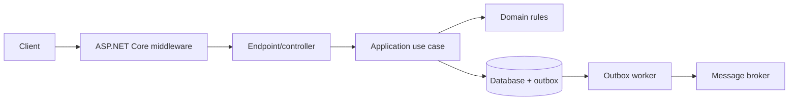

# 1. How do you design a clean REST API for an enterprise application?

**Technology:** ASP.NET Core and Web API

**Source question:** 1. How do you design a clean REST API for an enterprise application?

## 1. What problem does it solve?

An enterprise API is a long-lived contract between changing systems. Clean design makes it secure, evolvable, and predictable. Otherwise endpoints mirror tables, controllers accumulate logic, errors vary, retries duplicate payments, and changes break clients.

Beyond URL style, consistency aids maintenance; statelessness and pagination support scale; validation, authorization, concurrency control, and idempotency protect correctness. REST does not supply transactions or security automatically.

## 2. Explain it in simple language

A clean API presents business resources through a consistent contract while hiding implementation details. Like a bank counter, clients use stable forms; they do not manipulate the ledger.

**One-sentence definition:** A clean REST API is a resource-oriented HTTP contract with predictable semantics, separated application logic, and explicit security, consistency, and failure behavior.

**Memory rule:** Design the contract around resources; enforce the rules behind it.

## 3. How does it work internally?

For `POST /api/v1/transfers`, the flow is:



Kestrel accepts the request; middleware handles correlation, exception mapping, authentication, rate limiting, and routing. Model binding deserializes JSON and validation rejects malformed input. Authorization checks the authenticated principal and transfer policy. A thin endpoint invokes an application use case through dependency injection. The use case loads state, executes domain rules, and commits the transfer plus an outbox event in one database transaction. A background worker later publishes that event.

`async` frees a thread while I/O is pending; it does not make work parallel. A scoped `DbContext` must not be shared across threads. `RequestAborted` is cooperative cancellation, not transaction rollback; an error after commit does not undo it.

A common misunderstanding is that REST means CRUD only. A transfer is a lifecycle resource; clients should not coordinate debit and credit endpoints.

## 4. Realistic payment or banking example

An Angular application submits a transfer command with source account, beneficiary, amount, currency, and an idempotency key. Angular performs usability validation and disables accidental double-clicks, but it is untrusted: the API repeats every validation and authorization check.

ASP.NET Core owns the HTTP contract, identity and policy enforcement, orchestration, error mapping, and audit context. The domain owns rules such as positive amount, account status, limits, and valid transfer state transitions. PostgreSQL or SQL Server is the authoritative source of truth for transfer status, balances/reservations, idempotency record, and outbox message. The broker distributes `TransferCreated`; it is not the ledger and consumers must tolerate duplicate delivery.

Useful endpoints are `POST /api/v1/transfers`, `GET /api/v1/transfers/{id}`, and `POST /api/v1/transfers/{id}/cancellations`. Responses use DTOs, not EF entities. `201 Created` returns a `Location`; long-running work can return `202 Accepted` with a status resource.

## 5. Successful flow and failure flow

### Successful flow

1. Angular sends authenticated JSON, `Idempotency-Key`, and correlation context.
2. The API validates syntax, business input, ownership, and transfer permissions.
3. The use case claims the idempotency key, loads accounts, applies domain rules, and writes the transfer and outbox record atomically.
4. The API returns `201 Created` with a sanitized transfer representation and `Location`.
5. The outbox worker publishes the event; consumers deduplicate it and the transfer progresses through explicit states.

### Failure flow

- Invalid input returns RFC 9457-style `ProblemDetails`, normally `400`; failed authorization returns `403`, while missing authentication yields `401`.
- A reused idempotency key with the same canonical request returns the stored result; a different payload returns `409 Conflict`. A retry token alone is only retry protection—true idempotency stores and replays the operation outcome.
- An optimistic concurrency mismatch returns `409` (or `412` when an `If-Match` precondition is used), after which the client reloads state rather than blindly retrying.
- A database failure rolls back and returns an error without claiming success. Logs retain correlation but not secrets.
- If commit succeeds but the response times out, the retry finds the idempotency record and returns the original outcome. This resolves the uncertain-result problem.
- If the broker is down, the committed outbox row remains pending and is retried with backoff. Poison messages are alerted and quarantined; consumers remain idempotent.
- Cancellation before commit can abort work and roll back. After commit, cancellation merely stops response work; reversal requires a new audited business operation.

## 6. Practical C#/.NET implementation

This focused example targets supported ASP.NET Core/.NET 8+ APIs:

```csharp
public sealed record CreateTransferRequest(Guid FromAccountId,
    Guid BeneficiaryId, decimal Amount, string Currency);

[ApiController]
[Route("api/v1/transfers")]
public sealed class TransfersController(ITransferService service) : ControllerBase
{
    [HttpPost]
    [Authorize(Policy = "CanCreateTransfer")]
    [ProducesResponseType<TransferDto>(StatusCodes.Status201Created)]
    public async Task<ActionResult<TransferDto>> Create(
        CreateTransferRequest request,
        [FromHeader(Name = "Idempotency-Key")] string key,
        CancellationToken cancellationToken)
    {
        if (string.IsNullOrWhiteSpace(key))
            return Problem(statusCode: 400, title: "Idempotency key is required");

        var result = await service.CreateAsync(
            User.GetCustomerId(), key, request, cancellationToken);

        return CreatedAtAction(nameof(Get), new { id = result.Id }, result);
    }

    [HttpGet("{id:guid}")]
    public Task<ActionResult<TransferDto>> Get(Guid id, CancellationToken ct) =>
        throw new NotImplementedException();
}
```

The application contract keeps orchestration testable:

```csharp
public interface ITransferService
{
    Task<TransferDto> CreateAsync(Guid customerId, string idempotencyKey,
        CreateTransferRequest request, CancellationToken cancellationToken);
}

public sealed class TransferService(AppDbContext db, ILogger<TransferService> log)
    : ITransferService
{
    public async Task<TransferDto> CreateAsync(Guid customerId, string key,
        CreateTransferRequest request, CancellationToken ct)
    {
        var existing = await db.IdempotencyRecords
            .SingleOrDefaultAsync(x => x.CustomerId == customerId && x.Key == key, ct);
        if (existing is not null) return existing.ReplayOrThrowOnPayloadMismatch(request);

        var transfer = Transfer.Create(customerId, request); // domain invariants
        db.Transfers.Add(transfer);
        db.IdempotencyRecords.Add(IdempotencyRecord.For(key, customerId, request, transfer));
        db.OutboxMessages.Add(OutboxMessage.For(new TransferCreated(transfer.Id)));
        await db.SaveChangesAsync(ct); // one DB transaction; unique key closes races

        return TransferDto.From(transfer);
    }
}
```

Enforce a unique constraint on `(CustomerId, Key)` and translate race violations into replay/conflict behavior. Add an EF concurrency token (`rowversion` on SQL Server or an application-managed token). Configure `AddProblemDetails()` and `UseExceptionHandler()` centrally; ASP.NET Core 8+ supports consistent problem responses, but application exceptions still need deliberate mappings.

Unit-test domain transitions. Integration-test authentication, serialization, status codes, key races, rollback, and outbox persistence against the real database.

## 7. Important design decisions

| Decision | Recommended default and trade-off |
|---|---|
| Contract style | Resource-oriented JSON over HTTPS. RPC may better express specialized commands but increases coupling. |
| Versioning | Prefer compatible evolution; version breaking changes. URL versions are visible but duplicate surface area. API Versioning is a separate package. |
| Consistency | One local ACID transaction plus transactional outbox. Distributed transactions may offer stronger atomicity but reduce portability and operational resilience. |
| Concurrency | Optimistic tokens by default. They scale well but require conflict UX; pessimistic locks can suit short, highly contended sections but reduce throughput. |
| Idempotency | Durable keys for money-moving POSTs, scoped to caller and request hash. Storage needs retention and privacy controls. |
| Pagination | Cursor pagination for large changing data; offset is simpler but slow and unstable at depth. |
| Errors | `ProblemDetails` with stable codes, retryability, and correlation; never leak internals. |

Use a trusted OIDC/OAuth provider and resource-aware authorization. Rate limits, body limits, timeouts, metrics, traces, audit logs, and health checks are part of the design. Generated OpenAPI clients improve compile-time safety, not runtime compatibility.

## 8. When to use it and when not to use it

Use this approach for multi-team or public business APIs, especially regulated workflows with retries and audits. A small internal CRUD tool may need only a thin endpoint, validation, authorization, and persistence. A single-process call does not need HTTP for layering. Streaming often suits a broker; bidirectional updates may suit WebSockets or gRPC.

Warning signs include one endpoint per table, deep pass-through layers, chatty workflows, and “REST purity” overriding business semantics. Abstractions must isolate change, enforce rules, or enable tests.

## 9. Compare it with related concepts

| Option | Purpose/ownership | Lifecycle and performance | Reliability/complexity | Typical use and limitation |
|---|---|---|---|---|
| REST | API-owned resource contract | Request/response; cacheable reads | Moderate | Broad clients; weak for streaming |
| RPC/gRPC | Service-owned operations | Fast binary calls | Tighter coupling | Internal calls; public/browser constraints |
| Messaging | Shared event/command contract | Durable asynchronous throughput | Eventual consistency, duplicates | Workflows; no immediate result |
| GraphQL | Schema-owned client-shaped graph | Queries may fan out | Resolver and authorization complexity | Flexible reads; harder caching |

For the transfer, I would accept the command through REST, persist it and an outbox atomically, then use messaging for downstream processing. That gives clients a clear synchronous receipt without coupling the ledger transaction to broker availability.

## 10. Common production mistakes

- **Leaking EF entities:** causes over-posting and contract drift. Detect it in schema/security review; use DTOs.
- **Business logic in controllers:** becomes duplicated and hard to test. Move use cases and invariants inward.
- **Check-then-insert idempotency:** races create duplicates. Enforce uniqueness and handle the losing transaction.
- **Retrying every failure:** amplifies overload or repeats work. Measure retries; retry only classified transient failures with bounded backoff and jitter.
- **No outbox:** crashes create phantom or missing events. Commit state and outbox together.
- **Trusting frontend validation:** enables invalid input or cross-customer access. Enforce validation and object authorization server-side.
- **Unbounded reads and logs:** exhaust memory or leak data. Paginate, cap bodies, redact, and define retention.
- **Breaking contracts silently:** breaks deployed clients. Run contract tests, diff OpenAPI, deprecate visibly, and observe version use.

## 11. Interview-ready answer

**30-second answer:** I design an enterprise REST API as a stable business contract, not a database façade. I use resource-oriented URLs, correct HTTP semantics, DTOs, centralized `ProblemDetails`, authentication plus resource authorization, and thin controllers calling testable use cases. For money movement I add durable idempotency, optimistic concurrency, a database transaction with an outbox, and end-to-end telemetry.

**Two-minute senior-level answer:** I start with consumer journeys, invariants, ownership, and failure semantics, then define resources, status codes, pagination, and compatibility in OpenAPI. Middleware handles cross-cutting concerns; thin endpoints call application services and domain rules. The backend revalidates everything and performs object-level authorization. For a transfer, the database is authoritative. I atomically store the transfer, idempotency outcome, and outbox event, then publish asynchronously. This handles broker outage and a lost response after commit. I distinguish cancellation from rollback and async I/O from parallelism. I use stable `ProblemDetails`, correlated logs and traces, metrics, and sanitized audit events. I test domain rules, HTTP contracts, authorization, concurrency, retries, and recovery. REST versus gRPC, cursor versus offset, and synchronous versus `202` depend on consumers and operations.

**Likely follow-up questions:**

1. How would you guarantee idempotency when two identical requests arrive concurrently?
2. How do you evolve the contract without breaking existing clients?
3. What happens if the database commits but event publication or the HTTP response fails?

**Keywords:** resource contract, DTO, `ProblemDetails`, object-level authorization, idempotency, optimistic concurrency, transactional outbox, eventual consistency, correlation ID, OpenTelemetry, backward compatibility.

**Red flags:** “REST is just CRUD”; returning `200` for everything; trusting frontend validation; exposing EF entities; claiming async creates threads; claiming cancellation rolls back commits; or saying a retry key alone guarantees exactly-once execution.

## 12. Test my understanding interactively

Answer this during revision: A client posts a £10,000 transfer, the database commits, the broker is unavailable, and the HTTP connection times out. The client retries twice with the same idempotency key while another API instance handles the requests. Design the API and persistence behavior, responses, recovery process, and telemetry so that money moves only once and the client can learn the authoritative outcome.

## Revision card

- **One-sentence definition:** A clean REST API is a stable resource-oriented HTTP contract backed by separated, secure, observable, and failure-aware application logic.
- **Memory rule:** Design the contract around resources; enforce the rules behind it.
- **Recommended use:** Long-lived enterprise APIs shared across teams or clients.
- **Main danger:** A clean-looking HTTP surface can still duplicate money or leak data if concurrency, authorization, and failure recovery are ignored.
- **Interview takeaway:** Explain the contract, boundaries, source of truth, and ambiguous-failure strategy—not just routes and status codes.
