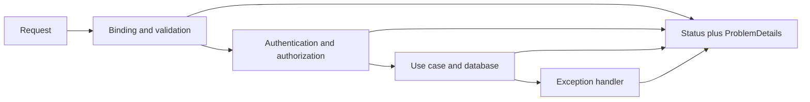

# 2. What status codes do you use for validation failure, unauthorized access, conflict, and unexpected errors?

**Technology:** ASP.NET Core and Web API

**Source question:** 2. What status codes do you use for validation failure, unauthorized access, conflict, and unexpected errors?

## 1. What problem does it solve?

HTTP status codes let clients and monitoring classify outcomes without parsing prose. Validation prompts input correction; missing authentication may trigger sign-in; conflict requires refreshed state; an unexpected error is escalated. Returning `200 OK` with an error body destroys those semantics.

Inconsistent mappings cause unsafe retries, misleading metrics, broken clients, and leaked details. In banking, an ambiguous result can become a duplicate payment. A deliberate contract improves reliability, security, and observability.

## 2. Explain it in simple language

Status codes classify failure; `ProblemDetails` supplies structured detail.

Think of a bank counter: an incomplete form is `400`, no identity is `401`, identity without permission is `403`, a records clash is `409`, and internal failure is `500`.

**One-sentence definition:** Map each failure to the most specific HTTP status that describes the client's request and the server's current state, then return a consistent, sanitized problem body.

**Memory rule:** Bad input `400`; no identity `401`; no permission `403`; state clash `409`; server fault `500`.

## 3. How does it work internally?



Kestrel receives the request and the middleware pipeline selects an endpoint. Authentication constructs the principal; authorization evaluates endpoint and resource policies. Model binding converts JSON into .NET values. With `[ApiController]`, invalid model state automatically produces `400` with `ValidationProblemDetails` unless the behavior is customized. Business validation still belongs in the application/domain layer.

The use case may detect a duplicate, invalid transition, or concurrency mismatch and return a typed result. A centralized handler maps recognized exceptions; unknown exceptions become `500`. ASP.NET Core 8+ provides `AddProblemDetails()`, `UseExceptionHandler()`, and `IExceptionHandler` for centralized responses.

`async` releases a request thread while database I/O waits; it is not parallel execution. `CancellationToken` signals abandoned work but does not itself roll back a committed transaction. A common misunderstanding is that `401` means every authorization failure: it means authentication is absent or invalid; an authenticated caller lacking permission gets `403`.

## 4. Realistic payment or banking example

Angular submits `POST /api/transfers` with source account, beneficiary, amount, and an idempotency key. Angular validates required fields for fast feedback, but the backend repeats all checks because browser input is untrusted.

ASP.NET Core owns security, HTTP mapping, orchestration, and correlation. The domain owns amount, currency, limit, and transition rules. The database is authoritative for accounts, transfers, versions, and idempotency outcomes. An outbox records events in the same commit; the broker distributes them but is not authoritative.

Examples are:

- Missing amount or malformed JSON: `400 Bad Request`.
- Missing/expired bearer token: `401 Unauthorized`, normally with a `WWW-Authenticate` challenge.
- Authenticated customer trying to debit another customer's account: `403 Forbidden`; use `404` only under a deliberate resource-concealment policy.
- Same idempotency key reused with a different payload, duplicate beneficiary, or invalid transition caused by current state: `409 Conflict`.
- Unhandled database/provider defect: `500 Internal Server Error`, with no stack trace exposed.

## 5. Successful flow and failure flow

### Successful flow

1. Angular sends valid input, credentials, idempotency key, and trace context.
2. The API authenticates the user, validates input, and authorizes access to the source account.
3. The use case claims the idempotency key, checks domain rules, and atomically stores the transfer and outbox record.
4. The API returns `201 Created` with a `Location` header; an existing identical idempotent result may be replayed consistently.
5. The outbox worker publishes, and downstream consumers deduplicate events.

### Failure flow

- **Validation:** return `400` with field errors. `422 Unprocessable Content` can distinguish semantic failure after valid syntax, but only under a documented convention. My ASP.NET Core default is `400`.
- **Authorization:** challenge unauthenticated callers with `401`; forbid authenticated unauthorized callers with `403`. Do not reveal another customer's account existence.
- **Duplicate/conflict:** return `409` with a stable problem code and enough safe context to reload or correct the request. For an HTTP conditional update whose `If-Match` ETag fails, use `412 Precondition Failed`; it is more precise than `409`.
- **Concurrency:** roll back, reload state, and return `409` or `412`. Do not blindly retry against changed balances.
- **Database failure:** roll back and map an unexpected failure to `500`; a known transient dependency outage can be `503 Service Unavailable`, optionally with `Retry-After` when a safe retry is appropriate.
- **Broker failure:** the commit remains authoritative and the outbox retries with backoff; immediate publication failure does not reverse it.
- **Uncertain result:** if commit succeeded but the response timed out, a retry with the same key returns the stored outcome. Retry protection without a durable request fingerprint and stored outcome is not true idempotency.
- **Cancellation:** before commit, cooperative cancellation can stop work and the transaction can roll back; after commit, cancellation cannot undo money movement.

## 6. Practical C#/.NET implementation

Use thin endpoints and typed application outcomes for expected failures:

```csharp
public sealed record CreateTransferRequest(
    Guid SourceAccountId, Guid BeneficiaryId,
    [property: Range(typeof(decimal), "0.01", "1000000")] decimal Amount);

[ApiController]
[Route("api/transfers")]
public sealed class TransfersController(ITransferService service) : ControllerBase
{
    [HttpPost]
    [Authorize(Policy = "CreateTransfer")]
    public async Task<IActionResult> Create(
        CreateTransferRequest request, CancellationToken ct)
    {
        var result = await service.CreateAsync(User.GetCustomerId(), request, ct);

        return result switch
        {
            Created<TransferDto> x => CreatedAtAction(nameof(Get),
                new { id = x.Value.Id }, x.Value),
            ValidationFailed x => ValidationProblem(x.Errors),
            Conflict x => Problem(409, code: x.Code, detail: x.SafeDetail),
            _ => throw new UnreachableException()
        };
    }

    [HttpGet("{id:guid}")]
    public IActionResult Get(Guid id) => throw new NotImplementedException();

    private ObjectResult Problem(int status, string code, string detail)
    {
        var problem = new ProblemDetails
        {
            Status = status, Title = "The request conflicts with current state",
            Detail = detail, Type = $"https://api.example.com/problems/{code}"
        };
        problem.Extensions["code"] = code;
        problem.Extensions["traceId"] = HttpContext.TraceIdentifier;
        return StatusCode(status, problem);
    }
}
```

The service validates domain rules, checks durable idempotency, writes through EF Core in a transaction, and translates unique-key or concurrency violations into typed conflicts. A database constraint closes duplicate races. Avoid result names that clash with `ControllerBase.Conflict`.

Configure unexpected errors centrally:

```csharp
builder.Services.AddProblemDetails(options =>
    options.CustomizeProblemDetails = context =>
        context.ProblemDetails.Extensions["traceId"] =
            context.HttpContext.TraceIdentifier);
builder.Services.AddExceptionHandler<GlobalExceptionHandler>();

app.UseExceptionHandler();
app.UseAuthentication();
app.UseAuthorization();
```

`GlobalExceptionHandler` logs once, maps recognized exceptions, and returns sanitized `ProblemDetails`. Never expose exception text, SQL, tokens, or account data. Prefer W3C trace IDs from `Activity`. Integration tests assert statuses, stable codes, challenges, no leaked detail, idempotency races, and concurrency.

## 7. Important design decisions

| Decision | Recommended default and trade-off |
|---|---|
| `400` vs `422` | Default to `400`; use a documented syntax/semantics split only if clients benefit. |
| `403` vs concealed `404` | Default to `403`; consistent `404` concealment reduces enumeration but complicates diagnosis. |
| `409` vs `412` | Use `409` for domain/current-state conflicts; use `412` when an explicit HTTP precondition such as `If-Match` fails. |
| Typed results vs exceptions | Use results for expected failures and exceptions for exceptional paths; frequent exceptions obscure flow and add cost. |
| Error detail | Publish stable codes, safe messages, and trace IDs; internal detail creates security risks. |
| Retry signals | Use `503`/`Retry-After` only when retry is safe; bad advice amplifies outages. |

Document and test the OpenAPI contract. Generated clients provide compile-time convenience, not runtime correctness.

## 8. When to use it and when not to use it

Use these mappings for HTTP APIs, especially shared or regulated ones. Centralized `ProblemDetails` keeps endpoints consistent.

A prototype may not need a rich taxonomy, but still needs correct statuses and sanitized `500`s. Insufficient funds may be `400` or `422`, not `409`, when no state collision occurred. Avoid `401` to hide every failure, `500` for expected input, and `200` for error bodies. Stable problem codes carry finer detail.

## 9. Compare it with related concepts

| Mechanism | Purpose/owner | Lifecycle/performance | Reliability/complexity | Typical limitation |
|---|---|---|---|---|
| HTTP status | Protocol outcome, API | One response; cheap | Coarse classification | Lacks business detail |
| `ProblemDetails` | Error contract, API | Serialized body | Consistent, extensible | Sanitize extensions |
| Domain result | Expected outcome, application | Typed in-process flow | Explicit, testable | Needs boundary mapping |
| Exception | Unexpected failure, runtime | Stack unwinding costs | Central handling | Poor normal control flow |

For transfers, domain results represent expected failures, boundary code maps them to HTTP and `ProblemDetails`, and centralized handling maps unexpected exceptions to `500` or a recognized `503`.

## 10. Common production mistakes

- **`401` for `403`:** causes endless reauthentication. Test authenticated principals lacking each policy.
- **`500` for validation:** corrupts availability metrics and encourages retries. Map expected outcomes.
- **Leaked exception text:** reveals schema or personal data. Scan responses and use safe telemetry.
- **Treating every unique-key violation alike:** may mislabel infrastructure defects as `409`. Inspect the violated constraint through provider-aware infrastructure mapping.
- **Check-then-insert conflicts:** concurrent requests both pass the check. Enforce database uniqueness and test simultaneous requests.
- **Blind concurrency retries:** overwrite user decisions. Return a safe conflict and require re-evaluation.
- **Inconsistent shapes:** create endpoint-specific parsing. Centralize mapping and contract-test it.
- **Repeated exception logging:** creates noise and cost. Log once with trace, route, safe identifiers, and outcome.
- **Ignoring post-commit failures:** clients retry an already completed transfer. Persist idempotency outcomes and use an outbox.

## 11. Interview-ready answer

**30-second answer:** I normally use `400` for validation failures, `401` when authentication is missing or invalid, `403` when an authenticated caller lacks permission, `409` for a conflict with current resource state, and a sanitized `500` for unexpected server errors. I return consistent `ProblemDetails` with stable codes and trace IDs. I may use `412` for failed `If-Match`, `422` under a documented semantic-validation convention, and `503` for a known temporary outage.

**Two-minute senior-level answer:** The mapping should show who can act next. Invalid input is normally `400`, including `[ApiController]` model validation. I use `401` to challenge an unauthenticated request and `403` for a valid identity without permission; a consistent `404` policy may conceal resource existence. `409` represents a state collision, while failed `If-Match` is `412`. Unknown exceptions become sanitized `500`s; a classified temporary outage can be `503` with safe retry guidance. Expected failures use typed results; exceptional paths use exceptions. Errors carry `ProblemDetails`, a stable code, and trace ID without sensitive data. For transfers, constraints close races, durable idempotency handles lost responses, and an outbox isolates broker failure. I integration-test statuses, challenges, concurrency, and data leakage.

**Likely follow-up questions:**

1. When would you choose `422` instead of `400`?
2. How do you distinguish `409 Conflict` from `412 Precondition Failed`?
3. How do you prevent an exception handler from leaking sensitive information?

**Keywords:** HTTP semantics, `ProblemDetails`, `ValidationProblemDetails`, authentication challenge, authorization forbid, optimistic concurrency, ETag, idempotency, centralized exception handling, trace ID, transactional outbox.

**Red flags:** returning `200` for every outcome; saying `401` means authenticated-but-forbidden; exposing stack traces; retrying every `500`; relying only on frontend validation; or claiming cancellation reverses a committed transaction.

## 12. Test my understanding interactively

Answer this during revision: An authenticated customer submits a valid transfer request, but the account version changed, the database commit outcome becomes uncertain after a timeout, and the client retries with the same idempotency key. Which status and `ProblemDetails` would you return on each attempt, and how would persistence, authorization, and telemetry prove that the transfer occurred at most once?

## Revision card

- **One-sentence definition:** Use the status code that accurately classifies the failure, with a consistent and sanitized problem contract.
- **Memory rule:** Bad input `400`; no identity `401`; no permission `403`; state clash `409`; server fault `500`.
- **Recommended use:** Apply centralized mappings and `ProblemDetails` across every production ASP.NET Core API.
- **Main danger:** Incorrect codes or leaked details cause unsafe retries, security exposure, and misleading operations.
- **Interview takeaway:** State the core five codes, then show senior judgment with `403`, `412`, idempotency, sanitization, and recoverability.
