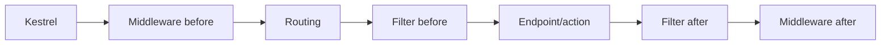

# 3. How do middleware and filters differ in ASP.NET Core?

**Technology:** ASP.NET Core and Web API

**Source question:** 3. How do middleware and filters differ in ASP.NET Core?

## 1. What problem does it solve?

Web applications need cross-cutting behavior—exception handling, authentication, correlation, validation, authorization, logging, and caching—without duplicating it in every endpoint. ASP.NET Core provides different interception points because some concerns apply to every HTTP request, while others need endpoint, action, argument, or result context.

Without the right abstraction, controllers become repetitive, ordering becomes accidental, errors leak inconsistent responses, and security checks can be bypassed. Putting endpoint-specific work in global middleware also forces it to rediscover metadata or deserialize bodies. The distinction therefore affects maintainability, security, performance, observability, and consistent failure handling.

## 2. Explain it in simple language

Middleware wraps the broad HTTP pipeline. Filters wrap a selected endpoint's execution after routing has supplied framework-specific context.

Think of an airport: middleware is airport-wide security and signage through which everyone passes; filters are checks at a particular airline gate, where staff know the passenger, flight, and boarding result.

**One-sentence definition:** Middleware handles host-level request/response concerns across pipelines, whereas filters handle concerns around MVC actions, Razor Pages, or minimal API handlers using endpoint-aware context.

**Memory rule:** Middleware surrounds HTTP; filters surround endpoint execution.

## 3. How does it work internally?

At startup, `Use...` calls compose request delegates. Each middleware can inspect `HttpContext`, do work before and after `await next(context)`, short-circuit, or catch downstream exceptions. Registration order determines inbound order; responses unwind in reverse.



After routing selects an endpoint, endpoint middleware runs it. For controllers, MVC creates the controller through dependency injection, binds arguments, and invokes its filter pipeline: authorization filters, resource filters, action filters, exception filters, and result filters, with important short-circuit and scope-order rules. Endpoint filters, introduced with minimal APIs in ASP.NET Core 7, wrap the handler and can inspect or replace its arguments and result. They are not MVC filters.

Middleware is normally created once, so conventional middleware should not constructor-inject scoped services; inject them into `InvokeAsync`, or use `IMiddleware`, which is resolved per request. Filter attributes may also be reused and should not hold mutable request state. Prefer DI-resolved filters or globally registered filter types for dependencies.

`await next` is asynchronous continuation, not parallelism. Avoid blocking and large body buffering. Exceptions flow outward only through components that surround the throwing code. A common misunderstanding is that exception filters replace exception middleware: MVC exception filters see only failures inside MVC action/result processing and miss routing, authentication, minimal APIs, and earlier middleware.

## 4. Realistic payment or banking example

Angular sends `POST /api/transfers` with a bearer token, an idempotency key, and transfer data. Frontend validation improves usability but is never authoritative.

ASP.NET Core middleware establishes a correlation ID, handles unexpected exceptions, applies HTTPS/security headers, authenticates, and logs request outcomes. Authorization may be middleware-driven through endpoint metadata. A controller action filter validates the presence and syntax of the idempotency header, or an endpoint filter does the equivalent for a minimal API; the application service still enforces durable idempotency and business rules.

The database is authoritative for account balances, transfer state, idempotency records, and an outbox. The broker distributes `TransferCreated` events; it is not the source of truth. Angular must not decide authorization, available balance, or whether a timed-out transfer failed.

## 5. Successful flow and failure flow

### Successful flow

1. Correlation and exception middleware wrap the request; authentication builds the principal.
2. Routing selects the transfer endpoint and authorization verifies its policy.
3. A filter rejects malformed endpoint-specific headers or records action timing.
4. The action calls an application service with `CancellationToken`; the service claims the idempotency key, checks rules, and atomically writes transfer and outbox rows.
5. The filter observes the result; middleware records status and duration. The API returns `201`, and an outbox worker later publishes.

### Failure flow

- **Validation or authorization:** endpoint validation returns `400`; unauthenticated and forbidden requests become `401` and `403`. Backend enforcement remains mandatory even if Angular validated first.
- **Duplicate:** the same key and payload returns the stored outcome; the same key with a different fingerprint returns `409`. A filter can require the header, but true idempotency requires durable atomic storage.
- **Concurrency/database failure:** optimistic concurrency becomes a safe `409`; the transaction rolls back on a failed commit. Request cancellation asks code to stop but does not reverse a commit.
- **Timeout or uncertain result:** retry with the same key and reconcile against the authoritative idempotency record. Never assume a timeout means no transfer.
- **Broker failure:** the committed outbox row is retried with backoff; do not undo the transfer merely because publication failed.
- **Unexpected exception:** outer exception middleware logs once and emits sanitized `ProblemDetails`. An MVC exception filter alone would leave non-MVC failures uncovered.

## 6. Practical C#/.NET implementation

Use middleware for correlation across every endpoint:

```csharp
public sealed class CorrelationMiddleware(RequestDelegate next)
{
    public async Task InvokeAsync(HttpContext context, ILogger<CorrelationMiddleware> log)
    {
        var correlationId = context.Request.Headers["X-Correlation-ID"].FirstOrDefault()
            ?? context.TraceIdentifier;
        context.Response.Headers["X-Correlation-ID"] = correlationId;

        using (log.BeginScope(new Dictionary<string, object>
               { ["CorrelationId"] = correlationId }))
        {
            await next(context);
        }
    }
}

app.UseMiddleware<CorrelationMiddleware>();
app.UseExceptionHandler();
app.UseAuthentication();
app.UseAuthorization();
```

Register `AddProblemDetails()` and an `IExceptionHandler` (available since ASP.NET Core 8) to map unexpected failures centrally. Place exception handling early enough to wrap components whose failures it must handle, and follow the documented authentication-before-authorization order.

For a minimal API, use an endpoint filter for handler-specific input:

```csharp
public sealed class IdempotencyHeaderFilter : IEndpointFilter
{
    public async ValueTask<object?> InvokeAsync(
        EndpointFilterInvocationContext context, EndpointFilterDelegate next)
    {
        var request = context.HttpContext.Request;
        if (!request.Headers.TryGetValue("Idempotency-Key", out var value) ||
            !Guid.TryParse(value, out _))
        {
            return TypedResults.Problem(
                statusCode: StatusCodes.Status400BadRequest,
                title: "A valid idempotency key is required");
        }

        return await next(context);
    }
}

app.MapPost("/api/transfers", async (
    CreateTransfer command, ITransferService service, CancellationToken ct) =>
{
    var result = await service.CreateAsync(command, ct);
    return result.ToHttpResult();
})
.RequireAuthorization("CreateTransfer")
.AddEndpointFilter<IdempotencyHeaderFilter>();
```

The filter performs cheap boundary validation; `ITransferService` owns authorization requiring loaded account data, business validation, optimistic concurrency, the transaction, durable idempotency, and outbox creation. This keeps the endpoint thin and makes business behavior independently testable.

Unit-test the filter by invoking it with a fake next delegate. Use `WebApplicationFactory` integration tests to verify actual ordering, short-circuiting, authentication, `ProblemDetails`, headers, cancellation, and concurrent duplicate requests. Unit tests alone cannot prove pipeline composition.

## 7. Important design decisions

| Decision | Recommended default and trade-offs |
|---|---|
| Middleware or filter | Use middleware for protocol/host-wide behavior; use a filter only when endpoint arguments, metadata, action, or result are genuinely needed. |
| MVC or minimal API filter | Match the endpoint model. MVC offers specialized stages; endpoint filters are simpler handler wrappers but do not reproduce every MVC stage. |
| Global or local | Global registration improves consistency; endpoint/controller registration limits cost and accidental coupling. Test both ordering and exclusions. |
| Attribute or DI type | Metadata-only attributes are clear; DI-resolved filter types are better for services. Avoid service-locator access and mutable attribute state. |
| Short-circuit or call next | Short-circuit invalid/unauthorized work deliberately; an accidental missing `next` silently prevents business execution. |
| Body inspection | Prefer model binding/filter arguments. Middleware body reading requires buffering and limits, increasing memory, latency, and denial-of-service exposure. |

Operationally, avoid logging account details, tokens, or raw bodies. Measure cardinality and cost. Security middleware ordering is architecture, not cosmetics. Compile-time types help select APIs, but only integration tests establish runtime order and behavior.

## 8. When to use it and when not to use it

Use middleware for exception handling, forwarded headers, correlation, authentication, compression, rate limiting, and request logging across endpoint technologies. Use MVC filters for action/result concerns such as a legacy controller convention, and endpoint filters for minimal-handler argument/result concerns.

Do not use either to hide core transfer rules; put those in application/domain services. A helper or explicit action code is simpler for one endpoint. Do not build a filter merely to avoid a three-line method call. Warning signs include filters accessing repositories for major workflows, duplicate validation at several stages, middleware parsing every JSON body, unexplained ordering dependencies, or business results that differ between HTTP and message consumers.

## 9. Compare it with related concepts

| Mechanism | Purpose/ownership | Lifecycle/performance | Reliability/complexity | Typical use and limitation |
|---|---|---|---|---|
| Middleware | HTTP host pipeline | Usually singleton delegate; every matching request | Ordering is explicit but global effects are broad | Exceptions, auth, correlation; lacks bound action arguments |
| MVC filter | MVC action/result pipeline | Per MVC execution; can be DI-resolved | Rich stages, more ordering rules | Controller conventions; cannot cover non-MVC failures |
| Endpoint filter | Minimal endpoint handler wrapper | Per invocation; low ceremony | Simple composition, fewer specialized stages | Argument/result checks; applies only where added |
| Application decorator | Use-case boundary | Independent of HTTP | Reusable across transports, extra abstraction | Transactions/auditing; lacks `HttpContext` semantics |

For the transfer, I choose middleware for correlation, authentication, exception handling, and request telemetry; an endpoint filter only for HTTP idempotency-header shape; and an application service/decorator for durable idempotency and transaction behavior.

## 10. Common production mistakes

- **Wrong exception boundary:** relying on MVC exception filters leaves middleware and minimal API failures exposed. Exercise every route type in integration tests; use outer exception middleware as the default boundary.
- **Incorrect order:** authorization before authentication or exception handling too late produces wrong identities or inconsistent errors. Review the built pipeline and assert outcomes.
- **Scoped service in singleton middleware:** causes startup validation failures or captured request state. Resolve scoped dependencies in `InvokeAsync` or use `IMiddleware`.
- **Double-reading bodies:** consumes the stream, breaks model binding, and creates memory pressure. Avoid it or deliberately enable bounded buffering and rewind.
- **Business logic in filters:** makes transfers transport-dependent and hard to test or reuse. Keep filters thin and delegate to the use case.
- **Logging twice or leaking data:** middleware and filters both log the same exception or sensitive payload. Define ownership, sanitize, and log once with trace IDs.
- **Assuming retry equals idempotency:** transient retries can duplicate transfers. Enforce a database uniqueness constraint, payload fingerprint, and stored result.
- **Mutable filter state:** reused instances mix concurrent requests. Keep filters stateless and all request data local.

## 11. Interview-ready answer

**30-second answer:** Middleware wraps the general ASP.NET Core HTTP pipeline and can run for any request, including before routing or when no endpoint executes. Filters wrap selected endpoint execution and provide richer action, argument, metadata, or result context. I use middleware for exception handling, authentication, correlation, and request logging; filters for endpoint-specific validation or result behavior; and never hide business rules in either.

**Two-minute senior-level answer:** Middleware is a chain of `RequestDelegate`s ordered during application startup. It works with `HttpContext`, can short-circuit, and surrounds everything downstream, so it is the right default for host-wide concerns. MVC filters run inside MVC with specialized authorization, resource, action, exception, and result stages. Endpoint filters wrap minimal API handlers and have access to handler arguments and results. They are related interception mechanisms, not substitutes. For a transfer API, correlation and global exception handling belong in middleware. A filter may validate an idempotency header, but durable idempotency, authorization against account ownership, transactions, concurrency, and outbox writes remain in the application/infrastructure layers. I pay close attention to ordering, DI lifetime, body buffering, sanitized logs, and integration tests. I also would not use an MVC exception filter as the global safety net because it cannot catch failures outside MVC.

**Likely follow-up questions:**

1. Why should conventional middleware not constructor-inject a scoped dependency?
2. In what order do MVC filter types execute and short-circuit?
3. Where should idempotency and transaction logic live?

**Keywords:** `HttpContext`, `RequestDelegate`, short-circuiting, pipeline order, endpoint metadata, MVC filters, endpoint filters, DI lifetime, `ProblemDetails`, correlation ID, idempotency, integration testing.

**Red flags:** “Filters and middleware are interchangeable”; using exception filters for all failures; putting transfer logic in an attribute; ignoring pipeline order; reading bodies without buffering limits; or claiming async means parallel execution.

## 12. Test my understanding interactively

Answer this during revision: A transfer API uses controllers today and will add minimal API health and payment endpoints. You need correlation IDs, global sanitized exception responses, account-ownership authorization, idempotency-key validation, durable duplicate protection, and action-duration metrics. Which responsibilities belong in middleware, MVC filters, endpoint filters, authorization/application services, and persistence—and how would you prove that failures before routing and after database commit behave safely?

## Revision card

- **One-sentence definition:** Middleware surrounds the HTTP pipeline; filters surround selected framework endpoint execution with richer endpoint context.
- **Memory rule:** Middleware surrounds HTTP; filters surround endpoint execution.
- **Recommended use:** Put broad protocol concerns in middleware and narrowly endpoint-aware concerns in the matching filter type.
- **Main danger:** Incorrect scope or ordering creates security gaps, duplicated behavior, and failures that bypass handling.
- **Interview takeaway:** Explain boundary, context, order, DI lifetime, and why business correctness still belongs below the web pipeline.
