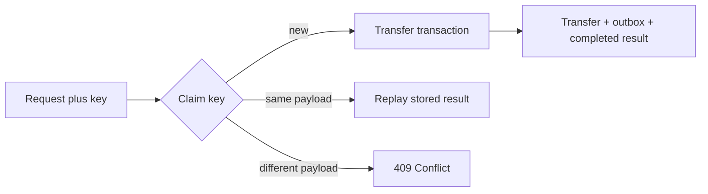

# 4. How would you design an API that needs idempotency?

**Technology:** ASP.NET Core and Web API

**Source question:** 4. How would you design an API that needs idempotency?

## 1. What problem does it solve?

Clients retry requests. A mobile connection drops, a gateway times out, a user double-clicks, or a worker restarts before recording the response. The first request may already have committed even though the caller never received the result. Retrying a non-idempotent operation such as `POST /transfers` can therefore debit an account twice.

Idempotency makes repeated execution of the same logical command produce one business effect and a stable outcome. It addresses reliability and consistency under ambiguous failures. Without it, systems accumulate duplicate payments, manual reconciliation, and misleading events. Durable coordination adds storage, indexes, and contention.

## 2. Explain it in simple language

A client labels one operation with a key. On retry, the server returns the remembered outcome instead of repeating the effect.

Think of a numbered deposit slip: presenting slip 847 twice should not create two deposits.

**One-sentence definition:** Idempotency guarantees that repeating the same logical request has the same externally observable business effect as processing it once.

**Memory rule:** Same intent, same key, one effect.

## 3. How does it work internally?

For a transfer command, the flow is:

1. The client creates a high-entropy key and reuses it only for retries of that exact intent.
2. ASP.NET Core authenticates and authorizes the caller, validates the request, and computes a canonical payload fingerprint.
3. The application attempts to insert an idempotency record scoped to the caller and operation. A database unique constraint—not an in-memory check—arbitrates concurrent requests.
4. The winner checks balances and concurrency, writes the transfer and outbox event, and stores a stable response.
5. A duplicate with the same fingerprint returns the stored result. The same key with a different fingerprint returns `409 Conflict`.
6. If a record is still processing, the API may return `409`/`425` with `Retry-After`, briefly wait, or expose a status resource. It must not run the command again blindly.



The claim and business write should share one database transaction. Otherwise a crash can create an orphaned claim or unrecorded effect. Cancellation only asks work to stop; it does not undo a commit. Merely rejecting duplicates is retry protection, not full idempotency, because the caller cannot recover the original outcome.

## 4. Realistic payment or banking example

Angular submits `POST /api/transfers` with an `Idempotency-Key` and transfer details. It generates a random key per intent, preserves it across retries, and creates a new one only for a new transfer. Frontend validation improves UX but is not enforcement.

ASP.NET Core authenticates, authorizes, validates, fingerprints the command, and delegates to the application service. The database is authoritative for balances, transfers, idempotency, and outbox rows. The broker distributes `TransferCreated`; consumers independently deduplicate at-least-once delivery.

Do not put secrets in keys or logs. Scope uniqueness by customer and operation.

## 5. Successful flow and failure flow

### Successful flow

1. Angular sends the command and key; the server independently authenticates, authorizes, and validates it.
2. The database accepts the unique `(CustomerId, Operation, Key)` claim.
3. In one transaction, the application checks available funds, creates the transfer, updates balances with optimistic concurrency, adds an outbox row, and stores the completed response.
4. The API commits and returns `201 Created` with the transfer identifier and `Location`.
5. An outbox worker publishes the event. A retry with the same key and fingerprint returns the same logical result without another debit.

### Failure flow

- **Validation or authorization:** return `400`/`422`, `401`, or `403` before claiming the key. Do not cache authentication failures.
- **Duplicate or concurrency:** the unique index selects one winner. A matching completed request replays the result; a mismatched fingerprint returns `409`. Balance row-version conflicts are retried carefully or returned as a domain conflict.
- **Timeout or cancellation:** the outcome is unknown, so retry with the same key. HTTP cancellation does not imply rollback.
- **Database failure:** an uncommitted transaction rolls back both the transfer and claim. A commit-acknowledgement failure is ambiguous, so retry and inspect the key rather than issue a new command.
- **Broker failure:** the transfer remains committed. The outbox worker retries publication with backoff; consumers deduplicate by event ID.
- **Partial completion:** atomic writes and the outbox close the database/event gap. Give external providers a stable downstream key and reconcile uncertain states.

## 6. Practical C#/.NET implementation

Keep HTTP thin. ASP.NET Core 8 introduced `IExceptionHandler`; register `AddProblemDetails()` and `UseExceptionHandler()` for sanitized errors.

```csharp
app.MapPost("/api/transfers", async (
    CreateTransfer request,
    HttpContext http,
    ITransferService service,
    CancellationToken ct) =>
{
    if (!http.Request.Headers.TryGetValue("Idempotency-Key", out var values) ||
        values.Count != 1 || values[0] is not { Length: > 0 and <= 128 } key)
        return Results.Problem(statusCode: 400, title: "One idempotency key is required");

    var result = await service.CreateAsync(
        http.User.GetRequiredCustomerId(), key, request, ct);

    return result.ToHttpResult(); // 201, replay, conflict, or in-progress ProblemDetails
}).RequireAuthorization("CreateTransfer");
```

The application boundary owns the contract:

```csharp
public interface ITransferService
{
    Task<TransferResult> CreateAsync(
        Guid customerId, string key, CreateTransfer command, CancellationToken ct);
}

public sealed class TransferService(BankingDbContext db, ILogger<TransferService> log)
    : ITransferService
{
    public async Task<TransferResult> CreateAsync(
        Guid customerId, string key, CreateTransfer command, CancellationToken ct)
    {
        var hash = RequestFingerprint.Create(command); // canonical, versioned representation
        await using var tx = await db.Database.BeginTransactionAsync(ct);

        var claim = await IdempotencyClaim.TryCreateAsync(
            db, customerId, "create-transfer", key, hash, ct);
        if (!claim.IsOwner)
            return await claim.ResolveExistingAsync(hash, ct);

        var transfer = await Transfer.CreateAsync(db, customerId, command, ct);
        db.OutboxMessages.Add(OutboxMessage.For(transfer.CreatedEvent));
        claim.Complete(transfer.Id, TransferResponse.From(transfer));

        await db.SaveChangesAsync(ct);
        await tx.CommitAsync(ct);
        log.LogInformation("Transfer {TransferId} committed for idempotency record {RecordId}",
            transfer.Id, claim.Id);
        return new TransferResult.Created(transfer.Id);
    }
}
```

`TryCreateAsync` must rely on a unique index; a prior `SELECT` races. Also use balance concurrency tokens, bounded keys/responses, expiry metadata, and a versioned fingerprint excluding correlation IDs. Store a DTO or resource ID, not arbitrary headers.

Log correlation, transfer, and internal record IDs while redacting the key. Integration-test simultaneous duplicates, a lost post-commit response, changed payload, cancellation near commit, and broker failure. Unit tests cannot prove database constraints.

## 7. Important design decisions

| Decision | Recommended default and trade-offs |
|---|---|
| Key ownership | Client keys suit gateway retries; server operation resources suit workflows. Require entropy, limits, tenant scope, and authorization. |
| Storage | Use the same relational database as the business write for atomicity. Redis is faster but cross-store consistency and eviction complicate correctness. |
| Stored value | Prefer resource ID plus stable fields. Full responses cost space and may retain sensitive headers. |
| Fingerprint | Hash a canonical, versioned semantic command. Raw JSON is easy but property order and harmless formatting produce false conflicts. |
| In-progress behavior | Return a documented retryable status. Waiting holds connections and amplifies load. |
| Retention | Keep records beyond the maximum retry/reconciliation window, then purge operationally. Forever is expensive; early expiry permits late duplicates. |

Define whether replay returns `201` or `200` and whether validation failures are retained. Active-active regions need global uniqueness or key affinity. Types model results; runtime constraints provide exclusivity.

## 8. When to use it and when not to use it

Use it for payments, orders, and provisioning where retries occur and duplicates cost. Exact-state `PUT` operations may need concurrency but not response caching. Safe reads need no key.

For low-value internal commands, a business identifier may suffice. Warning signs include treating keys as authentication, using process memory, generating a key per retry, retaining records forever, or duplicating downstream effects.

## 9. Compare it with related concepts

| Concept | Purpose/owner | Lifecycle and performance | Reliability/complexity | Typical limitation |
|---|---|---|---|---|
| Idempotency key | API owns one client intent | Retry-window storage cost | Handles ambiguous retries | Needs atomic claim and fingerprint |
| Optimistic concurrency | Prevents lost updates | Entity version check | Detects competing changes | Does not replay a result |
| Unique constraint | Database prevents duplicates | Persistent index | Strong arbitration | Cannot define semantic sameness |
| Message deduplication | Consumer owns event ID | Inbox retention cost | Handles repeated delivery | Does not protect HTTP effects |
| Distributed lock | Serializes contenders | Lease/coordination cost | Reduces overlap | Not durable idempotency |

For transfers, combine the record and unique constraint with balance concurrency, an outbox, and consumer deduplication.

## 10. Common production mistakes

- **Check-then-insert:** concurrent requests both see no row and debit twice. Detect with concurrency tests; enforce a unique index and handle its specific violation.
- **Key without fingerprint:** the same key reused for a different amount returns the wrong payment. Store and compare a canonical semantic hash.
- **Claim separate from effect:** crashes leave `Processing` forever or commit an unrecorded transfer. Use one transaction where possible and define stale-claim reconciliation.
- **Assuming timeout means failure:** callers create a new key and duplicate a committed payment. Document unknown outcomes and same-key retry.
- **Using process memory:** restarts and scaling lose protection. Use durable shared storage.
- **Leaking sensitive data:** raw keys, payloads, or responses enter logs. Bound, redact, encrypt where required, and authorize replayed resources against the current caller.
- **Ignoring downstream duplicates:** the HTTP effect is single but emails or ledger consumers repeat. Use outbox event IDs and consumer inboxes.
- **No lifecycle observability:** stuck rows and purge lag remain invisible. Measure replay/conflict counts, processing age, storage, and outbox lag.

## 11. Interview-ready answer

**30-second answer:** I require a client-generated idempotency key for commands such as creating a transfer, scope it to the authenticated customer and operation, and store it durably with a canonical request fingerprint. A database unique constraint chooses one concurrent winner. I commit the transfer, idempotency result, and outbox message atomically; matching retries replay the result, while key reuse with another payload returns `409`.

**Two-minute senior-level answer:** The server may commit while the client sees a timeout, so a retry must represent the same intent. Angular generates one high-entropy key per transfer and preserves it across retries. ASP.NET Core authenticates, authorizes, validates, and computes a semantic fingerprint. I claim `(customer, operation, key)` through a database unique constraint. The winner writes the transfer, balance changes, result, and outbox row in one transaction. A matching duplicate gets the stable result; a changed payload gets `409`; an in-progress request gets a documented retry response. Cancellation does not reverse a commit, and the outbox recovers broker failure. I define retention, stale-record reconciliation, redacted telemetry, regional ownership, and concurrent integration tests. Consumers separately deduplicate events because API idempotency ends at the business boundary.

**Likely follow-up questions:**

1. How do you make the idempotency record and transfer atomic?
2. What do you return when the same key arrives concurrently or with a different body?
3. How do retention and multi-region deployment affect the guarantee?

**Keywords:** logical intent, idempotency key, canonical fingerprint, unique constraint, atomic transaction, replayed result, optimistic concurrency, transactional outbox, ambiguous outcome, retention window, correlation ID.

**Red flags:** “POST cannot be idempotent”; generating a new key per retry; treating cancellation as rollback; using a lock as the guarantee; or ignoring downstream duplicates.

## 12. Test my understanding interactively

Answer this during revision: Two identical transfer requests arrive concurrently in different application instances, the database commits the first, its HTTP response is lost, and the broker is unavailable. Design the database records, transaction boundary, API responses, retry behavior, and recovery process that guarantee one debit and eventual event publication.

## Revision card

- **One-sentence definition:** Idempotency makes repeated delivery of one logical request produce one business effect and a stable outcome.
- **Memory rule:** Same intent, same key, one effect.
- **Recommended use:** Use durable, transactionally coordinated keys for costly commands exposed to retries and ambiguous failures.
- **Main danger:** A non-atomic check or incomplete downstream boundary creates the appearance of safety while duplicates remain possible.
- **Interview takeaway:** Explain key scope, fingerprinting, database uniqueness, atomic business/outbox writes, replay behavior, cancellation, retention, and testing.
