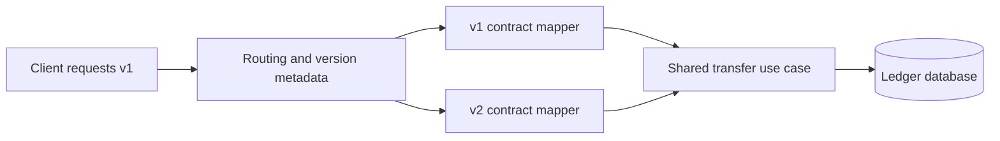

# 5. How do you version APIs without breaking existing clients?

**Technology:** ASP.NET Core and Web API

**Source question:** 5. How do you version APIs without breaking existing clients?

## 1. What problem does it solve?

An API is a runtime contract with independently deployed consumers. Renaming a field, changing status semantics, requiring an optional field, or removing an endpoint can break clients that cannot upgrade simultaneously.

Versioning lets the provider evolve while serving the old contract during migration. It protects reliability, compatibility, and maintainability. Without it, teams freeze the API or break clients in production. It does not replace compatible design: versioning every additive change creates needless support overhead.

## 2. Explain it in simple language

Think of electrical socket adapters: a building can introduce a new socket standard while keeping old outlets available until occupants have changed their equipment.

**One-sentence definition:** API versioning exposes materially different contracts under explicit identities so existing clients keep their original behaviour while migrating deliberately.

**Memory rule:** evolve compatibly; version only when the contract must break; retire with evidence.

A version is a promise about observable HTTP behaviour—not a build number, database schema version, or deployment number.

## 3. How does it work internally?

For `GET /api/v1/accounts/{id}/transactions`, the flow is:

1. ASP.NET Core routing reads the version from the URL, query string, header, or media type through an `IApiVersionReader`.
2. Endpoint metadata declares which versions each controller/action implements. Routing selects an endpoint matching both route and requested version.
3. Model binding creates that version's DTO; a mapper calls the version-neutral use case and maps its result to the promised shape.
4. Unsupported URL versions normally produce 404; header/query approaches normally use 400; media types can produce 406 or 415.
5. Headers and telemetry report supported/deprecated versions and provide retirement evidence.



Endpoint selection is runtime safety. Attributes and DTO types provide some compile-time safety inside the service, but they cannot prove that deployed external clients are compatible. Also, versioning is not content negotiation unless the chosen strategy places the version in the media type.

## 4. Realistic payment or banking example

Assume v1 creates a transfer with `amount` and returns `status: "accepted"`. A regulatory change requires v2 to accept `amount: { value, currency }`, require `purposeCode`, and return a richer status object. Changing v1 in place would reject old mobile clients.

Angular provides usability validation and explicitly calls v2; old clients remain on v1. ASP.NET Core authenticates, authorizes, enforces each contract, and maps into one command. The domain owns transfer rules. The ledger database is authoritative. An outbox commits with the ledger update; the broker distributes events but is not authoritative.

Both versions share genuinely common use-case behaviour, not public DTOs that must evolve independently.

## 5. Successful flow and failure flow

### Successful flow

1. Angular v2 sends the authenticated request, explicit URL version, correlation ID, and idempotency key.
2. Routing selects v2; backend validation and authorization run.
3. The v2 mapper creates the version-neutral command. The application checks idempotency and business rules.
4. Ledger entries, transfer state, and outbox event commit in one transaction.
5. The API maps the result to the v2 response. The publisher later sends the event; consumers deduplicate delivery.
6. Telemetry labels the route as v2 without using customer IDs as metric dimensions.

### Failure flow

- **Validation or authorization:** return documented `ProblemDetails`; Angular checks improve UX but cannot replace backend enforcement.
- **Duplicate request:** a database uniqueness constraint on `(client, idempotency-key)` returns the original compatible outcome. Retry protection is not true idempotency unless the same logical operation cannot execute twice.
- **Concurrency conflict:** optimistic concurrency returns 409; the caller reloads state or the service performs only a bounded, safe retry.
- **Timeout or cancellation:** propagate `CancellationToken`; cancellation does not roll back a commit. After uncertainty, retry with the same key or query status.
- **Database failure:** roll back and return an appropriate transient failure; never publish an event for uncommitted state.
- **Broker failure/partial completion:** the committed outbox remains pending and is retried with backoff. Do not reverse a valid transfer merely because publication is delayed.
- **Unsupported version:** return the documented status and migration link; never silently route v1 to v2.

## 6. Practical C#/.NET implementation

On .NET 10, use `Asp.Versioning.Mvc` 10.x and `Asp.Versioning.Mvc.ApiExplorer` for API exploration. The old `Microsoft.AspNetCore.Mvc.Versioning` name is pre-6.x. Match the package line to the supported target framework; 10.x targets .NET 10.

```csharp
using Asp.Versioning;

builder.Services.AddApiVersioning(options =>
{
    options.DefaultApiVersion = new ApiVersion(1, 0);
    options.AssumeDefaultVersionWhenUnspecified = false;
    options.ReportApiVersions = true;
    options.ApiVersionReader = new UrlSegmentApiVersionReader();
})
.AddMvc()
.AddApiExplorer(options =>
{
    options.GroupNameFormat = "'v'VVV";
    options.SubstituteApiVersionInUrl = true;
});
```

Requiring an explicit version avoids an unversioned request changing meaning when the default changes. Keep separate contract types and thin controllers:

```csharp
public sealed record CreateTransferV1(decimal Amount, Guid ToAccountId);
public sealed record MoneyV2(decimal Value, string Currency);
public sealed record CreateTransferV2(
    MoneyV2 Amount, Guid ToAccountId, string PurposeCode);

[ApiController]
[ApiVersion(1.0, Deprecated = true)]
[Route("api/v{version:apiVersion}/transfers")]
public sealed class TransfersV1Controller(ITransferService service) : ControllerBase
{
    [HttpPost]
    [Authorize(Policy = "CanCreateTransfer")]
    public async Task<IActionResult> Create(
        CreateTransferV1 request,
        [FromHeader(Name = "Idempotency-Key")] string key,
        CancellationToken ct)
    {
        var command = new CreateTransferCommand(
            request.Amount, "NZD", request.ToAccountId, "UNSPECIFIED", key);
        var result = await service.CreateAsync(command, User, ct);
        return result.ToV1ActionResult(this);
    }
}
```

The v2 controller uses `[ApiVersion(2.0)]`, maps its DTO, and calls the same interface. `ITransferService` handles authoritative validation, idempotency, concurrency, and transactions; infrastructure implements ledger/outbox repositories. Mappers produce version-specific DTOs and `ProblemDetails`.

Generate one OpenAPI document per version. Integration tests prove v1 stability, v2 validation, unknown-version rejection, authorization, idempotent retries, and document accuracy. Consumer contracts help, but retirement still requires production telemetry.

## 7. Important design decisions

**Version location.** URL segments are visible, cache-friendly, gateway-friendly, and my public-API default. Query parameters are overlooked, headers are less discoverable, and media types are operationally harder. Multiple styles multiply ambiguity and tests.

**Version granularity.** Prefer optional additions and tolerant readers. Create v2 for incompatible schema, validation, or semantics. Use expand-and-contract database migrations so versions coexist.

**Defaulting.** Require explicit versions for external clients. Assuming a default can ease migration of a previously unversioned internal API, but it hides client intent; never make “latest” the implicit selector for long-lived consumers.

**Implementation shape.** Separate controllers/DTOs make ownership and removal clear, at the cost of mapping code. One controller with many `[MapToApiVersion]` actions is compact for a small delta but becomes conditional spaghetti. Share domain/application behaviour, not transport contracts.

**Lifecycle.** Publish support and deprecation policy, communicate owners, report headers, measure calls by authenticated client/version, set a sunset date, and remove only after agreed criteria. Deprecation is notice, not immediate removal. Treat exposed schemas and error shapes as security surfaces; older versions still need patches, authorization, rate limits, and abuse monitoring.

## 8. When to use it and when not to use it

Use explicit versions when independent or third-party clients cannot upgrade atomically and an observable breaking change is necessary. It is also appropriate during a staged mobile migration or when a regulated partner contract has a fixed support window.

Do not version an optional addition, a fix restoring documented behaviour, an internal refactor, or a hidden database change. Use a feature flag for temporary rollout or a new endpoint for a new capability.

Warning signs are sprint-based versions, whole-codebase branches, duplicated logic, no client inventory, or silent “latest” selection. A private API deployed atomically with its only caller may not need versioning.

## 9. Compare it with related concepts

| Option | Purpose/ownership | Lifecycle and performance | Reliability/complexity | Typical use and limitation |
|---|---|---|---|---|
| Explicit API version | Provider owns parallel contracts | Long-lived; extra routes, tests, telemetry | Strong compatibility; support cost grows | Unavoidable breaking changes |
| Backward-compatible evolution | Provider extends one contract | Lowest routing/operational cost | Best default; requires tolerant clients | Optional fields; cannot change existing semantics |
| New resource/endpoint | Provider adds a capability | Independent endpoint lifecycle | Clear, but may duplicate concepts | New workflow, not merely a new representation |
| Feature flag | Product/operations controls behaviour | Temporary; evaluation overhead | Good rollout control, weak public contract | Canary rollout; not a permanent client version |
| Content negotiation | HTTP representation selection | Cache must vary correctly | Flexible but harder tooling/operations | JSON/XML or media-type versioning |

For the transfer change, I would keep v1, add URL-segment v2 with separate DTOs, and share a version-neutral use case. The semantic and required-schema changes are not safely additive; a feature flag would not give each client a stable contract.

## 10. Common production mistakes

- **Breaking v1 accidentally:** shared DTO edits alter both schemas. Detect with OpenAPI snapshots and consumer contracts; isolate DTOs and review compatibility.
- **Versioning everything:** routes explode. Require a documented breaking-contract decision.
- **Forever versions:** unknown consumers block removal. Authenticate clients, measure usage, assign owners, and enforce sunset policy.
- **Security neglect:** old endpoints miss fixes. Patch and security-test every supported version.
- **Silent fallback:** missing/unknown versions reach “latest.” Require explicit selection and integration-test rejection paths.
- **Controller branching:** `if (version == ...)` spreads across business logic. Route to contract-specific adapters and keep the domain version-neutral.
- **Inconsistent documentation:** Swagger advertises the wrong schemas. Generate and CI-validate per-version OpenAPI documents.
- **Unsafe cache/telemetry:** variants share cache entries or metrics explode. Configure cache keys and bounded version labels.
- **Removal by calendar alone:** active partner traffic breaks on sunset day. Combine contractual dates with client outreach, dashboards, alerts, and rehearsed rollback.

## 11. Interview-ready answer

**30-second answer:** I avoid breaking existing clients first by making changes additive. When semantics or required schemas must break, I expose an explicit version—usually a URL segment for a public API—keep separate DTOs and adapters, and reuse the application/domain logic. I run versions side by side, publish versioned OpenAPI, measure usage, mark the old version deprecated, communicate a sunset, and remove it only with contractual and telemetry evidence.

**Two-minute senior-level answer:** API versioning is contract lifecycle management, not merely adding `v2`. Optional additions can usually evolve v1; renamed fields, stricter input, or changed semantics need a new contract.

In ASP.NET Core I use the maintained `Asp.Versioning` packages, require explicit selection, and usually choose URL segments because routing, gateways, logs, and client support are straightforward. Each version owns request/response DTOs and mapping, while both call a shared version-neutral transfer use case. Backend authorization and validation apply to every version; the ledger remains the source of truth, and idempotency, concurrency, transactions, and outbox delivery are independent of HTTP versioning.

Operationally, I publish per-version OpenAPI, contract-test supported versions, report deprecation/sunset information, inventory consumers, and measure traffic. Deprecation starts migration; security maintenance continues. I retire v1 only after the support window, communication, usage evidence, and a rollback plan. Expand-and-contract database changes keep both versions deployable.

**Three follow-up questions:**

1. Which changes are truly breaking, and which can remain backward-compatible?
2. Why would you choose URL, header, query-string, or media-type versioning?
3. How would you prove that an old version is safe to retire?

**Keywords:** runtime contract, backward compatibility, explicit version, `Asp.Versioning`, URL segment, separate DTOs, tolerant reader, OpenAPI, deprecation, sunset, consumer telemetry, expand-and-contract, idempotency.

**Red flags:** “version every release,” “point v1 routes to v2,” “the frontend validation protects the API,” “deprecated means unsupported,” “Swagger proves consumers are compatible,” or “remove v1 when the new code deploys.”

## 12. Test my understanding interactively

During revision, answer this scenario-based interview question:

> Your bank has v1 mobile clients that send a scalar amount and v2 clients that send value, currency, and purpose code. A new compliance rule makes purpose mandatory, 8% of authenticated traffic still uses v1, one partner cannot upgrade for three months, and the database schema must change. How would you evolve, deploy, observe, deprecate, and eventually retire the API without breaking clients or creating duplicate transfers during uncertain retries?

## Revision card

- **One-sentence definition:** API versioning gives incompatible public contracts explicit identities so old and new clients can coexist safely.
- **Memory rule:** evolve compatibly; version only when the contract must break; retire with evidence.
- **Recommended use:** require an explicit, consistently located version and isolate transport DTOs while sharing application/domain behaviour.
- **Main danger:** accumulating insecure, unowned versions or silently changing the behaviour promised by an old one.
- **Interview takeaway:** a senior answer covers compatibility classification, implementation boundaries, migration telemetry, deprecation/sunset governance, and safe data/message recovery—not just route syntax.
