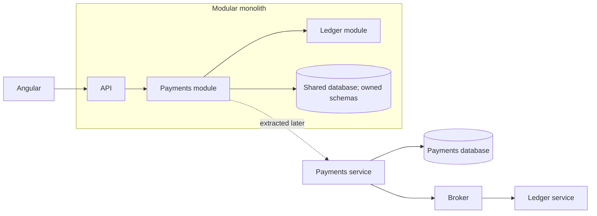

# 1. What is the difference between microservices and a modular monolith?

**Technology:** Microservices

**Source question:** 1. What is the difference between microservices and a modular monolith?

## 1. What problem does it solve?

As a system grows, one codebase can become a tightly coupled “big ball of mud”: payment code reaches directly into customer tables, releases require broad regression testing, and one change can break unrelated features. Teams then struggle to understand ownership, change safely, or scale the parts under pressure.

Both styles divide the business into cohesive capabilities. A modular monolith keeps modules in one deployable process; microservices deploy them independently and communicate over a network.

Without sound boundaries, either style fails. Microservices can retain coupling while adding latency, partial failures, eventual consistency, security exposure, and operational cost. The decision affects maintainability, autonomy, performance, reliability, scalability, security, and consistency.

## 2. Explain it in simple language

A modular monolith is one well-organized application: modules hide their internals and collaborate through defined in-process contracts. Microservices are multiple independently operated applications: each service owns a capability and normally its data, and collaboration crosses a network or message broker.

Think of bank departments in one building versus autonomous branches. Departments share utilities and opening hours; branches operate independently but need reliable communication.

**One-sentence definition:** A modular monolith separates business capabilities inside one deployment, whereas microservices separate them into independently deployable, networked services with independent operational ownership.

**Memory rule:** Modules separate code; services also separate deployment, process, and data ownership.

## 3. How does it work internally?

In a modular monolith, ASP.NET Core starts one process and DI container. Modules expose narrow contracts and keep domain types internal. Calls are fast and compile-time type-safe. Modules may use separate schemas, but one transaction can update several modules. A crash, resource exhaustion, or deployment can affect the whole application.

With microservices, each service has its own process, release, telemetry, and preferably data store. Calls cross HTTP/gRPC or a broker, introducing serialization, authentication, timeouts, retries, backpressure, and contract versioning. Compile-time types cannot guarantee deployed-peer compatibility. Asynchronous network I/O is not automatically parallel and still consumes connections and capacity.



Retrying a remote payment can duplicate money movement. A timeout means “outcome unknown,” so services need idempotency, outbox/inbox patterns, and reconciliation. Microservices are not simply small APIs: splitting controllers while sharing tables and releases creates a distributed monolith.

## 4. Realistic payment or banking example

For an account transfer, Angular performs usability validation, sends an idempotency key, and displays status. The backend still enforces balance, authorization, and limits.

In a modular monolith, Transfers enforces policy and asks Ledger through an internal interface to post entries. Owned schemas preserve boundaries, while one transaction commits the transfer, ledger entries, and outbox row.

With services, Transfer owns workflow data and Ledger owns postings and balances; Transfer cannot update ledger tables. Versioned broker messages make the workflow eventually consistent. Ledger is authoritative for balances; Transfer is authoritative for transfer status.

## 5. Successful flow and failure flow

### Successful flow

For the recommended initial modular monolith:

1. Angular submits a correlation ID and stable idempotency key.
2. ASP.NET Core authenticates, authorizes, and validates.
3. Transfers calls Ledger through an internal application contract, not its repository.
4. One database transaction inserts the transfer, balanced debit/credit entries, idempotency result, and outbox message using optimistic concurrency.
5. The API returns `201`; an outbox worker publishes `TransferPosted`.

After extraction, Transfer records `Pending`, publishes a command, Ledger posts idempotently, and emits a result that marks it `Completed`. Consumers tolerate duplicates and reordering.

### Failure flow

- **Validation/authorization:** return `400`/`422`, `401`, or `403`; frontend checks are not enforcement.
- **Duplicate request:** the database uniqueness constraint on customer, operation, and idempotency key returns the stored result. A lock or retry alone is not true idempotency.
- **Concurrency conflict:** re-evaluate a row-version mismatch or return `409`; never overwrite blindly.
- **Database failure:** the transaction rolls back. Request cancellation does not reverse a commit.
- **Timeout after commit:** the client retries with the same key because the outcome is uncertain.
- **Broker failure:** the outbox remains committed; publishing retries with backoff and age alerts.
- **Partial completion:** persist workflow state, retry idempotently, compensate when permitted, and reconcile; do not fake a distributed rollback.
- **Cancellation after posting:** requires a compensating business operation, not deleted history.

## 6. Practical C#/.NET implementation

Use a thin endpoint. `IExceptionHandler` and `AddProblemDetails()` are available from ASP.NET Core 8 onward.

```csharp
public interface ITransferUseCase
{
    Task<CreateTransferResult> ExecuteAsync(
        CustomerId customer, CreateTransfer command, string idempotencyKey,
        CancellationToken cancellationToken);
}

app.MapPost("/api/transfers", async (
    CreateTransfer command, HttpContext http, ITransferUseCase useCase,
    CancellationToken ct) =>
{
    var key = http.Request.Headers["Idempotency-Key"].SingleOrDefault();
    if (string.IsNullOrWhiteSpace(key) || key.Length > 128)
        return Results.Problem(statusCode: 400, title: "Valid idempotency key required");

    var result = await useCase.ExecuteAsync(
        http.User.GetRequiredCustomerId(), command, key, ct);
    return result.ToHttpResult();
}).RequireAuthorization("CreateTransfers");
```

The application service owns orchestration. `ILedgerModule.PostAsync(...)` is the module’s public contract:

```csharp
public sealed class TransferUseCase(
    BankingDbContext db, ILedgerModule ledger, ILogger<TransferUseCase> log)
    : ITransferUseCase
{
    public async Task<CreateTransferResult> ExecuteAsync(
        CustomerId customer, CreateTransfer cmd, string key, CancellationToken ct)
    {
        cmd.Validate();                         // backend/domain invariants
        await using var tx = await db.Database.BeginTransactionAsync(ct);
        var claim = await IdempotencyClaim.AcquireAsync(db, customer, key, cmd, ct);
        if (claim.Replay is not null) return claim.Replay;

        var transfer = Transfer.Start(customer, cmd);
        var posting = await ledger.PostAsync(
            transfer.Id, cmd.Amount, cmd.From, cmd.To, ct);
        transfer.MarkPosted(posting.Reference);
        db.AddRange(transfer, OutboxMessage.For(transfer.PostedEvent));
        claim.Complete(transfer.Id);
        await db.SaveChangesAsync(ct);
        await tx.CommitAsync(ct);

        log.LogInformation("Transfer {TransferId} committed", transfer.Id);
        return CreateTransferResult.Created(transfer.Id);
    }
}
```

In the monolith, `ILedgerModule` shares the scoped `DbContext` transaction. After extraction, do **not** hide HTTP behind it and assume atomicity; use durable pending state, an outbox command, and an idempotent inbox consumer.

EF Core concurrency tokens and unique indexes provide runtime guarantees; interfaces provide only compile-time safety. Return sanitized `ProblemDetails` with correlation IDs. Integration-test boundaries, database constraints, concurrent duplicates, cancellation near commit, lost responses, and broker outages; add consumer contract tests after extraction.

## 7. Important design decisions

| Decision | Recommended default and trade-offs |
|---|---|
| Starting architecture | Prefer a modular monolith for a new product unless independent scaling/release needs are proven. It is faster, cheaper, and easier to test, but requires boundary discipline. |
| Boundary | Align to business capability and ownership, not technical layers or table count. Poor boundaries create chatty calls and coordinated changes in either architecture. |
| Data | Give modules owned schemas/tables; services need exclusive data ownership. A shared service database improves joins but destroys autonomy and enlarges security blast radius. |
| Communication | In-process contracts inside the monolith; synchronous calls only where an immediate result is required; events for decoupling. Remote eventing improves resilience but adds lag, duplicates, and operational testing. |
| Extraction | Extract when a boundary has distinct scaling, availability, security, team, or release requirements. Extraction adds gateways, secrets, telemetry, deployment pipelines, and on-call ownership. |

A monolith scales as a unit; services can scale hot capabilities, but network hops cost more than method calls. Failure isolation requires timeouts, bulkheads, backpressure, and short dependency chains. More services also enlarge the authentication, patching, and audit burden.

## 8. When to use it and when not to use it

Use a modular monolith for a small-to-medium team, evolving domain, strong consistency, moderate scale, and shared release cadence. It can be the destination, not just an interim state.

Use microservices when mature capabilities have independent teams, release cadence, availability, regulatory isolation, or sharply different scaling needs.

Do not choose them because Kubernetes is available or another company uses them. A CRUD product owned by one team usually benefits from a modular monolith. Warning signs are one service per entity, shared writes, chatty call chains, coordinated releases, no on-call capability, and cross-service transactions.

## 9. Compare it with related concepts

| Concern | Modular monolith | Microservices |
|---|---|---|
| Purpose/ownership | Logical capability boundaries, often one product team | Operational autonomy per capability/team |
| Lifecycle | One build/deployment/process | Independent builds, deployments, processes |
| Performance | Fast in-process calls; coarse scaling | Network overhead; independent scaling |
| Reliability | Simple local transactions; shared failure boundary | Failure isolation possible; partial failures and eventual consistency |
| Data | Often one database with owned schemas | Service-owned databases; no cross-service writes |
| Complexity | Lower infrastructure, boundary discipline required | High platform, contract, security, and observability cost |
| Typical use | Evolving domain, shared release cadence | Mature boundaries, autonomous teams, different SLOs |
| Limitation | Whole application deploys/scales together | Distributed coordination and debugging |

A layered monolith separates technical concerns; a modular monolith enforces vertical business boundaries. Service-oriented architecture often uses broader enterprise services and centralized integration. “Microservice” implies autonomy, not a line count.

For transfers, I would start with enforced Transfers and Ledger modules, owned schemas, and an outbox. Extract only when measured autonomy benefits outweigh distributed consistency costs.

## 10. Common production mistakes

- **Folders mistaken for boundaries:** cross-module EF access creates coupling. Prevent it with architecture tests, internal types, projects, and schema permissions.
- **Premature decomposition:** unstable boundaries cause coordinated changes. Track coupled releases and clarify the domain in modules first.
- **Shared database ownership:** bypassed APIs create invisible coupling. Give each service exclusive write permissions.
- **Synchronous chains:** slow peers cause resource exhaustion. Trace latency, bound timeouts, and redesign long workflows asynchronously.
- **Blind retries:** timeouts cause duplicates or storms. Use idempotency, jittered backoff, budgets, and reconciliation.
- **Assuming exactly-once delivery:** redelivery repeats effects. Use outbox/inbox records and idempotent handlers.
- **Weak observability:** use propagated trace context, structured telemetry, business IDs, SLOs, and stuck-workflow alerts.
- **Trusting the internal network:** authenticate workloads, authorize operations, minimize exposure, rotate secrets, and audit privileges.
- **No ownership model:** maintain a service catalog, on-call responsibility, contracts, and deprecation policies.

## 11. Interview-ready answer

**30-second answer:** A modular monolith has strong business-module boundaries but runs and deploys as one application, so calls are in-process and local transactions are straightforward. Microservices move those boundaries into independently deployable processes with independent data ownership. That enables team, release, failure, and scaling autonomy, but introduces network failure, eventual consistency, contract versioning, security, observability, and operational cost. I normally start modular and extract only proven boundaries.

**Two-minute senior-level answer:** I distinguish logical modularity from operational autonomy. In a modular monolith, Transfers and Ledger expose narrow interfaces and own schemas but share an ASP.NET Core process, deployment, and possibly one ACID transaction. That gives low latency and simpler debugging, but the application scales and fails as a unit. With microservices, each capability owns its process, release, SLO, and database. Remote communication makes timeouts ambiguous; retries need idempotency; workflows need outbox/inbox patterns and compensation; deployed contracts need compatibility management. Microservices are justified by measurable independent scaling, availability, security, release, or team needs—not automatic maintainability. For a new transfer system, I would enforce Transfer and Ledger modules first, then extract only a stable boundary whose autonomy value exceeds the distributed-systems and on-call burden.

**Likely follow-up questions:**

1. How would you enforce module boundaries and data ownership in .NET?
2. What signals tell you that a module should become a service?
3. How would you replace a cross-module database transaction after extraction?

**Keywords:** bounded context, cohesion, coupling, independent deployment, data ownership, ACID, eventual consistency, idempotency, outbox/inbox, failure isolation, contract versioning, observability, SLO, distributed monolith.

**Red flags:** “Microservices are just smaller APIs”; “each entity should be a service”; “microservices always scale better”; shared tables across services; assuming retries or message delivery are exactly once; or presenting a modular monolith as unstructured legacy code.

## 12. Test my understanding interactively

Answer this during revision: Your modular banking application commits a transfer and its ledger entries in one transaction, but the Ledger module now needs a separate team, stricter availability target, and independent scaling. How would you decide whether to extract it, and how would you redesign data ownership, workflow consistency, idempotency, failure recovery, security, observability, and testing if you do?

## Revision card

- **One-sentence definition:** A modular monolith separates capabilities inside one deployment; microservices add independent process, deployment, data, and operational ownership.
- **Memory rule:** Modules separate code; services also separate runtime and ownership.
- **Recommended use:** Start modular unless a stable capability has proven autonomy, isolation, or scaling needs that justify extraction.
- **Main danger:** Creating a distributed monolith that keeps coupling while adding network and operational failure modes.
- **Interview takeaway:** Explain that the choice is a trade-off between simple in-process consistency and valuable, but costly, operational autonomy.
