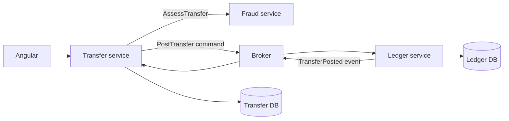

# 2. How do you decide service boundaries?

**Technology:** Microservices

**Source question:** 2. How do you decide service boundaries?

## 1. What problem does it solve?

A service boundary decides which capability, rules, data, and changes belong together so parts can evolve without constant coordination.

Poor boundaries create a distributed monolith: Transfer may call five services per request, releases remain coordinated, and shared tables make ownership ambiguous.

Good boundaries improve autonomy, fault isolation, security, and selective scaling. They cost latency, distributed consistency, contract management, and operations. Aim for **high cohesion and low coupling**, not maximum service count.

## 2. Explain it in simple language

Group behavior and data that change for the same business reasons. Separate capabilities with distinct ownership, lifecycle, security, or availability needs.

Think of bank departments: ledger posts entries, fraud assesses risk, and notifications deliver messages. One department for everything mixes responsibilities; one per rule creates bureaucracy.

**One-sentence definition:** A service boundary encloses a cohesive business capability and its data behind a stable contract so it can evolve and operate with minimal coordination.

**Memory rule:** Split by business responsibility and change pattern, not by controller, entity, or table.

## 3. How does it work internally?

Boundary discovery is iterative:

1. Map business workflows and language with domain experts—for example, “initiate transfer,” “assess risk,” and “post ledger entries.”
2. Identify invariants that must be enforced atomically. Balanced debit and credit entries belong together because the ledger must never be unbalanced.
3. Cluster rules, behavior, and data that change together. These clusters often become Domain-Driven Design bounded contexts.
4. Examine coupling: call frequency, payload size, shared transactions, coordinated releases, and ownership disputes. Chatty or cyclic boundaries are warning signs.
5. Overlay team ownership, scaling, availability, regulatory, and data-sensitivity needs.
6. Define contracts, test important flows and failures, then measure coupling. Boundaries are hypotheses.



Each service runs in its own process and owns its database writes. Network calls add authentication, timeouts, retries, and version compatibility. A timeout means “unknown outcome,” not “nothing happened.” Broker delivery is normally at least once, so consumers tolerate duplicates. Async I/O avoids blocking while waiting; it does not automatically make work parallel.

A bounded context is a semantic model boundary, not automatically a microservice; several may remain modules until independence is valuable.

## 4. Realistic payment or banking example

Angular collects transfer details and an idempotency key, performs usability validation, and displays status. It never decides authorization, funds, or posting correctness.

ASP.NET Core’s Transfer service authenticates the customer, authorizes account access, validates the request, owns the transfer workflow, and records its status. Fraud owns risk models and decisions. Ledger owns accounts, balances, and immutable postings. Notification owns delivery preferences and messages.

Ledger is authoritative for balances and postings; Transfer for workflow status. The broker carries messages but is not a business source of truth. Services do not access each other’s tables.

Debit and credit belong inside Ledger because double-entry invariants must be atomic. Notification can be separate because delayed email must not prevent posting. Fraud can start as a Transfer module unless specialist ownership or scaling justifies extraction.

## 5. Successful flow and failure flow

### Successful flow

1. Angular sends the transfer with an opaque idempotency key and trace context.
2. Transfer authenticates, authorizes, validates, and atomically stores `Pending` plus an outbox `PostTransfer` command.
3. An outbox worker publishes the command. Ledger’s inbox claims its message ID once.
4. Ledger checks its invariant and, in one database transaction, records balanced entries, the inbox receipt, and a `TransferPosted` outbox event.
5. Transfer consumes that event idempotently and marks the workflow `Completed`.
6. Notification reacts independently. Its failure cannot undo ledger entries.

### Failure flow

- **Validation or authorization failure:** return sanitized `400`/`422`, `401`, or `403`. Backend enforcement remains mandatory.
- **Duplicate request:** a unique constraint on customer, operation, and idempotency key returns the original result. Retry protection alone is not true idempotency.
- **Concurrent spending:** Ledger uses a database isolation strategy or optimistic concurrency token; on conflict it re-evaluates funds rather than blindly retrying stale logic.
- **Database failure:** the local transaction rolls back. Request cancellation stops cooperative work but does not reverse an already committed transaction.
- **Broker outage:** the committed outbox remains pending and publishes later with bounded backoff; alert on its age.
- **Timeout or lost response:** keep `Pending`; query by ID or retry with the same key because the outcome is uncertain.
- **Partial completion:** persist state, retry idempotently, reconcile, and use a compensating transaction when reversal is allowed—not a distributed rollback.
- **Cancellation after submission:** durable processing continues after acceptance; cancellation is not financial reversal.

## 6. Practical C#/.NET implementation

Use a thin API and express the boundary through an application contract. `AddProblemDetails()` is built into ASP.NET Core 8 and later; the example is suitable for supported .NET 8+ applications.

```csharp
app.MapPost("/transfers", async (
    CreateTransfer request, HttpContext http,
    ICreateTransfer useCase, CancellationToken ct) =>
{
    var key = http.Request.Headers["Idempotency-Key"].SingleOrDefault();
    if (string.IsNullOrWhiteSpace(key) || key.Length > 128)
        return Results.Problem(400, title: "Valid idempotency key required");

    var result = await useCase.ExecuteAsync(
        http.User.GetRequiredCustomerId(), request, key, ct);
    return Results.Accepted($"/transfers/{result.Id}", result);
}).RequireAuthorization("CreateTransfer");
```

The use case orchestrates, the domain owns transitions, and infrastructure persists and publishes.

```csharp
public sealed class CreateTransferHandler(
    TransferDbContext db, ILogger<CreateTransferHandler> log)
    : ICreateTransfer
{
    public async Task<TransferAccepted> ExecuteAsync(
        CustomerId customer, CreateTransfer request, string key,
        CancellationToken ct)
    {
        request.Validate(); // server-side shape checks

        var prior = await db.IdempotencyResults
            .SingleOrDefaultAsync(x => x.CustomerId == customer && x.Key == key, ct);
        if (prior is not null) return prior.ToResponse(request);

        var transfer = Transfer.Start(customer, request); // domain invariants
        db.Transfers.Add(transfer);
        db.Outbox.Add(OutboxMessage.For(new PostTransfer(
            transfer.Id, request.FromAccount, request.ToAccount, request.Amount)));
        db.IdempotencyResults.Add(IdempotencyResult.Accepted(customer, key, request, transfer.Id));

        await db.SaveChangesAsync(ct); // one local transaction; unique key enforced
        log.LogInformation("Transfer {TransferId} accepted", transfer.Id);
        return new(transfer.Id, "Pending");
    }
}
```

Store a request hash so reuse of a key with different data is rejected. EF Core unique indexes and concurrency tokens give runtime protection; C# interfaces only give compile-time compatibility. Propagate trace context, avoid logging account data, and include a trace ID in `ProblemDetails`.

Unit-test invariants and transitions. Integration-test constraints, concurrent requests, rollback, outbox publishing, duplicate delivery, cancellation around commit, and Ledger compatibility.

## 7. Important design decisions

| Decision | Recommended default and trade-offs |
|---|---|
| Boundary signal | Start with capability, invariants, and language. Team topology can refine it; entity-per-service creates chatty workflows. |
| Granularity | Prefer a few cohesive services. Smaller services isolate releases but increase latency, pipelines, tests, and on-call load. |
| Data ownership | One exclusive writer per dataset. Replicated read models help queries; shared writes destroy autonomy and auditability. |
| Communication | Use synchronous calls for immediate decisions and durable messaging for decoupled workflows. Messaging adds lag, duplicates, ordering, and reconciliation. |
| Consistency | Keep hard invariants in one transaction. Across services use explicit states, outbox/inbox, compensation, and reconciliation. |
| Deployment timing | Begin with modules when uncertain. Extract on evidence of independent release, SLO, security, or scaling value. |

Separate sensitive data when that narrows authorization and database permissions, but more endpoints expand the attack surface. Every service needs ownership, telemetry, deployment, secrets, and incident response. Testing shifts toward contract, component, and workflow tests.

## 8. When to use it and when not to use it

Create a service when a stable capability owns its invariants and data and gains measurable value from independent release, scaling, availability, or regulatory isolation.

Keep modules when one team changes capabilities together, the domain is evolving, cross-capability transactions dominate, or operational needs are similar.

Warning signs include service-per-table, technical-layer splits, shared databases, cycles, synchronous chains, coordinated releases, and no operational owner. If splitting increases coordination, it is wrong or premature.

## 9. Compare it with related concepts

| Concept | Purpose/ownership | Lifecycle and performance | Reliability/complexity | Typical use and limitation |
|---|---|---|---|
| Service boundary | Operationally autonomous capability and data owner | Independent deployment; network cost | Partial failures; highest operational cost | Proven autonomy need; distributed consistency |
| Bounded context | One domain model and language | May be in-process | Prevents model ambiguity | Not automatically a deployment unit |
| Modular-monolith module | Capability inside one application | One deployment; fast calls | Local transactions; shared failure | Cannot scale/deploy alone |
| Aggregate | Small consistency boundary inside a domain | Loaded/changed transactionally | Protects invariants; contention if oversized | Entities changed atomically; not a service |

I would begin with Transfer, Ledger, Fraud, and Notification modules, keep balanced posting in one Ledger transaction, and extract only on team or operational evidence.

## 10. Common production mistakes

- **Entity-based splitting:** causes chatty calls. Detect it through traces and coordinated changes; redesign around workflows and invariants.
- **Shared database access:** bypasses contracts and security. Audit permissions and enforce exclusive write ownership.
- **Hard invariant across services:** partial failure produces invalid state. Move the invariant into one boundary or model an explicit saga with compensation.
- **Blind retries:** duplicate effects or overload dependencies. Use deadlines, jitter, idempotency, and reconciliation.
- **Ignoring ownership:** services owned by several teams still require coordination. Publish owners, SLOs, and deprecation policy.
- **Leaking models in events:** internal changes break consumers. Publish minimal, version-tolerant facts and test compatibility.
- **Weak observability:** add trace, message, and business IDs plus outbox-age and pending-state alerts, without logging sensitive data.
- **Premature extraction:** unstable concepts cause repeated migrations. Prove boundaries with modules and architecture tests before adding a network.

## 11. Interview-ready answer

**30-second answer:** I define boundaries around business capabilities, not tables or layers. I look for atomic rules, concepts that change together, clear ownership, and genuine needs for independent deployment, scaling, security, or availability. Chatty calls, shared writes, or coordinated releases signal a poor boundary. I usually prove it as a module before extraction.

**Two-minute senior-level answer:** I start with business language, workflows, invariants, and change patterns. Balanced debit and credit entries must commit atomically, so they belong inside Ledger; Transfer owns workflow state; Notification is independent because delivery failure must not invalidate posting. I then consider ownership, release cadence, SLOs, scaling, regulation, and data sensitivity. A good boundary has cohesive rules, exclusive data ownership, and little cross-service coordination. Remote calls create ambiguous timeouts, so workflows need idempotency, outbox/inbox processing, explicit states, compensation, and reconciliation. I start with modules when uncertain, measure call and change coupling, and extract only when autonomy outweighs distributed-system cost.

**Likely follow-up questions:**

1. Which invariants would make you merge two proposed services?
2. How would you detect that existing service boundaries are wrong?
3. How do you migrate data safely when extracting a module?

**Keywords:** business capability, bounded context, cohesion, coupling, invariants, data ownership, independent deployment, team topology, outbox/inbox, idempotency, eventual consistency, contract versioning, observability, distributed monolith.

**Red flags:** “one service per entity/table”; “make services as small as possible”; using a shared database; treating a bounded context as automatically deployable; ignoring team and operational ownership; assuming messaging is exactly once; or claiming eventual consistency fixes every cross-service invariant.

## 12. Test my understanding interactively

Answer this during revision: A bank has separate Account, Balance, Debit, Credit, Transfer, Fraud, and Notification services, but releases are coordinated, Transfer makes five synchronous calls, and several services update the same account tables. How would you assess the boundaries and redesign them while preserving posting correctness, team ownership, security, availability, and a safe migration path?

## Revision card

- **One-sentence definition:** A service boundary encloses a cohesive business capability and its owned data behind a stable contract.
- **Memory rule:** Split by business responsibility and change pattern, not entity or table.
- **Recommended use:** Extract a proven bounded capability when independent ownership, deployment, scaling, security, or reliability creates real value.
- **Main danger:** A distributed monolith with shared data, chatty calls, and all the costs of network failure.
- **Interview takeaway:** Explain boundaries through invariants, data ownership, coupling, and operational evidence—and show that starting modular is often the senior choice.
