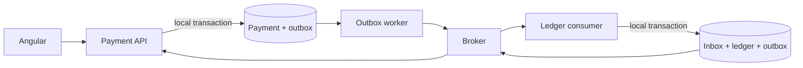

# 3. How do you handle distributed transactions and eventual consistency?

**Technology:** Microservices

**Source question:** 3. How do you handle distributed transactions and eventual consistency?

## 1. What problem does it solve?

A business operation often spans services that own separate databases. A card payment may require Payment to record the request, Ledger to post money, and Notification to send a receipt. A normal database transaction cannot atomically commit all three stores and a message broker.

Partial completion can leave money posted while Payment says `Pending`, or a database committed while event publication failed. Blind retries can double-charge, and synchronous chains amplify outages.

The goal is to keep local invariants correct and converge safely through durable progress, duplicate handling, compensation, and reconciliation.

## 2. Explain it in simple language

Each service commits its own work, then sends durable facts or commands. Systems may temporarily disagree before reaching a defined terminal state.

Like a tracked parcel, every hand-off is recorded; missed hand-offs retry, duplicate scans do nothing, and failure follows a return process.

**One-sentence definition:** A distributed transaction coordinates independently committed local transactions so the business operation converges safely without one global ACID transaction.

**Memory rule:** Commit locally, publish durably, consume idempotently, compensate explicitly, reconcile continuously.

## 3. How does it work internally?

A common implementation is a saga plus transactional outbox and inbox:

1. Payment validates the command and starts a saga in `Pending`.
2. In one local database transaction it saves Payment state and an outbox message.
3. A background publisher reads unpublished outbox rows, sends them to the broker, and marks them published. A crash between send and marking causes a duplicate, which is expected.
4. Ledger receives the command. In one local transaction it claims the message in an inbox table, checks funds and concurrency, posts balanced debit and credit entries, and creates its own outbox event.
5. Payment consumes `FundsPosted` idempotently and transitions to `Completed`.
6. A later reversible failure issues an audited compensating command, not a rollback through time.
7. A reconciler detects stuck states and repairs or escalates them.



Delivery is normally **at least once**. Ordering may apply only within a partition or session, so handlers validate current state. `async` frees a thread during I/O; it does not make steps simultaneous. Cancellation cannot undo a committed transaction.

Two-phase commit (2PC) coordinates prepare and commit votes across compatible participants. Locks, coordinator failure, limited support, and coupling make it an uncommon microservice default.

## 4. Realistic payment or banking example

A customer submits a card payment. Angular validates format, creates an opaque idempotency key, and polls for status. It never authorizes the account, decides funds, or treats `202 Accepted` as success.

ASP.NET Core Payment authenticates, authorizes, validates, owns `Pending/Completed/Failed`, and coordinates the saga. Ledger owns funds rules and immutable double-entry postings. Its database is authoritative for money; Payment’s is authoritative for workflow status. Notification owns receipts. The broker transports messages but is not a business source of truth.

Balanced debit and credit entries stay inside one Ledger database transaction because that invariant must never be eventually consistent. Payment status and receipt delivery may lag safely.

## 5. Successful flow and failure flow

### Successful flow

1. Angular sends the payment and idempotency key over TLS.
2. Payment authenticates, authorizes, validates, atomically stores `Pending`, request hash, and `PostFunds`, then returns `202` with a status URL.
3. The worker publishes with message, correlation, causation, and trace identifiers.
4. Ledger claims the message, atomically posts both entries, and records `FundsPosted` in its outbox.
5. Payment applies that event once and becomes `Completed`; Notification independently sends the receipt.

### Failure flow

- **Validation or authorization:** reject with sanitized `400`/`422`, `401`, or `403`. Only the backend enforces trust boundaries.
- **Duplicate request:** a unique `(customer, idempotency-key)` constraint returns the stored outcome. Reusing the key with a different request hash is rejected.
- **Concurrency conflict:** Ledger uses suitable isolation or optimistic concurrency and re-evaluates funds rather than retrying stale decisions.
- **Database failure:** that service’s local transaction rolls back, and the broker redelivers later.
- **Broker failure:** outbox rows remain pending; workers retry with backoff and jitter, with alerts on age.
- **Timeout or lost response:** the outcome is unknown. The client queries status or retries with the same key, never a new key.
- **Partial completion:** saga state drives retry or an allowed compensating reversal. Posted entries are never deleted.
- **Cancellation:** before commit, cooperative cancellation may abort work; after acceptance, durable processing continues. Cancellation is not payment reversal.
- **Poison message:** after bounded retries, quarantine, alert, and replay under control.

## 6. Practical C#/.NET implementation

For supported .NET 8+ applications, `AddProblemDetails()` and `IProblemDetailsService` standardize errors.

```csharp
app.MapPost("/payments", async (
    CreatePayment command, HttpContext http,
    ICreatePayment handler, CancellationToken ct) =>
{
    var key = http.Request.Headers["Idempotency-Key"].SingleOrDefault();
    if (string.IsNullOrWhiteSpace(key) || key.Length > 128)
        return Results.Problem(statusCode: 400,
            title: "A valid idempotency key is required");

    var result = await handler.ExecuteAsync(
        http.User.GetRequiredCustomerId(), key, command, ct);

    return Results.Accepted($"/payments/{result.Id}", result);
}).RequireAuthorization("CreatePayment");
```

The application handler stores state and intent to publish in the same local transaction:

```csharp
public sealed class CreatePaymentHandler(PaymentsDbContext db)
    : ICreatePayment
{
    public async Task<PaymentAccepted> ExecuteAsync(
        Guid customerId, string key, CreatePayment cmd, CancellationToken ct)
    {
        cmd.Validate();
        var hash = RequestHash.For(cmd);

        var existing = await db.PaymentRequests
            .SingleOrDefaultAsync(x => x.CustomerId == customerId && x.Key == key, ct);
        if (existing is not null)
            return existing.SameRequest(hash)
                ? existing.ToResponse()
                : throw new IdempotencyConflictException();

        var payment = Payment.Start(customerId, cmd);
        db.Payments.Add(payment);
        db.PaymentRequests.Add(PaymentRequest.Accepted(customerId, key, hash, payment.Id));
        db.Outbox.Add(OutboxMessage.Create(new PostFunds(
            payment.Id, cmd.AccountId, cmd.MerchantId, cmd.Amount)));

        await db.SaveChangesAsync(ct);
        return new(payment.Id, payment.Status.ToString());
    }
}
```

Enforce idempotency with a unique index because the prior read races. On conflict, reload the winner. The consumer uses an inbox constraint and one transaction:

```csharp
public async Task Handle(PostFunds message, CancellationToken ct)
{
    if (await db.Inbox.AnyAsync(x => x.MessageId == message.MessageId, ct)) return;

    var account = await db.Accounts.SingleAsync(x => x.Id == message.AccountId, ct);
    var posting = LedgerPosting.Create(account, message); // funds + balanced-entry rules
    db.Postings.Add(posting);
    db.Inbox.Add(new InboxReceipt(message.MessageId));
    db.Outbox.Add(OutboxMessage.Create(new FundsPosted(message.PaymentId)));
    await db.SaveChangesAsync(ct);
}
```

Use SQL Server `rowversion` or its provider equivalent. Log structured transitions, propagate W3C trace context, and exclude secrets. Unit-test transitions; integration-test constraints, duplicates, crashes, cancellation around commit, and full workflows.

## 7. Important design decisions

| Decision | Recommended default and trade-offs |
|---|---|
| Consistency boundary | Keep hard invariants in one owner and local ACID transaction; splitting makes correctness harder. |
| Coordination | Prefer orchestration for workflow visibility; choreography reduces central coupling but can hide cycles. |
| Messaging | Outbox/inbox is portable. “Exactly once” broker features do not cover every external side effect. |
| Compensation | Define valid business reversals; some actions are irreversible. |
| Concurrency | Optimistic concurrency suits low contention; stronger locking reduces throughput and can deadlock. |
| Client contract | Return `202` plus status for durable async work; use synchronous completion inside one reliable boundary. |

Require authorization at consumers, protected transport, least privilege, and redacted telemetry. Define retry budgets, dead-letter ownership, replay tooling, versioning, and retention.

## 8. When to use it and when not to use it

Use a saga when a workflow genuinely crosses service owners, intermediate states are acceptable, and recovery is defined. Outbox/inbox also supports reliable event publication.

Do not distribute work to follow service-per-table fashion. Keep atomic debit and credit in Ledger. A modular monolith and one transaction suit one team or tightly coupled rules. A synchronous call may suffice for a non-critical lookup.

Warning signs include excessive steps, unclear compensations, unreconciled `Pending` states, broker business logic, shared writes, and unscoped exactly-once claims.

## 9. Compare it with related concepts

| Option | Purpose and ownership | Performance/lifecycle | Reliability and complexity | Typical use and limitation |
|---|---|---|---|---|
| Local ACID transaction | One database owner | Fast; request-scoped | Strong atomicity; low complexity | Best for Ledger posting; cannot span independent stores |
| Orchestrated saga | Coordinator owns workflow state | Multi-step and eventually consistent | Visible recovery; coordinator complexity | Payment workflow; requires compensation/reconciliation |
| Choreographed saga | Services react to events | Decoupled but harder to trace | No central coordinator; cycles emerge | Short, simple reactions; weak global visibility |
| Two-phase commit | Coordinator atomically votes across participants | Locks resources and couples availability | Strong atomicity; coordinator/support burden | Controlled homogeneous systems; poor fit for most cloud microservices |
| Outbox/inbox | Reliably bridges database state and messages | Background publication; duplicate delivery | Durable and portable; cleanup/monitoring needed | Building block, not the complete business workflow |

I would keep posting in one Ledger transaction and use an orchestrated saga with outbox/inbox. This gives explicit state and auditability; Notification remains choreographed and non-blocking.

## 10. Common production mistakes

- **Dual-writing database then broker:** crashes lose events. Reconcile and use an outbox.
- **Assuming exactly once:** duplicates create charges. Use stable IDs, unique constraints, and idempotent effects.
- **Confusing retry with idempotency:** retries repeat execution; idempotency gives one logical effect. Persist identity and outcome.
- **Deleting history during compensation:** destroys audit evidence. Post authorized reversal entries referencing the original.
- **Unbounded retries:** overload dependencies. Use backoff, jitter, limits, quarantine, and controlled replay.
- **Ignoring evolution and ordering:** consumers regress state. Use tolerant contracts and guarded transitions.
- **Weak observability:** health looks green while payments stall. Measure saga age, outbox lag, retries, duplicates, and reconciliation differences.
- **Leaking sensitive data:** minimize payloads, encrypt, restrict access, and enforce retention.
- **No failure injection:** mocks miss commit/publish races. Test crashes against production-like infrastructure.

## 11. Interview-ready answer

**30-second answer:** I keep hard invariants, such as balanced ledger entries, in one local ACID transaction, then coordinate the wider payment with a saga. Outbox/inbox, idempotency, guarded transitions, retries, compensation, and reconciliation let it converge despite duplicates and ambiguous timeouts.

**Two-minute senior-level answer:** I first classify rules requiring immediate consistency. Debit and credit belong in one Ledger transaction; workflow status and notifications may be eventually consistent. Payment atomically stores `Pending` and an outbox command. Ledger uses an inbox constraint, posts balanced entries, and emits an outbox event. Payment consumes it idempotently. A timeout is an unknown result, so clients reuse the key and query status. Failures use bounded retries, valid reversals use compensating entries, and reconciliation catches stuck state. I trace correlation and causation IDs, monitor outbox and saga age, and test crashes around commits. I consider 2PC only where all participants support it and its availability cost is acceptable.

**Likely follow-up questions:**

1. How do outbox and inbox tables close the database-to-broker failure gaps?
2. How would you make an external payment-provider call idempotent when you do not control its database?
3. When would you choose orchestration, choreography, or two-phase commit?

**Keywords:** local ACID transaction, saga, eventual consistency, transactional outbox, inbox, at-least-once delivery, idempotency, optimistic concurrency, compensation, reconciliation, correlation ID, explicit state machine.

**Red flags:** claiming microservices provide one automatic rollback; relying on exactly-once messaging; retrying payments with new IDs; treating cancellation as rollback; compensating by deleting ledger records; placing a hard invariant across service databases; or having no reconciliation and operational recovery plan.

## 12. Test my understanding interactively

Answer this during revision: A payment is recorded as `Pending`, Ledger successfully posts the debit and credit, but the `FundsPosted` event is delivered twice after Payment’s first acknowledgement is lost; meanwhile the customer retries after a timeout—design the state transitions, idempotency records, recovery process, observability, and client response that prevent a double charge and eventually show the correct result.

## Revision card

- **One-sentence definition:** A distributed transaction coordinates independent local commits so a multi-service operation safely converges without one global ACID transaction.
- **Memory rule:** Commit locally, publish durably, consume idempotently, compensate explicitly, reconcile continuously.
- **Recommended use:** Keep financial invariants local and use a saga plus outbox/inbox for necessary cross-service workflows.
- **Main danger:** Partial effects, duplicate side effects, and indefinitely inconsistent state hidden behind blind retries.
- **Interview takeaway:** Explain consistency boundaries first, then durable messaging, idempotency, explicit states, compensation, reconciliation, and operations.
