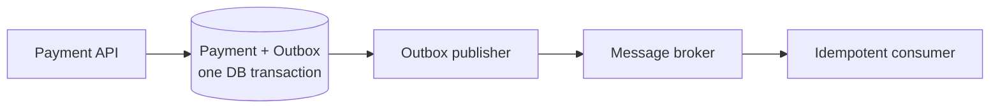

# 4. What is the outbox pattern, and why is it useful?

**Technology:** Microservices

**Source question:** 4. What is the outbox pattern, and why is it useful?

## 1. What problem does it solve?

A service often needs to change its database and publish an event as one logical operation. A normal database transaction cannot atomically include a separate broker such as Azure Service Bus, RabbitMQ, or Kafka.

If it commits first and crashes before publishing, downstream services never learn of the payment. If it publishes first and commit fails, consumers act on nonexistent state. Retries can duplicate effects. This is the **dual-write problem**.

Distributed transactions are often unsupported across cloud databases and brokers and can harm availability. The outbox instead makes the database update and publish intent atomic. It improves reliability at the cost of eventual consistency, duplicate handling, and operational machinery.

## 2. Explain it in simple language

The application writes the business change and outgoing message in one database transaction. A separate publisher sends pending rows to the broker.

**Analogy:** A bank clerk updates the account book and places a stamped instruction in a locked dispatch tray during the same procedure. A courier may arrive later or twice, but the instruction cannot be lost merely because the courier was unavailable.

**One-sentence definition:** The transactional outbox stores a business change and its publishable event atomically, then delivers that event asynchronously to a message broker.

**Memory rule:** **Commit intent locally; publish reliably later.**

## 3. How does it work internally?

1. An API request reaches the application use case.
2. Domain logic changes an aggregate and raises a domain event.
3. The persistence layer converts that event into a versioned integration-event envelope and inserts it into an `OutboxMessages` table.
4. The aggregate update and outbox insert commit in one local database transaction. If either fails, both roll back.
5. A background worker claims pending rows in batches and publishes them asynchronously. Async I/O does not imply parallel publishing; concurrency must be chosen explicitly.
6. After broker acknowledgement, the worker marks the row processed. It retries transient failures with backoff and records attempts and errors.
7. Consumers deduplicate by stable message ID and process idempotently.



The gap between broker acknowledgement and marking a row processed can cause republishing, so outbox normally provides **at-least-once delivery**, not exactly-once processing. Ordering is not automatic; use aggregate ID plus sequence/version where required.

Multiple publishers need safe claiming, such as short leases or skip-locked semantics. Never hold a database transaction during slow network publishing. Index pending scans and define retention.

## 4. Realistic payment or banking example

An Angular user approves a corporate payment. Angular supplies an idempotency key and displays downstream status; its validation is not trusted enforcement.

ASP.NET Core authenticates, authorizes, validates, checks idempotency and payment state, then writes `Payment.Status = Approved` and `PaymentApprovedV1` to the outbox. The **Payment database is authoritative for approval state**; the broker only transports facts.

Ledger and notification services consume through their own inbox/deduplication records. Their projections may lag, which the frontend must show rather than claiming all downstream work is complete.

## 5. Successful flow and failure flow

### Successful flow

1. Angular sends the approval with idempotency and correlation IDs.
2. The API authenticates, authorizes, and validates limits and state.
3. Optimistic concurrency checks the payment version.
4. One transaction updates the payment, stores the request outcome, and inserts the outbox event.
5. The API returns the committed payment status, commonly `200` or `202` depending on the contract.
6. The worker publishes; the broker acknowledges; the worker marks the row processed.
7. Consumers deduplicate, update their databases, and acknowledge independently.

### Failure flow

- **Validation or authorization failure:** return `ProblemDetails` before changing state; never create an outbox event.
- **Duplicate request:** return the stored result for the same key and request fingerprint; retries alone are not idempotency.
- **Concurrency conflict:** reject with `409 Conflict` or reload and re-evaluate; never silently overwrite approval state.
- **Database failure:** rollback removes both changes. Cancellation asks work to stop; transaction disposal/rollback provides rollback.
- **Broker unavailable or timeout:** the committed outbox row remains pending. Retry with exponential backoff and jitter. Do not undo an already approved payment merely because notification is delayed.
- **Uncertain publish result:** retry the same message ID. The consumer's inbox/idempotent business operation prevents repeated effects.
- **Crash after publish but before marking processed:** duplicate delivery is expected and handled by consumers.
- **Poison event:** cap attempts, alert, and provide an audited replay/dead-letter process.

## 6. Practical C#/.NET implementation

With supported .NET 8 or later and EF Core, keep orchestration outside the controller: the application service performs business work and infrastructure persists and publishes events.

```csharp
public async Task<ApproveResult> ApproveAsync(
    ApprovePayment command, CancellationToken ct)
{
    var payment = await db.Payments.SingleAsync(x => x.Id == command.Id, ct);
    payment.Approve(command.ApproverId); // enforces domain state transitions

    var message = OutboxMessage.Create(
        id: Guid.NewGuid(),
        type: "payments.approved.v1",
        payload: JsonSerializer.Serialize(new PaymentApprovedV1(
            payment.Id, payment.AccountId, payment.Amount, payment.Version)),
        correlationId: correlation.Id);

    db.OutboxMessages.Add(message);
    await db.SaveChangesAsync(ct); // aggregate and outbox share EF transaction
    return new(payment.Id, payment.Status);
}
```

EF Core wraps one `SaveChangesAsync` in a transaction when the provider supports it. Multiple saves require one explicit transaction. A row-version token rejects conflicting approvals:

```csharp
builder.Property(x => x.RowVersion).IsRowVersion(); // SQL Server
```

The publisher is a hosted service, but the batch operation should be a testable dependency:

```csharp
public sealed class OutboxWorker(IOutboxDispatcher dispatcher, ILogger<OutboxWorker> log)
    : BackgroundService
{
    protected override async Task ExecuteAsync(CancellationToken stoppingToken)
    {
        while (!stoppingToken.IsCancellationRequested)
        {
            var count = await dispatcher.DispatchBatchAsync(stoppingToken);
            log.LogInformation("Dispatched {MessageCount} outbox messages", count);
            if (count == 0)
                await Task.Delay(TimeSpan.FromSeconds(1), stoppingToken);
        }
    }
}
```

The dispatcher claims bounded batches, publishes stable message/correlation IDs, and records acknowledgements. Minimize sensitive payloads, encrypt storage, and restrict replay permissions. The controller maps failures to consistent `ProblemDetails`.

Integration tests should cover rollback, broker outage, duplicates, competing workers, ordering, and cancellation using the real database provider because locking differs from in-memory doubles.

## 7. Important design decisions

**Polling versus CDC:** Polling is the portable default for moderate workloads. Change-data capture can reduce latency and query load but adds platform coupling and connector operations.

**Event creation:** Explicit application-layer creation is easy to review. A `SaveChangesInterceptor` centralizes conversion but can hide behavior. Test the transaction boundary either way.

**Payload versus reference:** Prefer an immutable, versioned payload. An ID is smaller, but later lookup may publish newer state and couples dispatch to domain tables.

**Delivery and ordering:** Default to at-least-once plus idempotent consumers. Global ordering limits throughput; order per aggregate/account only when required.

**Retention and replay:** Archive or purge processed rows under policy. Authorize and audit replay because it may repeat sensitive actions.

## 8. When to use it and when not to use it

Use an outbox when a committed database change must reliably trigger cross-service events, especially payment, order, and account workflows where lost messages are unacceptable.

It is unnecessary for local operations, disposable telemetry, or systems without a database-plus-broker dual write. Synchronous calls can suit immediate dependency responses; a modular monolith can often use one transaction and in-process handlers.

Warning signs include claiming exactly-once, omitting consumer idempotency, treating the outbox as an unbounded audit log, or lacking backlog monitoring, schema evolution, replay, and cleanup.

## 9. Compare it with related concepts

| Concept | Purpose/ownership | Lifecycle and performance | Reliability/complexity | Typical use and limitation |
|---|---|---|---|---|
| Transactional outbox | Producer owns intent | Local commit, later dispatch | At-least-once; medium complexity | Reliable DB-to-broker events; duplicates remain |
| Direct publish | Application publishes immediately | Low happy-path latency | Dual-write gap; low code complexity | Noncritical events; can lose or invent facts |
| Distributed transaction | Coordinator owns participants | Synchronous; lower availability | Strong atomicity; high coupling | Supported resources; often unavailable in cloud brokers |
| Saga | Workflow owns compensating steps | Long-running state transitions | Handles cross-service process failure; high domain complexity | Multi-step payment workflow; does not itself solve reliable event publication |
| CDC | Platform captures database log changes | Near-real-time, scalable | Operational/platform complexity | High-volume capture; mapping table changes to stable contracts is difficult |

For approval, I would use an outbox and add a saga only for a multi-service workflow requiring compensation. CDC can dispatch an outbox; it does not replace atomic publish intent.

## 10. Common production mistakes

- **Separate outbox transaction:** hidden units of work cause missing events. Enforce and failure-test one boundary.
- **Marking processed before acknowledgement:** avoids duplicates but loses messages on publish failure. Mark only after acknowledgement and accept duplicates.
- **Non-idempotent consumers:** duplicate emails may be tolerable; duplicate ledger postings are not. Use a unique message-ID inbox and a transaction combining inbox insert with consumer state change.
- **Unsafe worker competition:** duplicate scans cause storms. Use leases/claims, bounded batches, and stable IDs.
- **No backlog observability:** row count misses old stuck messages. Monitor oldest age, latency, attempts, poison rows, throughput, and correlation IDs.
- **Unbounded table/payloads:** scans and backups degrade. Index scans, minimize data, retain deliberately, and test cleanup.
- **Breaking schemas:** CLR renames can strand messages. Use explicit names, versioned contracts, tolerant readers, and compatibility tests.
- **Blind retries:** permanent errors consume resources. Back off transient failures, quarantine permanent ones, and secure replay.

## 11. Interview-ready answer

**30-second answer:** The outbox pattern solves the database-and-message-broker dual-write problem. The service saves its business change and an outgoing event in the same local transaction, then a background publisher sends pending events to the broker. That prevents lost events when the broker is down, but delivery is usually at least once, so consumers must be idempotent and operations must monitor retries and backlog.

**Two-minute senior-level answer:** Updating a payment and publishing `PaymentApproved` cannot normally be atomic across SQL and a broker. Publishing before commit can expose nonexistent state; publishing afterward can lose an event on a crash. I store a versioned event in the same transaction as the payment update. A worker or CDC connector claims, publishes, and marks it after acknowledgement.

The acknowledgement-to-mark gap can produce duplicates, so I use stable IDs, consumer inboxes or idempotent operations, and explicit per-aggregate ordering where needed. I define leasing, retention, poison handling, schema compatibility, and secure replay, and monitor oldest-pending age and retries. The payment database remains authoritative while downstream views are eventually consistent. The pattern closes a failure window; it does not provide exactly-once business effects.

**Three likely follow-up questions:**

1. How do you prevent duplicate ledger postings after a publisher crash?
2. How do multiple publisher instances claim work without holding a transaction during network I/O?
3. When would you choose polling, CDC, a saga, or a distributed transaction?

**Keywords:** dual write, atomic local transaction, integration event, at-least-once delivery, idempotent consumer, inbox, eventual consistency, stable message ID, ordering, leasing, backoff, poison message, observability, schema versioning.

**Red flags:** “The outbox guarantees exactly once”; “the broker and database commit together”; “mark it sent before publishing”; “duplicates are unlikely”; “retrying makes the API idempotent”; or ignoring backlog cleanup, consumer design, security, and replay.

## 12. Test my understanding interactively

During revision, answer this scenario-based interview question:

Your Payment API commits an approved payment and its outbox row. The publisher sends `PaymentApprovedV1`, but times out before receiving acknowledgement; meanwhile, two publisher replicas can see the row, and the Ledger service must never post twice. Design the producer and consumer recovery flow, including claiming, message identity, transaction boundaries, ordering, observability, and what response or status the Angular client should see.

## Revision card

- **One-sentence definition:** Store the business change and outgoing event atomically, then publish the event asynchronously.
- **Memory rule:** Commit intent locally; publish reliably later.
- **Recommended use:** Reliable database-to-broker integration where lost business events are unacceptable.
- **Main danger:** Mistaking at-least-once delivery for exactly-once processing and omitting consumer idempotency.
- **Interview takeaway:** The outbox closes the dual-write failure gap but requires deliberate duplicates, ordering, retries, monitoring, schema evolution, and cleanup design.
