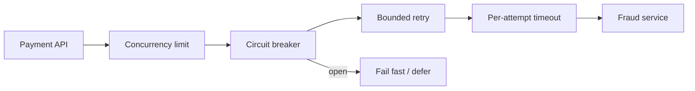

# 5. How do you prevent cascading failures between services?

**Technology:** Microservices

**Source question:** 5. How do you prevent cascading failures between services?

## 1. What problem does it solve?

In a synchronous service chain, one slow dependency can consume callers' connections, memory, and database connections. Those callers then slow their callers. Retries multiply traffic precisely when capacity is lowest, turning a small failure into a platform-wide outage.

If Payment calls Fraud and Fraud stalls, requests accumulate, gateways retry, users click again, and Payment exhausts its connection pool. Even healthy operations fail. This affects reliability and scalability; unsafe fallbacks and uncertain retries also create security and consistency risks.

The objective is to **contain failure**, preserve healthy capacity, and recover without duplicating business effects.

## 2. Explain it in simple language

**Analogy:** An electrical circuit breaker cuts power to one faulty circuit instead of allowing it to overheat the entire house. Separate fuses and capacity limits prevent one appliance from monopolizing everything.

**One-sentence definition:** Cascading-failure prevention combines bounded calls, controlled retries, circuit breakers, isolation, load shedding, and safe asynchronous recovery so one dependency cannot exhaust the system.

**Memory rule:** **Bound, isolate, fail fast, recover safely.**

## 3. How does it work internally?

1. The caller assigns an end-to-end deadline and passes a `CancellationToken` downstream.
2. Each dependency call gets a shorter timeout from the remaining budget.
3. A concurrency limiter or bulkhead caps in-flight work per dependency, preserving resources for other operations.
4. Only transient, safe operations are retried, with few attempts, exponential backoff, jitter, and respect for the deadline and server `Retry-After` guidance.
5. A circuit breaker opens after its failure threshold and rejects calls immediately. Later probes close or reopen it.
6. The caller returns a controlled error, uses a safe fallback, or queues work for later. Metrics and traces identify the constrained dependency.



Timeouts stop waiting, not remote work. Cancellation is cooperative, not transaction rollback. A breaker neither repairs the dependency nor replaces timeouts. Async I/O releases a thread, but outstanding requests still consume sockets, memory, and downstream capacity.

## 4. Realistic payment or banking example

An Angular client submits a card payment with an idempotency key. The ASP.NET Core Payment API authenticates and authorizes the customer, validates server-side, and asks Fraud for a risk decision before authorizing the card.

Angular prevents accidental resubmission and shows pending or unavailable states, but the API enforces every rule. Payment owns orchestration and its database is the **authoritative source of payment status**. Fraud owns risk decisions. A broker carries events and deferred commands; it is transport, not truth.

Payment bounds concurrent Fraud calls and opens a breaker during sustained failure. It rejects safely or stores `PendingRiskReview` for asynchronous processing—never approving by default.

## 5. Successful flow and failure flow

### Successful flow

1. Angular sends idempotency and correlation identifiers.
2. Payment authenticates, authorizes, validates, and reserves the key.
3. Fraud responds within budget; Payment commits the status using optimistic concurrency.
4. The same transaction stores an outbox event; a worker later publishes it.

### Failure flow

- **Validation or authorization:** reject before remote or database work using `ProblemDetails`; never degrade security controls.
- **Timeout:** cancel waiting and return `503`/`504` or persist `PendingRiskReview` by policy. The remote work may continue.
- **Transient failure:** retry only within the deadline and only when safe. Jitter prevents synchronized retry waves.
- **Sustained failure:** the breaker opens; calls fail fast while probes determine recovery.
- **Duplicate or uncertain result:** reuse the idempotency key and fingerprint. The authoritative service returns the stored outcome without repeating the charge.
- **Concurrency conflict:** reload and re-evaluate or return `409`; do not overwrite a newer payment state.
- **Database failure:** roll back the local transaction. Request cancellation and rollback are distinct mechanisms.
- **Broker failure:** keep the outbox event and retry publication asynchronously; do not hold an HTTP request open.
- **Partial completion:** reconcile by stable operation ID and authoritative status; compensate only genuinely reversible actions.
- **Client cancellation:** stop optional work, but if commit or external authorization may have happened, complete/reconcile safely and let the client query status.

## 6. Practical C#/.NET implementation

On supported .NET 8 and later, `Microsoft.Extensions.Http.Resilience` integrates Polly v8 resilience pipelines with `HttpClientFactory`. Keep policy and business fallback outside the controller.

```csharp
builder.Services.AddHttpClient<IFraudClient, FraudClient>(client =>
{
    client.BaseAddress = new Uri(configuration["Fraud:BaseUrl"]!);
})
.AddStandardResilienceHandler(options =>
{
    options.TotalRequestTimeout.Timeout = TimeSpan.FromSeconds(2);
    options.AttemptTimeout.Timeout = TimeSpan.FromMilliseconds(700);
    options.Retry.MaxRetryAttempts = 2;
    options.Retry.BackoffType = DelayBackoffType.Exponential;
    options.Retry.UseJitter = true;
    options.CircuitBreaker.SamplingDuration = TimeSpan.FromSeconds(30);
    options.CircuitBreaker.BreakDuration = TimeSpan.FromSeconds(15);
});
```

These settings are a starting point. Configure predicates so unsafe writes retry only with end-to-end idempotency. Avoid independent retry layers at gateway, service, SDK, and broker.

```csharp
public sealed class SubmitPaymentHandler(
    IFraudClient fraud, IPaymentRepository payments,
    IIdempotencyStore requests, ILogger<SubmitPaymentHandler> log)
{
    public async Task<SubmitResult> HandleAsync(SubmitPayment cmd, CancellationToken ct)
    {
        var replay = await requests.FindAsync(cmd.IdempotencyKey, cmd.Fingerprint, ct);
        if (replay is not null) return replay;

        FraudDecision decision;
        try
        {
            decision = await fraud.AssessAsync(
                new(cmd.PaymentId, cmd.Amount, cmd.CustomerId), ct);
        }
        catch (Exception ex) when (ex is TimeoutRejectedException
                                   or BrokenCircuitException
                                   or HttpRequestException)
        {
            log.LogWarning(ex,
                "Fraud dependency unavailable for {PaymentId}", cmd.PaymentId);
            return await payments.CreatePendingReviewAsync(cmd, ct);
        }

        return await payments.ApplyDecisionAsync(cmd, decision, ct);
    }
}
```

The controller supplies authenticated identity, correlation context, and `RequestAborted`, then maps typed outcomes to `ProblemDetails`. One repository transaction saves payment, idempotency result, and outbox row. Propagate W3C trace context, but never trust external identity headers.

Use a controllable fake server to test timeouts, breaker transitions, cancellation, retry count, `Retry-After`, and idempotency. Load and fault-injection tests should prove Fraud saturation cannot exhaust Payment or cause a recovery storm.

## 7. Important design decisions

**Fail closed, defer, or fallback:** For fraud approval, fail closed or defer; cached approval creates financial risk. A read-only exchange rate might tolerate a bounded, labelled stale cache. Test every degraded contract.

**Timeout budgets:** Derive per-hop budgets from the user-facing objective and measured percentiles. Aggressive limits cause false failures; loose limits retain resources.

**Retry ownership:** Prefer one layer closest to the dependency. Retry transient faults only, cap attempts, add jitter, and expose retry volume. Writes require stable idempotency.

**Isolation:** Prefer per-dependency limits; separate critical and background workloads where justified. Too many pools waste capacity; too few allow noisy neighbours.

**Synchronous versus asynchronous:** Use synchronous calls for immediate decisions. Brokers absorb bursts and support recovery but add lag, duplicates, ordering, and operations. Avoid long human-facing call chains.

**Breaker scope:** Scope by endpoint or meaningful partition. Global breakers may disable healthy regions; narrow ones lack samples. Audit administrative overrides.

## 8. When to use it and when not to use it

Use these controls at finite-resource boundaries, especially fan-out or high-volume paths. Queue work that can finish later; isolate critical from noncritical traffic.

A breaker is unnecessary around in-process code and may misbehave with too few samples. Never retry validation, authorization, or non-idempotent commands. A modular monolith is simpler when separate deployment and scaling are unnecessary.

Warning signs include identical policies everywhere, fallback to insecure behavior, five retries on every layer, queues without capacity limits, and breakers used to mask a chronically undersized dependency.

## 9. Compare it with related concepts

| Mechanism | Purpose and ownership | Lifecycle/performance | Reliability and complexity | Typical limitation |
|---|---|---|---|---|
| Timeout/deadline | Caller bounds waiting | Per request; releases caller sooner | Essential, low complexity | Remote work may continue |
| Retry with backoff | Caller handles transient faults | Adds latency and load | Improves brief-fault recovery | Amplifies outages; writes may duplicate |
| Circuit breaker | Caller stops futile calls | Opens across requests; fast rejection | Protects capacity; stateful tuning | Does not isolate in-flight work |
| Bulkhead/limiter | Caller reserves finite capacity | Rejects or queues excess work | Contains saturation | Bad limits waste capacity or reject early |
| Queue/load leveling | Producer and consumer decouple | Eventual completion; absorbs bursts | Durable recovery, higher complexity | Lag, duplicates, ordering, backlog |
| Rate limiting | Service protects itself by identity/route | Rejects excess arrivals | Fairness and overload control | Does not cure slow dependencies |

For payment risk assessment I would combine deadlines, concurrency limiting, cautious retries, and a breaker, then defer through durable messaging where permitted.

## 10. Common production mistakes

- **Retry storms:** layered retries multiply calls. Detect attempt-rate spikes; assign retry ownership and use budgets, jitter, and caps.
- **No total deadline:** fresh per-hop timeouts exceed the SLA. Propagate one deadline and reserve response time.
- **Retrying unsafe writes:** uncertain responses cause duplicate charges. Use operation IDs, fingerprints, durable idempotency records, and reconciliation.
- **Fallback that breaks security:** approving without Fraud converts availability into loss. Document fail-closed/defer policy and test it.
- **Breaker without isolation:** slow calls fill pools before it opens. Add concurrency and queue limits.
- **Unbounded queues:** the outage becomes memory pressure or hours of stale work. Bound backlog, expire obsolete commands, apply backpressure, and alert on oldest age.
- **Poor observability:** generic `500` logs conceal the cause. Record dependency latency, breaker state, saturation, rejections, retries, and traces without card data.
- **Unit tests only:** mocks miss socket, pool, and lock behavior. Run integration, load, and fault-injection tests.

## 11. Interview-ready answer

**30-second answer:** I prevent cascading failures by bounding every remote call, propagating deadlines and cancellation, limiting concurrency per dependency, retrying only transient and idempotent operations with backoff and jitter, and using circuit breakers to fail fast during sustained faults. Where immediate completion is unnecessary, I decouple through durable queues. I also use load shedding, idempotency, and observability so recovery is safe and measurable.

**Two-minute senior-level answer:** I start with latency and capacity budgets. Each dependency gets a per-attempt timeout inside an end-to-end deadline, a concurrency cap, and defined transient failures. Retries are few, jittered, and owned by one layer; writes need server-side idempotency. A shared breaker rejects futile calls, while the bulkhead stops slow calls exhausting unrelated paths.

For payment Fraud checks, I never fall back to approval. I fail closed or persist pending state and continue through durable messaging. Payment remains authoritative; operation IDs reconcile uncertainty. I monitor saturation, retry amplification, breaker transitions, oldest queue age, and dependency latency, verified with load and fault-injection tests. This is coordinated containment, not merely adding Polly policies.

**Three follow-up questions an interviewer may ask:**

1. How do you choose timeout, retry, and circuit-breaker thresholds?
2. How do you make a retried payment command genuinely idempotent?
3. When would you choose a queue instead of a synchronous fallback?

**Important keywords:** deadline budget, timeout, bounded retry, exponential backoff, jitter, circuit breaker, bulkhead, concurrency limiter, load shedding, backpressure, idempotency, outbox, graceful degradation, reconciliation, saturation, tracing.

**Red-flag answers:** “Retry every exception”; “async means it cannot exhaust resources”; “the circuit breaker cancels the remote work”; “approve when Fraud is unavailable”; “queues can grow indefinitely”; or discussing policies without idempotency, capacity, observability, and testing.

## 12. Test my understanding interactively

During revision, answer this scenario-based interview question:

Your Payment API normally calls Fraud synchronously, but Fraud latency rises from 100 ms to 8 seconds during a promotion; gateway and SDK retries are already enabled, Payment instances are exhausting connections, some card authorizations have uncertain outcomes, and the business refuses to approve without risk screening. How would you contain the incident and redesign the flow, including deadline and retry ownership, isolation, breaker behavior, idempotency, degraded customer experience, recovery, and the signals you would monitor?

## Revision card

- **One-sentence definition:** Bound and isolate dependency failures so they cannot consume the whole system, then recover without duplicating effects.
- **Memory rule:** Bound, isolate, fail fast, recover safely.
- **Recommended use:** Apply coordinated timeouts, limits, safe retries, breakers, and durable decoupling at failure-prone resource boundaries.
- **Main danger:** Retry amplification or unsafe fallback can turn a dependency fault into an outage or financial loss.
- **Interview takeaway:** Cascading-failure prevention is a capacity, consistency, and recovery design—not merely a circuit-breaker configuration.
