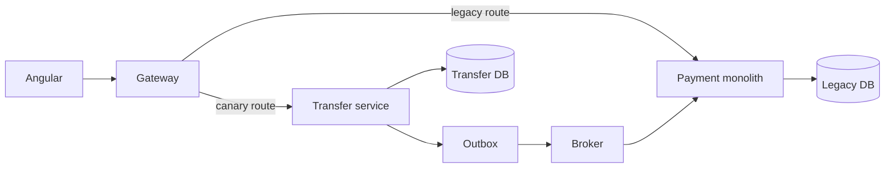

# 6. How would you migrate a monolithic .NET application to microservices?

**Technology:** Microservices

**Source question:** 6. How would you migrate a monolithic .NET application to microservices?

## 1. What problem does it solve?

A growing monolith makes unrelated changes share one deployment, scaling unit, and failure boundary. In a bank, changing notifications may redeploy the payment engine, while a reporting fault may affect transfers.

Migration creates independently owned capabilities where autonomy has value. It improves deployability, fault isolation, scaling, security, and maintainability. It does **not** fix poor code. A careless rewrite introduces latency, partial failure, duplicates, and eventual consistency.

The problem is not size but coupling that prevents safe change. Migration must reduce it without risking customer money.

## 2. Explain it in simple language

I would gradually redirect cohesive business capabilities out of the monolith while it continues serving customers. Before extraction, I would make boundaries explicit inside the monolith and remove shared-data assumptions.

The analogy is renovating an open bank branch: isolate one department, move traffic gradually, and keep a route back until proven.

**One-sentence definition:** Monolith-to-microservices migration is the incremental extraction of proven business capabilities, their data, and their operational ownership behind stable contracts.

**Memory rule:** Modularize, measure, extract, migrate traffic, then retire.

## 3. How does it work internally?

I normally use the **strangler-fig pattern**:

1. Baseline lead time, change coupling, incidents, latency, database dependencies, and critical flows.
2. Identify bounded contexts and invariants. Code that must change or commit atomically should usually remain together.
3. Refactor into enforceable modules, testing boundaries without a network.
4. Select a low-risk, valuable seam—often Notifications, not the Ledger—and define an HTTP or message contract.
5. Route old and new implementations through a gateway. An anti-corruption layer prevents leaking legacy models.
6. Give the service exclusive writes. Migrate data by backfill plus change capture or events; reconcile before cutover.
7. Shadow reads or canary traffic, compare business outcomes and service indicators, then increase traffic.
8. Stop legacy writes, verify reconciliation, remove dead paths, and repeat.



An HTTP timeout means the outcome is unknown. At-least-once broker delivery requires idempotent consumers. `async` releases a thread during I/O; it does not make operations parallel. Cancellation is cooperative and cannot undo a committed transaction.

## 4. Realistic payment or banking example

Angular collects transfer details, creates an idempotency key, performs usability validation, and polls status. It never enforces authorization, limits, or funds.

ASP.NET Core authenticates, authorizes, validates, owns transfer state, and returns sanitized `ProblemDetails`. Transfer owns its workflow database. Ledger remains authoritative for balances and immutable debit/credit postings. The broker transports messages but is not a source of truth.

I would first separate Transfer, Ledger, Fraud, and Notification as modules. Notification can prove deployment, telemetry, messaging, security, and on-call practices. Transfer follows when ownership is stable. Debit and credit remain together because their invariant must not cross a network.

## 5. Successful flow and failure flow

### Successful flow

1. Angular sends the command and idempotency key.
2. The gateway routes a controlled cohort to the new Transfer API.
3. Transfer authenticates, authorizes, validates, and atomically stores `Pending`, the idempotency record, and an outbox command.
4. An outbox worker publishes `PostTransfer`; Ledger records balanced entries and an inbox receipt in one transaction.
5. Ledger publishes `TransferPosted`; Transfer marks `Completed` idempotently.
6. Reconciliation compares old and new read models. After stable canary results, routing increases and the legacy path is retired.

### Failure flow

- **Validation/authorization:** reject server-side with `400`/`422`, `401`, or `403`; frontend validation is only user experience.
- **Duplicate:** a unique idempotency constraint returns the stored result; key reuse with a different request hash is rejected. Retries alone are not idempotency.
- **Concurrency conflict:** Ledger uses an appropriate isolation level or concurrency token and re-evaluates funds; it never blindly retries stale business logic.
- **Database failure:** the local transaction rolls back. If commit acknowledgement is lost, retry with the same key and query status.
- **Broker failure:** the committed outbox remains pending and retries with bounded exponential backoff and jitter; alert on message age.
- **Partial completion:** durable states, idempotent consumers, reconciliation, and compensating ledger entries recover safely—never direct deletion of posted entries.
- **Cancellation:** stop work before commit where possible; after acceptance, durable processing continues. Cancellation is not transfer reversal.
- **Bad canary:** stop routing; use the old path only before irreversible write cutover, and repair through an audited process.

## 6. Practical C#/.NET implementation

In supported .NET 8+, ASP.NET Core’s `AddProblemDetails()` and `IProblemDetailsService` provide consistent errors. Keep routing thin:

```csharp
app.MapPost("/transfers", async (
    CreateTransfer command, HttpContext http,
    ICreateTransfer handler, CancellationToken ct) =>
{
    var key = http.Request.Headers["Idempotency-Key"].SingleOrDefault();
    if (string.IsNullOrWhiteSpace(key) || key.Length > 128)
        return Results.Problem(statusCode: 400,
            title: "Valid idempotency key required");

    var customerId = http.User.GetRequiredCustomerId();
    var result = await handler.ExecuteAsync(customerId, command, key, ct);
    return Results.Accepted($"/transfers/{result.Id}", result);
}).RequireAuthorization("CreateTransfer");
```

The application layer coordinates domain and infrastructure:

```csharp
public sealed class CreateTransferHandler(
    TransferDbContext db,
    ILogger<CreateTransferHandler> log) : ICreateTransfer
{
    public async Task<TransferAccepted> ExecuteAsync(
        CustomerId customer, CreateTransfer cmd, string key,
        CancellationToken ct)
    {
        cmd.Validate();
        var hash = RequestHash.For(cmd);

        var previous = await db.IdempotencyResults
            .SingleOrDefaultAsync(x => x.CustomerId == customer && x.Key == key, ct);
        if (previous is not null)
            return previous.ReplayOrReject(hash);

        var transfer = Transfer.Start(customer, cmd); // domain invariants
        db.Transfers.Add(transfer);
        db.IdempotencyResults.Add(IdempotencyResult.Accepted(
            customer, key, hash, transfer.Id));
        db.Outbox.Add(OutboxMessage.For(new PostTransfer(
            transfer.Id, cmd.FromAccount, cmd.ToAccount, cmd.Amount)));

        await db.SaveChangesAsync(ct); // one local transaction
        log.LogInformation("Accepted transfer {TransferId}", transfer.Id);
        return new(transfer.Id, "Pending");
    }
}
```

Enforce `(CustomerId, Key)` with a unique index; the C# check races. Propagate W3C trace and business IDs without sensitive data. Unit-test transitions; integration-test constraints, concurrency, rollback, duplicates, outbox recovery, contracts, cancellation, and reconciliation.

## 7. Important design decisions

| Decision | Recommended default and trade-offs |
|---|---|
| Migration style | Incremental strangler with reversible traffic shifts. A rewrite may fit a tiny disposable system, but delays feedback and increases cutover risk. |
| First extraction | Choose a clear, lower-risk capability. The hardest core maximizes cost and financial risk. |
| Communication | Synchronous calls for immediate answers; durable events for decoupling. Calls add latency/cascades; messaging adds lag, duplicates, ordering, and operations. |
| Data ownership | One writer per dataset. Temporary replication needs an owner and expiry; shared writes destroy autonomy. |
| Consistency | Keep financial invariants local; use outbox/inbox, compensation, and reconciliation. Distributed transactions are a poor default. |
| Cutover | Canary plus shadow reads and business reconciliation. Dual writes are fragile unless one authoritative write and durable propagation are explicit. |

Every service needs least-privilege identity, secret rotation, rate limiting, ownership, SLOs, dashboards, automation, and on-call. More processes expand attack surface and workload. Favor contract/component tests plus a few critical end-to-end tests.

## 8. When to use it and when not to use it

Migrate when teams need deployment autonomy, capabilities have different operational requirements, security isolation reduces risk, or coordination impedes delivery.

Prefer a modular monolith when one team owns the system, local transactions dominate, the domain changes rapidly, or operations cannot support many services.

Warning signs include service-per-table, shared databases, call chains, coordinated releases, and no owner. “Microservices are modern” is not a business case.

## 9. Compare it with related concepts

| Option | Ownership/lifecycle | Performance/reliability | Complexity and use | Limitation |
|---|---|---|---|---|
| Strangler migration | Capability moves incrementally; old and new coexist | Network cost; reversible canaries reduce risk | Best default for a live bank | Temporary duplication and routing complexity |
| Big-bang rewrite | New system developed separately | Fast clean runtime possible; dangerous cutover | Rarely, for small replaceable systems | Late feedback and feature parity trap |
| Modular monolith | Modules share process/deployment | Fast calls, local transactions, shared failure boundary | Strong default before extraction | No independent deployment/scaling |
| Branch by abstraction | Callers use an interface while implementation changes | In-process initially; easy rollback | Useful seam inside the monolith | Does not itself separate data or operations |

I would combine modular preparation, branch by abstraction, and strangler cutover, preserving Ledger invariants while proving boundaries.

## 10. Common production mistakes

- **Big-bang replacement:** feedback arrives late. Deliver thin vertical slices.
- **Extracting code but sharing tables:** deployments remain coupled and unauthorized access expands. Audit database principals and enforce one writer.
- **Dual writes without atomicity:** one system updates and the other does not. Use a transactional outbox and reconciliation.
- **Wrong boundary:** chatty calls appear. Detect through traces and change coupling; redraw around invariants.
- **Blind retries:** duplicates payments and amplifies outages. Use deadlines, jitter, idempotency, circuit breaking, and status lookup after uncertainty.
- **No observability:** canaries and stuck transfers become invisible. Add traces, business metrics, outbox-age alerts, and audit trails.
- **Ignoring security:** copied data and broad credentials expand exposure. Minimize replication, use workload identity, least privilege, and threat modeling.
- **Never deleting legacy paths:** permanent duplication raises cost and ambiguity. Define retirement criteria, owners, and dates before extraction.

## 11. Interview-ready answer

**30-second answer:** I would not rewrite the monolith all at once. I would baseline the problems, identify business boundaries and atomic invariants, modularize internally, then use a strangler approach to extract one proven capability at a time. Each service gets a stable contract, exclusive data ownership, observability, security, and operational ownership. I would canary traffic, reconcile business outcomes, and retire the old path only after evidence proves it safe.

**Two-minute senior-level answer:** For a banking monolith, I start with business outcomes rather than a target service count. I map workflows, database coupling, change frequency, incidents, and invariants. Debit and credit posting must remain one Ledger transaction, while Notifications is a safer early extraction. I first enforce module boundaries in the monolith, introduce an abstraction or anti-corruption layer, and define version-tolerant contracts. Then I extract with the strangler pattern and route a small cohort through the new service. The service exclusively owns its writes; data moves through backfill plus durable change propagation and reconciliation, not uncontrolled dual writes. Cross-service workflows use explicit states, idempotency, transactional outbox/inbox, compensation, and repair tooling because timeouts and duplicate delivery are normal. I require workload identity, least privilege, trace propagation, SLOs, dashboards, contract tests, canaries, and a rollback or forward-fix plan. I measure whether lead time, reliability, scaling, or ownership actually improves. If it does not, I stop extracting; a modular monolith may be the correct architecture.

**Three follow-up questions an interviewer may ask:**

1. How would you migrate a large shared database without losing or duplicating payments?
2. Which capability would you extract first, and what evidence supports that choice?
3. How would you roll back after the new service has accepted writes?

**Keywords:** strangler fig, bounded context, branch by abstraction, anti-corruption layer, invariants, data ownership, canary, reconciliation, outbox/inbox, idempotency, eventual consistency, compensation, contract testing, observability, SLO.

**Red-flag answers:** “rewrite everything”; “one service per table”; treating shared tables as harmless; assuming exactly-once delivery; using retries as idempotency; moving debit and credit apart; ignoring data migration, security, rollback, reconciliation, or operations; and claiming microservices are always more scalable.

## 12. Test my understanding interactively

Answer this during revision: Your bank’s payment monolith has Transfer, Ledger, Fraud, and Notification modules sharing one SQL Server database, and management wants Transfer extracted first within six months; how would you phase the migration, choose data ownership and contracts, preserve atomic ledger posting, handle uncertain outcomes, validate the cutover, and decide whether to continue?

## Revision card

- **One-sentence definition:** Incrementally extract proven business capabilities and their data behind stable, independently operated contracts.
- **Memory rule:** Modularize, measure, extract, migrate traffic, then retire.
- **Recommended use:** Use a strangler migration when independent ownership, deployment, scaling, security, or reliability provides demonstrated value.
- **Main danger:** Creating a distributed monolith with shared data, network failures, and no operational autonomy.
- **Interview takeaway:** Preserve invariants, establish one data owner, migrate incrementally, reconcile outcomes, and let evidence—not fashion—decide each extraction.
