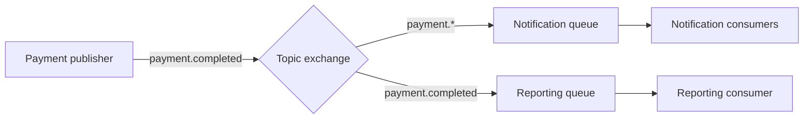

# 1. Explain exchanges, queues, bindings, routing keys, publishers, and consumers.

**Technology:** RabbitMQ and Messaging

**Source question:** 1. Explain exchanges, queues, bindings, routing keys, publishers, and consumers.

## 1. What problem does it solve?

Direct calls couple a sender to receiver availability, latency, and capacity. If a payment API synchronously calls notifications, fraud, and reporting, one slow dependency can fail the request, while traffic spikes can overwhelm downstream systems.

RabbitMQ adds an asynchronous boundary: the broker routes messages to queues that buffer work. This improves availability, load levelling, scalability, and maintainability, but introduces eventual consistency, duplicates, and operational complexity. Reliability still requires confirms, acknowledgements, idempotency, and monitoring.

## 2. Explain it in simple language

- A **publisher** sends a message to an exchange; it normally does not address a queue directly.
- An **exchange** applies routing rules. It does not store messages.
- A **routing key** is publisher-supplied routing metadata, such as `payment.completed`.
- A **binding** connects an exchange to a queue and may contain a matching rule.
- A **queue** stores messages until consumers acknowledge them.
- A **consumer** receives and processes deliveries from a queue.

Analogy: a publisher posts a labelled parcel at a sorting office (exchange). Sorting rules (bindings) inspect its postcode or label (routing key), place copies into delivery sacks (queues), and couriers (consumers) take parcels from each sack.

**One-sentence definition:** RabbitMQ decouples message producers from processors by routing published messages through exchanges and bindings into queues consumed asynchronously.

**Memory rule:** **Publish to exchanges; bind queues; consume from queues.**

## 3. How does it work internally?

1. A client opens a TCP connection and one or more channels. Channels are lightweight protocol sessions; do not open a connection per message.
2. Infrastructure declares an exchange, queues, and bindings, preferably idempotently at startup or through controlled provisioning.
3. The publisher serializes a message, assigns identifiers and headers, chooses an exchange and routing key, and publishes on a channel.
4. The exchange evaluates its type: **direct** requires an exact binding-key match; **topic** supports dot-separated patterns with `*` and `#`; **fanout** ignores routing keys and copies to every bound queue; **headers** matches headers.
5. Every matching binding receives a copy. If several consumers share one queue, they compete for deliveries rather than each receiving a copy. Separate queues are required for independent subscribers.
6. RabbitMQ pushes deliveries subject to consumer prefetch. An unacknowledged message remains in broker state. On success the consumer acknowledges it; on failure it can reject/nack it for requeueing or dead-lettering.
7. If a channel or connection closes before acknowledgement, RabbitMQ normally requeues its unacknowledged deliveries. Therefore delivery is commonly **at least once**, not exactly once.



A routing key is not a destination; bindings determine destinations. Async consumption also does not imply parallel processing. With RabbitMQ.Client 7.x, use async APIs and copy or deserialize retained delivery bodies before the callback returns because their backing memory has limited lifetime.

## 4. Realistic payment or banking example

Angular submits a card-payment request with an idempotency key and performs usability validation. ASP.NET Core still enforces authentication, authorization, ownership, limits, and business rules.

One database transaction writes the payment and a `PaymentCompleted` **outbox** record. This database is authoritative. A worker publishes it to durable topic exchange `bank.events` with key `payment.completed`.

Bindings route copies to `notifications.payment` using `payment.*` and `reporting.payment-completed` using `payment.completed`. Notification instances compete for scale. Each capability owns its queue and retry policy; RabbitMQ is transport, not the ledger.

## 5. Successful flow and failure flow

### Successful flow

1. Angular submits an authorized request and correlation/idempotency IDs.
2. ASP.NET Core validates again and commits the payment plus outbox row atomically.
3. The API returns the committed payment status; it does not claim downstream notifications are complete.
4. The outbox worker publishes a persistent message and waits for a publisher confirm.
5. The exchange routes copies to both bound durable queues.
6. Consumers process their copy, record the message ID for idempotency, commit their local changes, then acknowledge.

### Failure flow

- Validation or authorization failure returns `ProblemDetails`; nothing is written or published.
- A duplicate API request returns the existing result using the idempotency key. Retry protection alone—such as Polly—is not idempotency.
- An optimistic-concurrency conflict is retried only after re-reading state, or returned as a conflict; blind retry could approve an invalid balance.
- If the database commit fails, neither payment nor outbox exists. If the response times out after commit, the client safely retries with the same idempotency key.
- If RabbitMQ is unavailable, the payment remains committed and the outbox remains pending. The worker retries with backoff; cancellation stops the attempt but does not roll back the earlier database commit.
- If publish succeeds but the confirm is lost, republishing can create a duplicate. Consumers must still be idempotent.
- If consumer processing fails transiently, nack/dead-letter through bounded retry queues. Do not immediately requeue forever. Invalid or poison messages go to a dead-letter queue with diagnostics and controlled replay.
- If a consumer commits locally but crashes before ack, it receives the event again; its inbox/deduplication record makes the second delivery harmless.

## 6. Practical C#/.NET implementation

The API transaction creates the outbox; publishing is infrastructure work, not controller work:

```csharp
public sealed record PaymentCompleted(Guid MessageId, Guid PaymentId, decimal Amount);

public interface IEventPublisher
{
    Task PublishAsync(PaymentCompleted message, CancellationToken cancellationToken);
}

public sealed class RabbitEventPublisher(IChannel channel) : IEventPublisher
{
    public async Task PublishAsync(PaymentCompleted message, CancellationToken ct)
    {
        var body = JsonSerializer.SerializeToUtf8Bytes(message);
        var properties = new BasicProperties
        {
            MessageId = message.MessageId.ToString(),
            ContentType = "application/json",
            DeliveryMode = DeliveryModes.Persistent
        };

        await channel.BasicPublishAsync(
            exchange: "bank.events",
            routingKey: "payment.completed",
            mandatory: true,
            basicProperties: properties,
            body: body,
            cancellationToken: ct);
    }
}
```

In RabbitMQ.Client 7.x, enable publisher confirms and handle mandatory unroutable publications; a completed call is not durable business processing. Respect `IChannel` concurrency rules.

```csharp
await channel.BasicQosAsync(0, prefetchCount: 20, global: false, ct);

var consumer = new AsyncEventingBasicConsumer(channel);
consumer.ReceivedAsync += async (_, args) =>
{
    var message = JsonSerializer.Deserialize<PaymentCompleted>(args.Body.Span)!;
    using var scope = scopeFactory.CreateScope();
    var handler = scope.ServiceProvider.GetRequiredService<PaymentCompletedHandler>();

    try
    {
        await handler.HandleIdempotentlyAsync(message, args.BasicProperties.MessageId, ct);
        await channel.BasicAckAsync(args.DeliveryTag, multiple: false, ct);
    }
    catch (TransientException ex)
    {
        logger.LogWarning(ex, "Transient failure for {MessageId}", message.MessageId);
        await channel.BasicNackAsync(args.DeliveryTag, false, requeue: false, ct);
    }
};

await channel.BasicConsumeAsync("notifications.payment", autoAck: false, consumer, ct);
```

`HandleIdempotentlyAsync` inserts an inbox ID and local effect in one transaction. Use a long-lived connection and a DI scope per delivery because hosted consumers are singletons. Log correlation/message IDs, routing key, queue, attempt, and duration without sensitive data. Container integration tests verify routing, confirms, redelivery, acknowledgements, and dead-lettering; unit tests cover handlers.

## 7. Important design decisions

| Decision | Recommended default and trade-off |
|---|---|
| Exchange type | Topic for event taxonomies; direct for exact commands; fanout for broadcast. Broad patterns can misroute data. |
| Queue ownership | One per independent subscriber. Sharing load-balances instead of broadcasting and couples deployments. |
| Durability | Durable topology and persistent business messages cost I/O and still require confirms. |
| Delivery guarantee | Prefer at-least-once with outbox, confirms, manual ack, and idempotency; cross-system “exactly once” is generally an illusion. |
| Prefetch/concurrency | Start conservatively and tune for latency and downstream capacity. High values increase throughput and in-flight work. |
| Contracts | Use versioned, backward-compatible schemas. Validate size/content; never instantiate arbitrary CLR types from headers. |
| Topology | Choose controlled provisioning for governance or idempotent app declarations for autonomy; test incompatibilities before deployment. |

Use TLS, least-privilege virtual-host permissions, rotated credentials, and separate identities. Alert on queue depth/age, redeliveries, dead letters, and confirm failures.

## 8. When to use it and when not to use it

Use RabbitMQ for asynchronous work, buffering, reliable decoupling, or multiple subscribers—for example notifications, document generation, and fraud analysis.

Prefer a direct API for immediate decisions and an in-process channel for local work that need not survive restart. A database job table may suit one low-volume worker.

Warning signs include hidden synchronous RPC, a queue per request, huge or secret payloads, assumed global ordering, and using a broker where a function call suffices.

## 9. Compare it with related concepts

| Option | Ownership/lifecycle | Performance and reliability | Complexity / typical use |
|---|---|---|---|
| RabbitMQ queue | Consumer capability; removed after ack | Push, buffering, acknowledgements | Moderate; commands and routed events |
| Direct HTTP API | Callee; request lifetime | Immediate result; temporal coupling | Low; synchronous decisions |
| Kafka topic | Retained log; consumer offsets | High throughput, replay, retention | Higher; streams and analytics |
| In-process channel | One process; normally lost on restart | Fast; no cross-service durability | Low; local work |

I would use HTTP for the immediate payment result and outbox plus RabbitMQ downstream. Kafka fits better if long-term replay and high-volume streams dominate.

## 10. Common production mistakes

- **Publishing before commit** creates ghost or missing events; use a transactional outbox.
- **Automatic acknowledgement** loses deliveries after processing failure; ack only after durable work.
- **Assuming exactly once** duplicates side effects; track message IDs transactionally and test crash-after-commit.
- **Immediate infinite requeue** creates poison-message loops; use bounded delayed retries and dead-lettering.
- **Unbounded concurrency** exhausts memory or databases; load-test and apply backpressure.
- **Missing mandatory routing** silently drops unroutable messages; test bindings and alert on returns.
- **Sensitive-data leakage** through bodies, logs, or dead letters requires minimal payloads, restricted access, and retention.
- **No correlation/topology ownership** makes incidents guesswork; standardize metadata, dashboards, and declaration tests.

## 11. Interview-ready answer

### 30-second answer

A publisher sends a message to an exchange with a routing key. The exchange evaluates bindings and places a copy in each matching queue. Consumers read from queues and acknowledge only after successful processing. Exchanges route; queues buffer; bindings connect them. In production I add durable topology, publisher confirms, manual acknowledgements, an outbox, idempotent consumers, bounded retries, and dead-letter monitoring because RabbitMQ normally gives at-least-once delivery, not exactly once.

### Two-minute senior-level answer

RabbitMQ separates producers from consumers in time and deployment. Publishers know the exchange and routing metadata, not every service. Direct exchanges match exact keys, topic exchanges match patterns, fanout broadcasts, and headers exchanges use headers. Multiple consumers on one queue compete; independent subscribers need separate queues.

For payments, I commit payment and outbox together. A worker publishes `PaymentCompleted` to a durable topic exchange with persistent delivery, mandatory routing, and confirms. Notification and reporting own separate queues. Consumers use bounded prefetch, manual acknowledgements, and transactional inbox IDs.

Broker downtime leaves the outbox pending. Lost confirms can cause republishing; a crash after consumer commit but before ack causes redelivery, so consumers must be idempotent. Poison messages use bounded delayed retry and dead-lettering. I use TLS, least privilege, versioned contracts, and queue/confirm monitoring. The payment database remains authoritative.

### Three follow-up questions

1. How would you guarantee that a committed payment event is eventually published?
2. What happens if a consumer crashes after updating its database but before acknowledging?
3. When would you choose topic, direct, fanout, or headers exchanges?

**Keywords:** exchange, queue, binding, routing key, competing consumers, at-least-once, publisher confirms, mandatory publish, manual ack, prefetch, outbox, idempotent consumer, dead-letter queue, observability.

**Red flags:** saying an exchange stores messages; claiming one queue broadcasts to every consumer; treating persistence as a complete guarantee; acknowledging before processing; claiming exactly-once delivery; or relying on retries without idempotency.

## 12. Test my understanding interactively

During revision, answer this one scenario-based interview question:

> A payment is committed and its `PaymentCompleted` outbox event is published. Notifications send the receipt, then the consumer crashes before acknowledging. RabbitMQ redelivers the message, while reporting has not processed its separate copy yet. Explain the expected routing and delivery behavior, and design safe recovery without losing the reporting event or sending a duplicate receipt.

## Revision card

- **One-sentence definition:** RabbitMQ routes publisher messages through exchanges and bindings into queues that consumers process asynchronously.
- **Memory rule:** Publish to exchanges; bind queues; consume from queues.
- **Recommended use:** Decouple durable asynchronous work and independent downstream subscribers.
- **Main danger:** Mistaking at-least-once delivery for exactly once and producing duplicate or lost side effects.
- **Interview takeaway:** Explain the six roles, then connect them to outbox, confirms, acknowledgements, idempotency, bounded retries, security, and observability.
