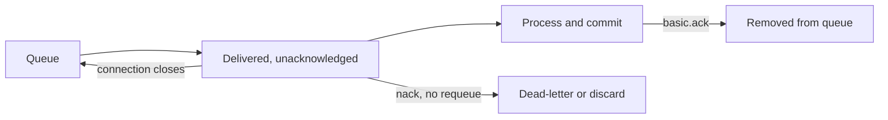

# 2. How do acknowledgements make message processing reliable?

**Technology:** RabbitMQ and Messaging

**Source question:** 2. How do acknowledgements make message processing reliable?

## 1. What problem does it solve?

Receiving a message is not completing its business work. A consumer can crash or lose its connection after delivery but before processing finishes. If the broker removed the message on delivery, that work would be lost.

An acknowledgement, or **ack**, lets the consumer tell RabbitMQ, “this delivery has reached a safe completion point.” Until then, RabbitMQ tracks it as unacknowledged. If the channel or connection closes, the broker requeues unacknowledged deliveries for another consumer.

This primarily addresses reliability and consistency. Unacknowledged deliveries consume resources, while acknowledging too early risks loss. Acknowledgements create **at-least-once delivery**, not exactly-once business processing, so duplicates remain possible.

## 2. Explain it in simple language

Imagine a bank archive keeping its payment instruction until a clerk confirms safe recording. If the clerk disappears, another receives it. The second may repeat completed work, so processing must detect duplicates.

**One-sentence definition:** Acknowledgements let RabbitMQ remove a delivery only after the consumer signals successful processing, enabling redelivery when processing is interrupted.

**Memory rule:** **Commit the effect, then ack; expect the message again.**

Automatic acknowledgement removes the delivery as RabbitMQ sends it. Manual acknowledgement lets the application control the safe boundary and is the normal default for important banking work.

## 3. How does it work internally?

1. RabbitMQ delivers on a channel with a channel-scoped `deliveryTag`.
2. With manual acknowledgement (`autoAck: false`), the broker marks that delivery as unacknowledged rather than deleting it from the queue immediately.
3. The consumer validates and processes the message, usually committing its database effect and an inbox/deduplication record in one local transaction.
4. The consumer sends `basic.ack`; RabbitMQ forgets the delivery. `multiple: true` also acknowledges earlier outstanding tags on that channel, so misuse can acknowledge unfinished work.
5. `basic.reject` handles one failure; `basic.nack` handles one or many. `requeue: true` redelivers; `false` discards or dead-letters under configured policy.
6. Channel closure requeues outstanding deliveries. The `redelivered` flag is telemetry, not a uniqueness mechanism.



Prefetch limits unacknowledged deliveries and provides backpressure; it is not a retry count. Acks must use the delivery's channel and tag.

A common misunderstanding is that an ack proves the database update succeeded exactly once. RabbitMQ knows only that it received the ack. If the database commits and the process crashes before acking, RabbitMQ redelivers an already-applied message. Conversely, acking before commit can permanently lose work.

## 4. Realistic payment or banking example

A `PaymentCompleted` event causes a receipt service to record and send a receipt.

- **Angular:** submit with an idempotency key and show status; its validation is not authoritative.
- **ASP.NET Core:** authenticate, authorize, validate, and atomically commit payment plus outbox.
- **Database:** the payment database is authoritative; the receipt database owns inbox and receipt state.
- **RabbitMQ:** buffer and redeliver until ack; it is not the ledger.

The consumer transaction inserts the stable `MessageId` into a uniquely constrained inbox and creates an `EmailPending` receipt. It commits, then acks. A separate sender delivers the email because email and database work cannot commit atomically; it passes a provider idempotency key when supported.

## 5. Successful flow and failure flow

### Successful flow

1. The API commits payment and outbox event.
2. The outbox publishes with a confirm, protecting publisher-to-broker transfer.
3. RabbitMQ delivers within prefetch, using manual ack.
4. The consumer validates, transactionally records message ID and receipt intent, then acks.
5. RabbitMQ removes the copy; a local sender delivers the receipt.

### Failure flow

- **Invalid data:** nack without requeue to quarantine; do not log sensitive payloads.
- **Unauthorized producer:** enforce TLS and broker permissions; investigate rather than retry.
- **Database timeout/failure:** do not ack. Use bounded delayed retry; the inbox makes an uncertain commit safe.
- **Crash after commit, before ack:** redelivery occurs; the inbox proves completion, so ack without another receipt.
- **Duplicate publication:** reuse the same inbox protection.
- **Concurrency conflict:** competing deliveries race on the unique inbox key; one wins. Distinguish that duplicate from a genuine database failure.
- **Ack network failure:** assume redelivery; idempotency, not retrying an ack on a dead channel, provides safety.
- **Cancellation:** stop consumption and drain briefly. Leave interrupted work unacked. Cancellation does not roll back an already committed transaction.
- **Poison message:** avoid hot requeue loops; bound, delay, dead-letter, alert, and control replay.

## 6. Practical C#/.NET implementation

With RabbitMQ.Client 7.x, async consumer and channel APIs are first-class. The handler owns database idempotency; the transport adapter owns ack policy:

```csharp
public sealed record PaymentCompleted(Guid MessageId, Guid PaymentId, decimal Amount);

public interface IPaymentCompletedHandler
{
    Task HandleIdempotentlyAsync(PaymentCompleted message, CancellationToken ct);
}

public sealed class PaymentCompletedConsumer(
    IChannel channel, IServiceScopeFactory scopes,
    ILogger<PaymentCompletedConsumer> logger)
{
    public async Task StartAsync(CancellationToken ct)
    {
        await channel.BasicQosAsync(0, prefetchCount: 16, global: false, ct);
        var consumer = new AsyncEventingBasicConsumer(channel);

        consumer.ReceivedAsync += async (_, ea) =>
        {
            PaymentCompleted message;
            try
            {
                message = JsonSerializer.Deserialize<PaymentCompleted>(ea.Body.Span)
                    ?? throw new JsonException("Empty message");
            }
            catch (JsonException ex)
            {
                logger.LogWarning(ex, "Invalid event; tag {Tag}", ea.DeliveryTag);
                await channel.BasicRejectAsync(ea.DeliveryTag, requeue: false, ct);
                return;
            }

            try
            {
                await using var scope = scopes.CreateAsyncScope();
                var handler = scope.ServiceProvider
                    .GetRequiredService<IPaymentCompletedHandler>();

                await handler.HandleIdempotentlyAsync(message, ct);
                await channel.BasicAckAsync(ea.DeliveryTag, multiple: false, ct);
            }
            catch (TransientDataException ex)
            {
                logger.LogWarning(ex, "Transient failure for {MessageId}",
                    message.MessageId);
                await channel.BasicNackAsync(
                    ea.DeliveryTag, multiple: false, requeue: false, ct);
            }
        };

        await channel.BasicConsumeAsync(
            queue: "receipts.payment-completed",
            autoAck: false,
            consumer: consumer,
            cancellationToken: ct);
    }
}
```

Here `requeue: false` assumes dead-letter routing to a bounded delayed retry path; without it the message may be discarded, so integration-test the topology. In 7.x, deserialize or copy `ea.Body` before the callback returns because its memory has limited lifetime.

`HandleIdempotentlyAsync` transactionally stores `Inbox(MessageId UNIQUE)` and receipt intent; it does not send email. The singleton consumer creates a DI scope per delivery for scoped `DbContext`. Log correlation/message ID, attempt, duration, and outcome. In a container test, close the connection before ack and verify redelivery but one effect.

## 7. Important design decisions

| Decision | Options and recommended default | Trade-offs and implications |
|---|---|---|
| Ack mode | Manual for durable work | Adds protocol state but prevents delivery-time loss; automatic suits acceptable loss. |
| Ack point | Prefer after durable local commit | Late ack increases in-flight time; external effects still need idempotency or an outbox. |
| Retry route | Prefer bounded delayed retry | Reduces outage amplification but adds topology; quarantine exhaustion. |
| Prefetch | Start conservatively and measure | Higher values improve throughput but increase memory, unfairness, and duplicate work after failure. |
| Individual/batch | Individual is safer concurrently | Batch saves traffic but risks premature ack with out-of-order work. |
| Idempotency | Usually combine inbox, business key, and provider key | Storage/cleanup cost buys safe replay; retain keys through the replay window. |

Use TLS and least privilege because a consumer able to ack can remove work. Monitor unacked count, message age, redeliveries, dead letters, and ack latency. Separate handlers from transport code for unit and integration testing.

## 8. When to use it and when not to use it

Use manual acknowledgements for payments, notifications, projections, or other queued work whose loss matters.

Automatic ack can suit disposable telemetry where loss is acceptable. An in-process channel is simpler when work need not survive restart; a database job table can suit one low-volume transactional worker.

Warning signs are ack-on-receipt, long uncontrolled calls, `redelivered` as deduplication, infinite requeue, or exactly-once claims.

## 9. Compare it with related concepts

| Concept | Purpose / owner | Lifecycle and performance | Reliability, complexity, limitation |
|---|---|---|---|
| Consumer acknowledgement | Consumer confirms processing | Per delivery; small state cost | Enables redelivery, not exactly-once effects |
| Publisher confirm | Broker confirms publication | Per publish/batch; throughput cost | Covers publishing, not consumer completion |
| Automatic ack | Broker removes on delivery | Lowest tracking overhead | Can lose work after consumer failure |
| Kafka offset commit | Group records log position | Retained log; batchable | Replayable, but effects still need safety |
| Database job status | Application owns state | Persistent polled rows | Simple transactions; less routing/scalability |

For the receipt example I would combine publisher confirms, manual consumer acks, transactional outbox/inbox records, and idempotent external sending. Each mechanism protects a different failure boundary.

## 10. Common production mistakes

- **Acking before commit:** a crash loses work. Detect missing business records and ack only after durable completion.
- **Assuming exactly once:** crash-after-commit creates duplicates. Inject that failure in tests and enforce unique inbox/business keys.
- **Infinite immediate requeue:** transient and poison failures consume CPU and flood logs. Track redeliveries and use delayed bounded retry plus quarantine.
- **Incorrect batch ack:** out-of-order handlers ack unfinished tags. Prefer individual acks unless ordering is controlled.
- **Unbounded prefetch:** exhausts pools and memory. Cap it against downstream capacity.
- **Unmonitored dead letters:** become forgotten. Alert on age/count and assign replay ownership.
- **Leaking payment data:** minimize contracts, encrypt transport, restrict queues, and redact logs.
- **No graceful shutdown:** stop consumption, drain to a deadline, and expect redelivery afterward.

## 11. Interview-ready answer

### 30-second answer

RabbitMQ acknowledgements make delivery reliable by keeping a manually acknowledged message in an unacknowledged state until the consumer reports success. If its channel closes first, RabbitMQ requeues the message. I acknowledge only after committing durable local state, use bounded retries and dead-lettering for failures, and make the consumer idempotent because a crash after commit but before ack causes valid redelivery. So acknowledgements provide at-least-once delivery, not exactly-once processing.

### Two-minute senior-level answer

An acknowledgement is the consumer-side reliability boundary. With `autoAck: false`, RabbitMQ tracks each channel-scoped delivery tag. The consumer acks only after its database transaction commits; if its channel closes first, outstanding deliveries are requeued.

The transaction may commit while the ack is lost, so the handler records a stable message ID in a uniquely constrained inbox in the same transaction as its effect. External effects such as email need their own idempotency key or outbox.

I use bounded delayed retries for transient faults and dead-letter invalid or exhausted messages. Prefetch limits in-flight work and is tuned to database capacity. I avoid batch ack with out-of-order processing.

Publisher confirms say RabbitMQ accepted publication; consumer acks say processing finished. I monitor unacked messages, redeliveries, age and dead letters, enforce least privilege, and test crash-after-commit against a real broker.

### Three follow-up questions

1. What happens if the database commits but the acknowledgement is lost?
2. When would you use nack with requeue versus dead-lettering?
3. How do prefetch and consumer concurrency affect acknowledgements?

**Keywords:** manual acknowledgement, delivery tag, unacknowledged, redelivery, at-least-once, idempotency, inbox, commit-before-ack, prefetch, bounded retry, dead-letter queue, publisher confirm.

**Red flags:** claiming acknowledgements provide exactly once; acking before processing; blindly requeueing every failure; using the redelivery flag as a unique ID; confusing publisher confirms with consumer acknowledgements; or ignoring idempotency and observability.

## 12. Test my understanding interactively

During revision, answer this one scenario-based interview question:

> A receipt consumer commits its inbox row and `EmailPending` record, but its RabbitMQ connection drops before `basic.ack` reaches the broker. The event is delivered to another instance while the email sender may already be sending the receipt. Explain the safe recovery design, including the acknowledgement point, database constraints, external email idempotency, retry/dead-letter policy, and observability.

## Revision card

- **One-sentence definition:** Acknowledgements keep deliveries recoverable until a consumer signals that processing reached a safe completion point.
- **Memory rule:** Commit the effect, then ack; expect the message again.
- **Recommended use:** Manual ack after a durable, idempotent local commit for business-critical queued work.
- **Main danger:** Believing ack eliminates duplicates; crash-after-commit-before-ack necessarily permits redelivery.
- **Interview takeaway:** Explain the failure boundary, then connect manual ack to idempotency, prefetch, bounded retries, dead-lettering, and monitoring.
