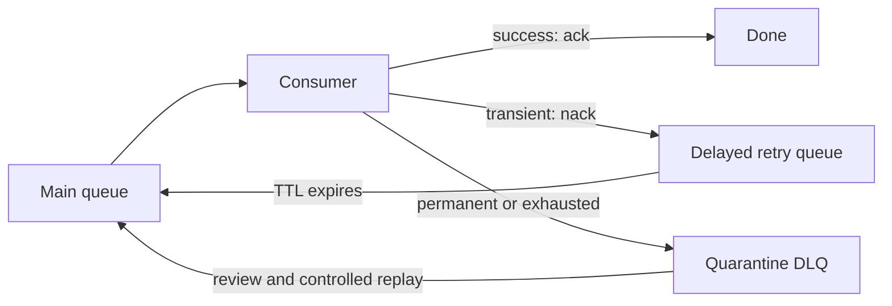

# 3. How do you handle poison messages and dead-letter queues?

**Technology:** RabbitMQ and Messaging

**Source question:** 3. How do you handle poison messages and dead-letter queues?

## 1. What problem does it solve?

A **poison message** repeatedly fails and will not succeed through immediate retry—for example, malformed JSON or an unsupported contract. Continual requeue creates a hot loop that consumes resources while useful payments wait.

Dead-lettering removes such work while preserving recovery evidence. Without bounded retries, one event can cause a storm, block work, or disappear unaudited.

A DLQ does not fix the message; it requires monitoring, ownership, retention, and safe replay.

## 2. Explain it in simple language

Think of a bank mailroom. A damaged instruction is not passed endlessly between clerks. It is labelled with the reason, moved to a secure exception tray, investigated, corrected at the source, and reintroduced only under control.

**One-sentence definition:** Poison-message handling classifies failed deliveries, applies bounded delayed retries only where useful, and quarantines terminal failures through dead-letter routing for investigation or controlled replay.

**Memory rule:** **Retry the temporary; quarantine the permanent; never loop forever.**

RabbitMQ republishes a dead letter from its queue to a configured dead-letter exchange (DLX), commonly routed to a DLQ.

## 3. How does it work internally?

1. A producer publishes through an exchange to the main queue; a manual-ack consumer classifies failures.
2. A transient failure enters a bounded delayed path, often by nacking without requeue into a retry queue whose TTL routes it back. Avoid immediate requeue.
3. A permanent or exhausted failure is nacked without requeue and routed by the DLX to quarantine.
4. RabbitMQ updates `x-death` history with queue, reason, and count. It is metadata, not business identity.
5. Operations resolves the cause and republishes under a controlled replay policy.



Dead-lettering can follow reject/nack with `requeue: false`, TTL expiry, queue overflow, and—for quorum queues—delivery-limit exhaustion. Prefer RabbitMQ policies for DLX settings because hard-coded arguments require redeclaration to change. Test for routing cycles.

A DLX transfer is not automatically lossless. Classic-queue internal republishing lacks application publisher-confirm safety; an unavailable target can lose a dead letter. Quorum queues support safer at-least-once dead-lettering when appropriately configured, at a resource cost. Verify the deployed RabbitMQ version and queue type.

## 4. Realistic payment or banking example

A payment service commits a card payment and publishes `PaymentSettled` through an outbox. A ledger-projection consumer updates a reporting database.

- **Angular:** displays status and correlation ID; it never decides broker validity or replay.
- **ASP.NET Core:** enforces authentication, authorization, validation, payment/outbox commit, and replay authorization.
- **Database:** the payment ledger is the authoritative source of truth; the projection database owns its inbox and read model.
- **RabbitMQ:** transports the event, holds delayed retries, and quarantines terminal deliveries; the DLQ is not the financial ledger.

A database timeout may recover; invalid currency or unsupported schema will not. Quarantine the latter with non-sensitive diagnostics. After deploying compatibility, replay preserves the original message ID so inbox idempotency works.

## 5. Successful flow and failure flow

### Successful flow

1. The payment API validates authorization server-side and commits payment plus outbox atomically.
2. The outbox publisher sends `PaymentSettled` with a stable message ID and uses publisher confirms.
3. The consumer validates the envelope and contract, transactionally inserts an inbox row and projection update, then acknowledges.
4. RabbitMQ removes the delivery; metrics record success and processing latency.

### Failure flow

- **Validation or provenance failure:** quarantine corrupted, unsupported, oversized, or untrusted content immediately.
- **Timeout or dependency outage:** retry with backoff and jitter, capped by attempts and age. The inbox makes uncertain commits safe.
- **Duplicate/redelivery:** the unique inbox key detects prior completion; acknowledge without repeating the effect.
- **Concurrency conflict:** retry only if rereading can succeed; otherwise quarantine.
- **Database unavailable:** delay and apply backpressure; never ack success.
- **DLX unavailable or misrouted:** alert on unroutable/dead-letter failures and retain the source where the chosen topology permits; validate bindings before release.
- **Cancellation:** let unfinished work redeliver; cancellation does not reverse a committed transaction.
- **Partial completion:** persist external-call intent in an outbox and make that call idempotent.
- **Replay:** fix first, authorize, preserve identity, rate-limit, and audit.

## 6. Practical C#/.NET implementation

With RabbitMQ.Client 7.x, use asynchronous channel APIs. Keep classification in application code and acknowledgement/routing in the transport adapter:

```csharp
public enum FailureKind { Transient, Permanent }

public sealed record MessageFailure(FailureKind Kind, string Code);

public interface IPaymentSettledHandler
{
    Task HandleIdempotentlyAsync(PaymentSettled message, CancellationToken ct);
}

public sealed class PaymentSettledConsumer(
    IChannel channel,
    IPaymentSettledHandler handler,
    ILogger<PaymentSettledConsumer> logger)
{
    public async Task HandleAsync(BasicDeliverEventArgs delivery, CancellationToken ct)
    {
        PaymentSettled? message = null;
        try
        {
            message = JsonSerializer.Deserialize<PaymentSettled>(delivery.Body.Span)
                ?? throw new JsonException("Empty payload");

            await handler.HandleIdempotentlyAsync(message, ct);
            await channel.BasicAckAsync(delivery.DeliveryTag, multiple: false, ct);
        }
        catch (Exception ex) when (TryClassify(ex, out MessageFailure failure))
        {
            logger.LogWarning(ex,
                "Message {MessageId} failed with {Code}; permanent={Permanent}",
                message?.MessageId, failure.Code,
                failure.Kind == FailureKind.Permanent);

            // Queue policy routes rejected deliveries to retry or quarantine topology.
            await channel.BasicNackAsync(
                delivery.DeliveryTag, multiple: false, requeue: false, ct);
        }
    }

    private static bool TryClassify(Exception ex, out MessageFailure failure)
    {
        failure = ex switch
        {
            JsonException => new(FailureKind.Permanent, "invalid_contract"),
            UnsupportedSchemaException => new(FailureKind.Permanent, "schema_version"),
            TimeoutException => new(FailureKind.Transient, "dependency_timeout"),
            _ => new(FailureKind.Permanent, "unclassified")
        };
        return true;
    }
}
```

In RabbitMQ.Client 7.x, deserialize or copy `delivery.Body` before the callback returns because its memory has a limited lifetime. The handler transactionally inserts `Inbox(MessageId UNIQUE)` and the projection. Logs include IDs, failure code and attempt, but redact payment data.

Production retry stages normally use distinct queues and TTLs. One nack cannot select between two DLXs; classification needs topology or explicit republishing. For the latter, confirm the new publish before acknowledging the original.

Unit-test classification. With a real RabbitMQ container, test nack routing, `x-death`, attempt limits, crash-after-commit, and idempotent replay; mocks cannot validate topology.

## 7. Important design decisions

| Decision | Recommended default | Trade-offs and implications |
|---|---|---|
| Failure classification | Explicit transient/permanent codes; unknowns quarantine | May delay recoverable work, but avoids retry storms. |
| Retry strategy | Bounded delayed backoff with jitter | Extra topology protects dependencies; cap attempts and age. |
| Configuration | RabbitMQ policies for DLX; version-controlled topology | Policies are changeable operationally; application arguments are visible but require queue recreation to alter. |
| Quarantine shape | DLQ per domain/owner | Better permissions and diagnosis; more queues and alerts. |
| Replay | Authorized, audited, rate-limited tool | Manual is slower; automatic replay can repeat incidents. |
| Queue type | Quorum for higher-value work when its guarantees justify cost | Better resilience and safer dead-letter options, but greater disk/network overhead than classic queues. |

Use TLS, least-privilege vhost permissions, restricted DLQ access, and retention rules. Monitor depth, oldest age, retry/failure rates, routing, and replay. Assign an owner and runbook.

## 8. When to use it and when not to use it

Use bounded retry plus quarantine for durable asynchronous workflows where messages can be malformed, incompatible, or repeatedly fail: payment events, ledger projections, settlement files, and notifications.

It is unnecessary for disposable telemetry. An in-process queue suits non-durable work; a database job table may suit a small transactional scheduler. A DLQ is not normal workflow, an archive, or a validation substitute. Endless retries, manual payload edits, no owner, and changed replay IDs are warning signs.

## 9. Compare it with related concepts

| Concept | Purpose / ownership | Lifecycle and performance | Reliability, complexity, limitation |
|---|---|---|---|
| Immediate requeue | Consumer retries | Low topology, hot-loop risk | No useful delay or bound |
| Delayed retry queue | Broker defers transient work | Extra queues/storage and latency | Protects dependencies; attempts must be bounded |
| Quarantine DLQ | Operations holds terminal work | Retained until investigation/expiry | Enables recovery, not automatic correctness |
| Parking-lot store | Application stores failures | Queryable external storage | Flexible; application owns handoff |
| Outbox/inbox | Application protects publication/idempotent effects | Transactional database records | Solves different boundaries; does not classify poison data |

For payments I would combine outbox/inbox with delayed retries and a domain DLQ: the first protects publication/effects; the latter isolates outages and poison data.

## 10. Common production mistakes

- **Infinite immediate retry:** creates hot loops; detect redelivery spikes and enforce delayed attempt/age limits.
- **Using `x-death` as business idempotency:** headers can change or be absent after republishing. Use a stable signed/validated message ID and a unique inbox constraint.
- **Assuming permanent safety:** retention, overflow, misrouting, or broker loss can remove data. Test and monitor chosen guarantees.
- **Blind replay:** repeats incidents or effects. Fix first, preserve identity, canary, rate-limit, audit, and support stopping.
- **Sensitive diagnostics:** minimize contracts, redact logs, encrypt transport, and restrict access.
- **Hard-coded DLX arguments:** makes changes require deleting/redeclaring queues. Prefer policies where operational mutability is needed.
- **No ownership:** alert on count/age and failure codes; maintain a runbook and objective.
- **Testing only handlers:** misses TTL, routing, cycles, and target failures. Add broker-backed tests.

## 11. Interview-ready answer

### 30-second answer

I classify failures as transient or permanent. Transient failures get bounded delayed retries; malformed, incompatible, or exhausted messages are nacked without requeue into quarantine. I monitor depth and age, preserve IDs for idempotent replay, and use authorized, audited replay. A DLQ is neither a fix nor a guaranteed archive.

### Two-minute senior-level answer

I never blindly `requeue: true`, because poison messages create hot loops. Timeouts may be transient; invalid data and unsupported versions are permanent. Transient cases use bounded delayed retries; permanent or exhausted cases go through a DLX to domain quarantine.

I configure DLX routing with policies and integration-test bindings, TTL, `x-death`, cycles, and target failure. Classic and quorum queues have different safety and cost, so I verify the deployed RabbitMQ version and choose guarantees by business value.

The payment database remains authoritative. A stable message ID and transactional inbox make replay idempotent. DLQ access is least-privileged and logs contain reason codes, not sensitive payloads.

I alert on retry rate, count, oldest age, and reasons, with explicit ownership and retention. After fixing the cause, an authorized, rate-limited, audited tool replays a canary while preserving identity. Poison handling is a recovery process, not merely another queue.

### Three follow-up questions

1. What can cause RabbitMQ to dead-letter a message, and when can dead-letter transfer fail?
2. How would you implement delayed retries without creating an infinite routing cycle?
3. How do you replay a DLQ safely while preventing duplicate payment effects?

**Keywords:** poison message, classification, nack, `requeue: false`, DLX, quarantine, bounded backoff, `x-death`, quorum queue, idempotency, inbox, controlled replay, least privilege.

**Red flags:** “retry everything”; claiming a DLQ guarantees exactly once or permanent storage; using immediate requeue indefinitely; replaying with new IDs; editing financial messages manually; ignoring queue type, DLX failure, security, monitoring, or ownership.

## 12. Test my understanding interactively

During revision, answer this one scenario-based interview question:

> A `PaymentSettled` consumer starts timing out against its projection database. After three retries, 20,000 messages reach the quarantine DLQ. The database then recovers, but investigation also finds 300 messages with an unsupported schema version. As technical lead, explain how you would classify, monitor, and safely replay this backlog without duplicating effects, exposing payment data, overwhelming the database, or returning the truly poison messages to a retry loop.

## Revision card

- **One-sentence definition:** Poison-message handling uses classified, bounded retries and dead-letter quarantine to isolate repeatedly failing deliveries for controlled recovery.
- **Memory rule:** Retry the temporary; quarantine the permanent; never loop forever.
- **Recommended use:** Durable asynchronous workflows where bad or exhausted messages must not block healthy work.
- **Main danger:** Treating a DLQ as a guaranteed archive or blindly replaying it without idempotency and cause remediation.
- **Interview takeaway:** Discuss classification, delayed bounds, DLX guarantees, stable IDs, secure observability, ownership, and controlled replay as one operational design.
