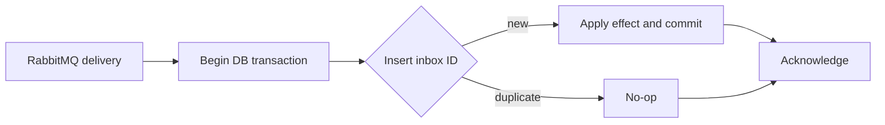

# 4. How do you prevent duplicate message processing?

**Technology:** RabbitMQ and Messaging

**Source question:** 4. How do you prevent duplicate message processing?

## 1. What problem does it solve?

Reliable brokers normally provide **at-least-once delivery**, not exactly-once business execution. A consumer may commit and crash before acknowledging. RabbitMQ cannot know the commit succeeded, so it redelivers. Publishers may also retry after an uncertain confirm, and operators may replay messages.

For a payment event, processing twice could post a ledger entry twice, send two refunds, or issue duplicate notifications. The problem is primarily consistency and reliability, with security, audit, scalability, and operational consequences.

The goal is not removing every broker duplicate, but making repeated delivery produce the same business result. That property is **idempotency**.

## 2. Explain it in simple language

Imagine a bank clerk receiving the same transfer instruction twice. Before posting it, the clerk checks a permanent register of instruction numbers. If the number was completed already, the clerk stamps the copy as handled without moving money again.

**One-sentence definition:** Prevent duplicate processing by assigning stable message identity and atomically recording that identity with the business effect, so redelivery is safely acknowledged without repeating the effect.

**Memory rule:** **Same identity, one committed effect, then acknowledge.**

Retry protection alone is not idempotency: limiting retries reduces frequency, while idempotency makes any number of repeats safe.

## 3. How does it work internally?

1. The producer assigns a stable event ID when the logical event is created. A retry keeps that ID.
2. RabbitMQ delivers the message with manual acknowledgement.
3. The consumer begins a database transaction and inserts the event ID into an **inbox** table protected by a unique constraint.
4. If insertion succeeds, it applies the business change in the same transaction. If the unique constraint reports an existing ID, it performs no business change.
5. The consumer commits, then acknowledges the RabbitMQ delivery.
6. A crash before commit leaves no durable effect, so redelivery can process normally. A crash after commit but before ack causes redelivery, but the inbox detects it.



Acknowledgements are scoped to a channel and delivery tag; they are not distributed transactions with the database. RabbitMQ's `redelivered` flag is only a hint and cannot replace durable deduplication. Likewise, an in-memory `HashSet` fails on restart and across replicas.

Scope the inbox key by consumer, such as `(ConsumerName, MessageId)`, because different consumers legitimately process the event. Retention must exceed the replay window.

## 4. Realistic payment or banking example

A payment service atomically commits a card payment and an outbox event, `PaymentSettled`. An outbox publisher sends it to RabbitMQ. A ledger-projection consumer updates its own reporting database.

- **Angular:** submits an API idempotency key for user retries and displays status; it cannot enforce backend uniqueness.
- **ASP.NET Core:** authenticates, authorizes, validates, creates stable IDs, commits payment plus outbox, and hosts the consumer.
- **Database:** the payment ledger is authoritative; the consumer database owns its inbox and projection transaction.
- **RabbitMQ:** routes and redelivers events but does not determine whether a financial effect already occurred.

API and message idempotency cover different boundaries: repeated user submissions and repeated downstream effects.

## 5. Successful flow and failure flow

### Successful flow

1. The API enforces authorization and validation, then stores the payment and outbox event atomically.
2. The publisher sends the event with its original message ID and waits for a publisher confirm.
3. The consumer inserts `(LedgerProjection, EventId)` and updates the projection in one transaction.
4. After commit, it acknowledges; RabbitMQ removes that delivery.
5. Logs and metrics carry correlation ID, event ID, outcome, and latency without sensitive card data.

### Failure flow

- **Duplicate or replay:** the unique constraint wins under concurrency; the losing delivery follows the duplicate path, then acknowledges.
- **Crash after database commit, before ack:** RabbitMQ redelivers; the inbox turns it into a no-op.
- **Database timeout with uncertain result:** do not guess or ack. Redelivery safely resolves the outcome through the inbox record.
- **Validation/authorization failure:** reject or quarantine invalid or untrusted messages; enforcement remains server-side.
- **Concurrency conflict:** retry the database transaction with a bound; the unique constraint remains the arbiter.
- **Broker/channel failure after commit:** the ack may be lost, so expect redelivery.
- **Cancellation:** stop taking work and do not ack an uncommitted operation. Cancellation does not roll back a transaction already committed.
- **External side effect:** an inbox cannot atomically cover another API. Pass its idempotency key, or write a local outbox for an idempotent dispatcher.
- **Partial completion:** keep local effect and inbox atomic; use state, reconciliation, and valid compensation across systems.

## 6. Practical C#/.NET implementation

With modern ASP.NET Core and EF Core, keep deduplication in the application/infrastructure boundary, not the controller. RabbitMQ.Client 7.x provides asynchronous channel methods:

```csharp
public sealed record PaymentSettled(Guid EventId, Guid PaymentId, decimal Amount);

public interface IPaymentSettledHandler
{
    Task<HandleResult> HandleAsync(PaymentSettled message, CancellationToken ct);
}

public enum HandleResult { Applied, Duplicate }

public sealed class PaymentSettledHandler(PaymentsReadDb db)
    : IPaymentSettledHandler
{
    public async Task<HandleResult> HandleAsync(
        PaymentSettled message, CancellationToken ct)
    {
        await using var tx = await db.Database.BeginTransactionAsync(ct);

        db.Inbox.Add(new InboxMessage("ledger-projection", message.EventId));
        try
        {
            await db.SaveChangesAsync(ct); // UNIQUE(Consumer, MessageId)
        }
        catch (DbUpdateException ex) when (IsUniqueInboxViolation(ex))
        {
            await tx.RollbackAsync(ct);
            return HandleResult.Duplicate;
        }

        db.LedgerEntries.Add(new LedgerEntry(
            message.PaymentId, message.Amount, message.EventId));
        await db.SaveChangesAsync(ct);
        await tx.CommitAsync(ct);
        return HandleResult.Applied;
    }

    private static bool IsUniqueInboxViolation(DbUpdateException ex) =>
        SqlErrorClassifier.IsUniqueConstraint(ex, "UX_Inbox_Consumer_MessageId");
}
```

Match the provider error code and constraint; not every `DbUpdateException` is a duplicate. The transport adapter acknowledges only after the handler returns:

```csharp
public async Task ConsumeAsync(BasicDeliverEventArgs delivery, CancellationToken ct)
{
    var message = JsonSerializer.Deserialize<PaymentSettled>(delivery.Body.Span)
        ?? throw new JsonException("Empty message");

    var result = await handler.HandleAsync(message, ct);
    logger.LogInformation("Payment event {EventId}: {Result}",
        message.EventId, result);
    await channel.BasicAckAsync(delivery.DeliveryTag, multiple: false, ct);
}
```

In RabbitMQ.Client 7.x, deserialize or copy `delivery.Body` before the callback returns because its memory has limited lifetime. Under consumer concurrency, the database constraint—not a pre-query—guarantees uniqueness.

Unit-test outcomes and error classification. Against the real database and RabbitMQ, deliver one ID concurrently, simulate crash-after-commit, restart, and assert one ledger row. Also test cancellation and replay.

## 7. Important design decisions

| Decision | Recommended default | Trade-offs and implications |
|---|---|---|
| Identity | Immutable producer event ID | Hashes mishandle legitimate identical events; delivery tags are unstable. Validate provenance. |
| Deduplication store | Inbox transactionally with the effect | Strong local consistency; adds writes, indexing, and retention. |
| Duplicate handling | Ack completed duplicates | Requeue wastes capacity; count metrics. |
| Concurrency | Unique constraint is authoritative | Read-before-write has a race. |
| Retention | Replay horizon plus margin | Forever grows storage; early deletion permits reprocessing. |
| External calls | Provider idempotency key or transactional outbox | No universal atomic transaction exists; reconciliation and provider semantics must be tested. |

Use TLS, least privilege, payload limits, and redacted logs. Monitor duplicates, inbox conflicts, unacked age, failures, and latency.

## 8. When to use it and when not to use it

Use durable idempotency for payments, refunds, ledger changes, reservations, and replayable events with important effects—especially with retries and multiple replicas.

An inbox may be unnecessary for disposable telemetry or a naturally idempotent `SetStatus(Completed)` where ordering is controlled. A database job table may suit a small single-database system.

Warning signs include trusting `redelivered`, acking before commit, new retry IDs, in-memory IDs, global deduplication across unrelated consumers, and undefined “exactly once” claims. A distributed cache adds expiry and availability failure modes when a local constraint is sufficient.

## 9. Compare it with related concepts

| Concept | Purpose / ownership | Lifecycle / performance | Reliability / complexity / limitation |
|---|---|---|---|
| Consumer inbox | Deduplicates consumer effects | DB write and retained key | Locally atomic; not remote effects |
| Idempotent operation | Same command reaches same state | Often no extra record | Simple; ordering may still matter |
| Producer outbox | Prevents lost publication | DB record until published | Complements inbox; may duplicate |
| Broker deduplication | Suppresses some repeats | Broker-specific window | Optimization, not business correctness |
| API idempotency key | Deduplicates requests | Stores response/status | Different boundary |
| Distributed transaction | Coordinates resources | Latency and coupling | Often unavailable end to end |

For banking I would use a producer outbox, consumer inbox, and provider idempotency keys or outbox dispatch for remote effects.

## 10. Common production mistakes

- **Check then insert:** replicas race and both apply. Enforce a unique constraint and transaction.
- **Ack before commit:** a crash loses work. Ack only after durable completion.
- **Separate inbox/effect commits:** crashes suppress or repeat work. Test transaction boundaries.
- **New retry/replay IDs:** bypass deduplication. Preserve logical identity.
- **Wrong key scope:** global blocks legitimate consumers; overly narrow misses duplicates.
- **Unbounded inbox:** inflates indexes/backups. Purge against the documented replay horizon.
- **All DB errors treated as duplicates:** hides outages. Match exact error and constraint.
- **Ignoring order:** an older unique event can overwrite newer state. Use versions and optimistic concurrency.
- **Leaking data:** log identifiers/reason codes, not financial payloads; restrict access.
- **Mock-only tests:** miss redelivery and races. Add infrastructure and failure tests.

## 11. Interview-ready answer

### 30-second answer

I assume RabbitMQ can redeliver. Each logical event has a stable producer-generated ID. The consumer inserts that ID into an inbox with a unique constraint and applies its database effect in the same transaction, then acknowledges only after commit. A redelivery becomes a safe no-op. For external APIs, I also need their idempotency key or an outbox and reconciliation; the inbox alone is not enough.

### Two-minute senior-level answer

RabbitMQ acknowledgements and database commits are not atomic. A consumer can commit, crash before ack, and receive the message again. I therefore design for at-least-once delivery.

The producer preserves an immutable event ID across retry and replay. A consumer transaction inserts `(ConsumerName, EventId)` into a uniquely constrained inbox and writes the effect. I commit before ack. Under concurrency the constraint decides; duplicates are acknowledged without repeating the effect. I never rely on memory, a pre-check, delivery tag, or redelivery flag.

I retain inbox records for the replay horizon, monitor conflicts and ack latency, and test crash-after-commit and concurrent delivery. Outbox solves publication; inbox solves consumer effects. Neither makes a remote API atomic, so it needs a provider idempotency key, stateful dispatch, and reconciliation. Unique but stale events also require sequence checks or optimistic concurrency.

### Three follow-up questions

1. Why must the inbox insert and business update share one transaction?
2. How would you make an external payment-provider call idempotent?
3. How do inbox retention and event ordering affect correctness?

**Keywords:** at-least-once delivery, idempotency, stable event ID, transactional inbox, unique constraint, manual acknowledgement, commit-before-ack, outbox, replay horizon, optimistic concurrency, reconciliation.

**Red flags:** claiming RabbitMQ guarantees exactly-once processing; trusting `redelivered`; using an in-memory cache or check-then-insert; acknowledging before commit; generating new retry IDs; assuming an inbox makes external calls atomic; ignoring retention, ordering, security, or race testing.

## 12. Test my understanding interactively

During revision, answer this one scenario-based interview question:

> A `PaymentSettled` consumer writes a ledger projection, calls a remote rewards API, and then acknowledges. Production shows occasional duplicate rewards after consumer restarts, although the projection has a unique inbox constraint. As technical lead, how would you diagnose the failure boundary and redesign the flow so retries and uncertain remote responses are safe?

## Revision card

- **One-sentence definition:** Stable message identity plus an atomic inbox and business effect makes redelivery harmless.
- **Memory rule:** Same identity, one committed effect, then acknowledge.
- **Recommended use:** Durable, replayable messages whose repeated effects would matter.
- **Main danger:** Assuming local deduplication makes remote side effects or event ordering safe.
- **Interview takeaway:** Start with at-least-once delivery, explain the commit-before-ack gap, then cover transactional inbox, unique constraints, outbox, external idempotency, retention, and testing.
