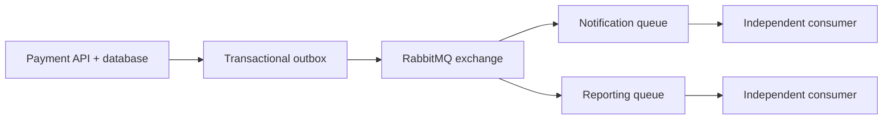

# 5. When would you choose RabbitMQ over direct API calls?

**Technology:** RabbitMQ and Messaging

**Source question:** 5. When would you choose RabbitMQ over direct API calls?

## 1. What problem does it solve?

Direct API calls couple services in time: the caller waits for the callee. That suits an immediate answer but is fragile for deferred work. If payment acceptance synchronously calls notifications, analytics, loyalty, and reporting, one slow optional dependency can fail the customer request.

RabbitMQ provides a durable asynchronous boundary. Producers publish and consumers process independently, absorbing bursts, isolating failures, and scaling separately.

It does not remove coupling or guarantee correctness. Contracts, retries, duplicates, ordering, and operations become explicit responsibilities.

## 2. Explain it in simple language

A direct call is like phoning a colleague and waiting. RabbitMQ is a tracked instruction in a durable work tray: you continue while they process it later.

**One-sentence definition:** Choose RabbitMQ when work may be completed asynchronously and needs durable buffering, retry, fan-out, or failure isolation; choose a direct API when the caller needs an immediate authoritative response.

**Memory rule:** **Need the answer now: call; need work done reliably later: queue.**

“Asynchronous” does not mean “parallel” or “faster.” It means the producer does not wait for downstream completion; total completion may take longer.

## 3. How does it work internally?

1. The producer creates a versioned message with stable message and correlation IDs.
2. It publishes to an exchange using a routing key. The exchange routes it to bound queues.
3. Durable queues, persistent messages, and publisher confirms protect important deliveries. An **outbox** closes the database/publication gap.
4. RabbitMQ stores and dispatches each queued delivery to a consumer. Prefetch limits unacknowledged messages and therefore memory and concurrency pressure.
5. The consumer validates, commits locally, and manually acknowledges after durable success.
6. If the channel closes before acknowledgement, RabbitMQ can redeliver. Consumers therefore need idempotency, commonly a transactional inbox and unique constraint.
7. Transient failures receive bounded, delayed retries; permanent failures go to a dead-letter or quarantine queue for investigation.



Publisher confirms mean RabbitMQ accepted responsibility, not that a consumer completed. Acknowledgements are not database transactions.

## 4. Realistic payment or banking example

A customer submits a card payment. Angular needs acceptance and a payment ID, so it calls ASP.NET Core directly. The API authenticates, authorizes, validates, and commits `Payment` plus a `PaymentAccepted` outbox record together.

- **Angular:** supplies an idempotency key and shows status. Frontend validation improves usability, not security.
- **ASP.NET Core:** owns authorization, command idempotency, business rules, persistence, and the stable event contract.
- **Database:** is the authoritative source of payment state and ledger facts.
- **RabbitMQ:** transports committed events; it is not the system of record.

If the interaction needs an immediate funds decision, use a direct call or local authoritative model, then publish resulting facts.

## 5. Successful flow and failure flow

### Successful flow

1. Angular sends the payment command with authentication, correlation ID, and idempotency key.
2. The API authorizes and validates it, then atomically stores the accepted payment and outbox event.
3. It returns `202 Accepted` with a status URL; acceptance is not settlement.
4. An outbox publisher sends the event and records a publisher confirm.
5. RabbitMQ fans out to independently owned queues.
6. Each consumer commits its inbox and local effect, then acknowledges.
7. Metrics track queue age, latency, retries, and payment state.

### Failure flow

- **Validation or authorization failure:** reject before publication; consumers still validate messages.
- **Duplicate request:** API idempotency returns the original result. Retry protection alone is not true idempotency.
- **Database failure:** payment and outbox both roll back; request cancellation does not itself guarantee rollback after a commit.
- **Broker unavailable after commit:** the outbox remains pending and retries, so no committed payment event is lost.
- **Unknown publish result:** resend the same event ID. A duplicate may occur, so consumers deduplicate.
- **Consumer timeout or crash:** do not acknowledge uncommitted work; RabbitMQ redelivers.
- **Poison message:** after bounded retries, dead-letter it instead of hot requeueing.
- **Concurrency conflict:** use optimistic concurrency and retry only when the operation remains valid.
- **Partial completion:** consumers are not mutually atomic. Reconcile and compensate where permitted.
- **Cancellation:** stop waiting or processing safely; it cannot undo a transaction already committed or a remote effect with an uncertain result.

## 6. Practical C#/.NET implementation

With supported modern .NET and RabbitMQ.Client 7.x, keep the broker outside the controller. The application service commits the domain change and outbox atomically:

```csharp
public sealed record AcceptPayment(Guid PaymentId, decimal Amount, string IdempotencyKey);
public sealed record PaymentAccepted(Guid EventId, Guid PaymentId, decimal Amount);

public sealed class AcceptPaymentHandler(PaymentsDb db, TimeProvider clock)
{
    public async Task<Guid> HandleAsync(AcceptPayment command, CancellationToken ct)
    {
        var previous = await db.ApiRequests
            .SingleOrDefaultAsync(x => x.Key == command.IdempotencyKey, ct);
        if (previous is not null) return previous.PaymentId;

        await using var tx = await db.Database.BeginTransactionAsync(ct);
        var payment = Payment.Accept(command.PaymentId, command.Amount, clock.GetUtcNow());
        var message = new PaymentAccepted(Guid.NewGuid(), payment.Id, payment.Amount);

        db.Payments.Add(payment);
        db.ApiRequests.Add(new(command.IdempotencyKey, payment.Id)); // UNIQUE key
        db.Outbox.Add(OutboxMessage.From(message));
        await db.SaveChangesAsync(ct);
        await tx.CommitAsync(ct);
        return payment.Id;
    }
}
```

The read is only an optimization; the unique constraint resolves concurrent duplicates. Map its exact provider error to the stored result. The API returns a status resource:

```csharp
app.MapPost("/payments", async (AcceptPayment request,
    AcceptPaymentHandler handler, CancellationToken ct) =>
{
    var id = await handler.HandleAsync(request, ct);
    return Results.Accepted($"/payments/{id}", new { paymentId = id });
}).RequireAuthorization("CanCreatePayments");
```

The publisher enables confirms through `CreateChannelOptions`, calls `BasicPublishAsync`, and marks the outbox published only after confirmation. With RabbitMQ.Client 7.x, copy or deserialize delivery bodies before the callback returns. Do not share channels concurrently without synchronization.

Log event, payment, and correlation IDs—not card data. Return expected HTTP failures as `ProblemDetails`. Integration-test real constraints, broker outage, duplicates, crash-after-commit, dead lettering, and cancellation.

## 7. Important design decisions

| Decision | Recommended default | Trade-offs |
|---|---|---|
| Interaction style | Direct for immediate decisions; events for deferred consequences | Messaging improves isolation but adds eventual consistency and operations. |
| Delivery correctness | Outbox, confirms, manual ack, idempotent consumer | Additional storage and writes; avoids loss and repeated effects. |
| Message type | Publish facts, not remote procedure calls disguised as queues | Events reduce producer knowledge; commands give clearer ownership. |
| Retry policy | Classified, bounded, delayed retry plus dead-lettering | Unlimited retries amplify outages and cost. |
| Ordering | Avoid global ordering; partition by entity when required | Strict ordering restricts concurrency and throughput. |
| Security | TLS, least-privilege virtual-host permissions, payload limits, schema validation | Broker access expands the attack surface; never place secrets or full card data in messages. |
| Operations | Ownership, alerts, replay procedure, retention and capacity plan | A broker without operational maturity becomes a hidden critical dependency. |

Prefer additive contracts, explicit versions, compatibility tests, and documented ownership. Monitor queue age, not depth alone.

## 8. When to use it and when not to use it

Use RabbitMQ for durable background work, burst smoothing, fan-out, unavailable consumers, and cross-service events such as `PaymentAccepted`.

Prefer direct APIs for interactive reads, immediate decisions, and cases where the caller cannot continue. An in-process call or database job may suit one small application.

Warning signs include queueing every call, synchronously awaiting reply messages, treating `202` as completion, sharing one queue across unrelated consumers, assuming exactly once, or lacking monitoring and replay ownership.

## 9. Compare it with related concepts

| Option | Purpose and ownership | Lifecycle and performance | Reliability, complexity, limitations |
|---|---|---|---|
| Direct HTTP/gRPC | Caller requests an immediate result from owner | Request lifetime; low end-to-end latency when healthy | Simple, but availability and latency are coupled |
| RabbitMQ | Durable commands/events between owners | Queued; adds latency but buffers bursts | Retries and fan-out; duplicates, eventual consistency, broker operations |
| In-process event | Decouples code in one process | Lost on crash; very fast | Simple, not durable or cross-service |
| Database job table | Background work owned by one application | Polling/locking overhead | Transactionally convenient; limited routing and broker features |
| Event streaming platform | Retained ordered log and replay | High-throughput streams | Strong replay/analytics fit; different operational and consumption model |

I use HTTP to submit/query payment, then RabbitMQ after commit for notification, reporting, and analytics. The outbox safely connects the boundaries.

## 10. Common production mistakes

- **No outbox:** creates phantom or missing events. Detect through reconciliation; persist an outbox atomically.
- **Acknowledging before durable consumer completion:** crashes lose work. Ack after commit and test forced termination.
- **Assuming exactly once:** redelivery repeats effects. Use stable IDs, inbox constraints, and external idempotency.
- **Immediate requeue loops:** poison messages consume CPU and starve healthy work. Classify, delay, cap, and dead-letter retries.
- **Excessive prefetch or concurrency:** exhausts memory, connections, or databases. Tune against measured service capacity.
- **No back-pressure plan:** growth exhausts disk. Alert on age, capacity, and lag.
- **Breaking contracts or leaking data:** consumers fail or sensitive data spreads. Evolve additively, restrict access, and redact logs.
- **Using messaging for synchronous RPC:** retains temporal coupling while adding correlation, timeout, and orphan-response problems.
- **Mock-only tests:** miss confirms, redelivery, and topology errors. Test real infrastructure.

## 11. Interview-ready answer

### 30-second answer

I choose RabbitMQ when the caller does not need an immediate result and I need durable buffering, retries, fan-out, or outage isolation. Direct APIs serve immediate queries and decisions. For payment events I atomically commit payment and outbox, publish with confirms, and make consumers idempotent. The trade-off is eventual consistency and operational complexity.

### Two-minute senior-level answer

First ask whether the caller needs the result to continue. If yes, an API is clearer. For later consequences such as notification or reporting, RabbitMQ fits when durability and isolation justify it.

For a payment, the API is authoritative. It validates and atomically writes payment plus outbox. `202` means accepted, not settled. The publisher uses persistent delivery and confirms. Each consumer owns a queue, limits prefetch, commits an inbox and effect, then acknowledges. This handles dual writes and redelivery.

I define bounded delayed retries, dead-letter handling, contract evolution, correlation, alerts, and replay ownership. RabbitMQ improves temporal decoupling but adds eventual consistency, duplicates, ordering limits, and a stateful platform. Queue-based request/reply usually retains coupling while adding failure modes.

### Three follow-up questions

1. How does the transactional outbox prevent a lost payment event?
2. Why can publisher confirms and consumer acknowledgements not provide exactly-once business processing?
3. How would you control retries, prefetch, and queue growth during a downstream outage?

**Keywords:** temporal coupling, durable buffering, eventual consistency, transactional outbox, publisher confirms, manual acknowledgement, at-least-once delivery, idempotency, inbox, back-pressure, dead-letter queue, correlation ID.

**Red-flag answers:** “RabbitMQ is always faster”; “it guarantees exactly once”; “a publish confirm means processing completed”; “just retry forever”; “returning `202` means payment succeeded”; or ignoring authorization, contract versioning, monitoring, duplicates, and broker outages.

## 12. Test my understanding interactively

During revision, answer this one scenario-based interview question:

> Your payment API synchronously calls fraud, notification, reporting, and loyalty services before responding. During a marketing campaign, notification latency causes payment timeouts, while some clients retry and create uncertainty about whether payments succeeded. Which interactions would you keep synchronous, which would you move to RabbitMQ, and how would you design the transaction, idempotency, failure recovery, and client-visible status?

## Revision card

- **One-sentence definition:** RabbitMQ is the right boundary for durable work that may complete later; direct APIs serve interactions needing an immediate answer.
- **Memory rule:** Need the answer now: call; need the work done reliably later: queue.
- **Recommended use:** Deferred payment consequences requiring buffering, retry, fan-out, or outage isolation.
- **Main danger:** Trading visible synchronous failures for hidden duplicates, lag, and eventual-consistency failures without operational controls.
- **Interview takeaway:** Decide from business timing first, then explain outbox, confirms, idempotent consumers, bounded retries, security, and observability.
