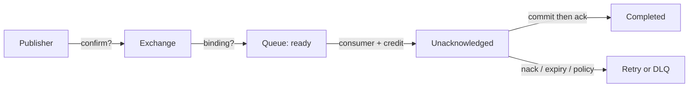

# 6. How would you debug a message that was published but not consumed?

**Technology:** RabbitMQ and Messaging

**Source question:** 6. How would you debug a message that was published but not consumed?

## 1. What problem does it solve?

“Published” is often an assumption, not an observed fact. A producer log may only prove that application code called `BasicPublishAsync`; it does not prove that RabbitMQ accepted the message, routed it to the intended queue, delivered it, or that a consumer completed the business operation.

A disciplined investigation prevents unsafe replays. The fault can be in publishing, routing, queue state, consumer connectivity, acknowledgement, dead-lettering, or downstream persistence. Guessing may create duplicate payment effects or destroy evidence.

This is a reliability and operability problem with consistency and security consequences.

## 2. Explain it in simple language

Treat message delivery like tracking a parcel through checkpoints: accepted by the depot, sorted to a route, placed in the destination bin, collected by a courier, and signed for. Find the first checkpoint without evidence.

**One-sentence definition:** Debugging an unconsumed RabbitMQ message means tracing one stable message ID from publisher confirmation through exchange routing, queue state, consumer delivery, acknowledgement, and business-side effect.

**Memory rule:** **Confirm, route, queue, deliver, acknowledge, commit.**

Before replaying, preserve headers, timestamps, metrics, and redacted logs.

## 3. How does it work internally?

1. The producer publishes the serialized event to an exchange with a routing key.
2. A publisher confirm proves that the broker accepted responsibility on that channel. It does not prove routing or consumption.
3. The exchange evaluates bindings. With no matching binding, the message is dropped unless `mandatory` publishing returns it or an alternate exchange captures it.
4. A matching queue stores it, subject to expiry, length, overflow, and dead-letter policies.
5. RabbitMQ delivers it to an eligible consumer when there is credit under the channel’s prefetch limit. It moves from **ready** to **unacknowledged**.
6. The consumer deserializes, validates, performs its transaction, and acknowledges after durable success. A reject/nack may requeue or dead-letter it.
7. If the channel closes before acknowledgement, RabbitMQ normally redelivers. Duplicates remain possible.



The key split is **ready versus unacknowledged**. Ready and increasing suggests no consumer, no credit, or slow consumption. Stuck unacknowledged suggests blocked processing, excessive prefetch, or missing acknowledgements. An empty queue does not prove success: the message may be unroutable, expired, dead-lettered, or acknowledged too early.

## 4. Realistic payment or banking example

An ASP.NET Core payment API commits a card payment and a `PaymentAccepted` outbox record. An outbox worker publishes the event to `payments.events`; a receipt service consumes from `receipts.payment-accepted` and stores a receipt.

- **Angular:** submits an idempotency key and displays status. Browser validation is usability only.
- **ASP.NET Core payment service:** authorizes, validates, commits payment plus outbox, and supplies stable IDs.
- **Database:** is authoritative for payment state and the outbox; the receipt database is authoritative for receipt processing.
- **RabbitMQ:** transports the committed fact and exposes routing and delivery state; it is not the payment system of record.

If payment `P123` exists but no receipt appears, correlate producer, broker, consumer, inbox, and receipt evidence by event ID. Never log card data.

## 5. Successful flow and failure flow

### Successful flow

1. Payment and outbox commit atomically.
2. The publisher sends a persistent message with stable IDs to the expected virtual host, exchange, and key.
3. RabbitMQ confirms and routes it to the durable receipt queue.
4. An active consumer with prefetch credit receives it.
5. The handler validates, transactionally records inbox and receipt, then acknowledges.
6. Logs connect event, correlation, queue, redelivery, and outcome.

### Failure flow

Investigate from left to right:

- **Outbox still pending:** the broker may be unreachable, credentials/TLS may fail, or the worker may be stopped. Retry the same event ID with backoff.
- **No confirm or channel closed:** the result is uncertain; safe republishing requires idempotent consumers.
- **Confirmed but not routed:** check exact exchange type/name, virtual host, routing key, bindings, and `mandatory` return handling. A confirm alone is insufficient.
- **Message ready:** inspect consumer count, channel health, flow control, prefetch, and logs. Queue age matters more than depth alone.
- **Message unacknowledged:** inspect blocked calls, database locks/timeouts, cancellation, and ack paths. Ensure duplicate safety before forcing redelivery.
- **Message disappeared:** check dead-letter/retry queues, TTL, max-length/overflow policy, operator policies, and consumer ack/nack logs.
- **Consumer rejects it:** separate permanent schema/validation errors for quarantine from transient failures eligible for bounded retry.
- **Commit succeeded but ack failed:** redelivery is correct; an inbox constraint prevents a repeated effect.
- **Ack before commit:** a crash may lose work. Reconcile and use controlled, audited replay.
- **Duplicate delivery:** enforce a unique event ID in the same transaction as the effect; retry protection is not true idempotency.

## 6. Practical C#/.NET implementation

With RabbitMQ.Client 7.x, capture evidence at publish time. Enable publisher confirmations on the channel and use mandatory publishing so unroutable messages fail visibly:

```csharp
public sealed class PaymentEventPublisher(IConnection connection, ILogger<PaymentEventPublisher> log)
{
    public async Task PublishAsync(PaymentAccepted message, CancellationToken ct)
    {
        var options = new CreateChannelOptions(
            publisherConfirmationsEnabled: true,
            publisherConfirmationTrackingEnabled: true);
        await using var channel = await connection.CreateChannelAsync(options, ct);

        var properties = new BasicProperties
        {
            MessageId = message.EventId.ToString("N"),
            CorrelationId = message.CorrelationId,
            ContentType = "application/json",
            Type = "payment.accepted.v1",
            DeliveryMode = DeliveryModes.Persistent
        };
        var body = JsonSerializer.SerializeToUtf8Bytes(message);

        log.LogInformation("Publishing {EventId} to {Exchange} with {RoutingKey}",
            message.EventId, "payments.events", "payment.accepted");

        await channel.BasicPublishAsync(
            exchange: "payments.events",
            routingKey: "payment.accepted",
            mandatory: true,
            basicProperties: properties,
            body: body,
            cancellationToken: ct);
    }
}
```

In RabbitMQ.Client 7.x, confirm-enabled `BasicPublishAsync` can surface nacks and mandatory returns as exceptions. Older APIs differ. A confirm still does not mean consumed. Production code should reuse connections/channels safely rather than create them per message.

The consumer commits before acknowledging:

```csharp
consumer.ReceivedAsync += async (_, args) =>
{
    // In v7.x, delivery-body memory is valid only during this callback.
    var message = JsonSerializer.Deserialize<PaymentAccepted>(args.Body.Span)!;
    using var scope = logger.BeginScope(new Dictionary<string, object?>
    {
        ["EventId"] = message.EventId,
        ["CorrelationId"] = message.CorrelationId,
        ["Redelivered"] = args.Redelivered
    });

    try
    {
        await receiptHandler.HandleAsync(message, stoppingToken); // inbox + effect transaction
        await channel.BasicAckAsync(args.DeliveryTag, multiple: false, stoppingToken);
    }
    catch (PermanentMessageException ex)
    {
        logger.LogWarning(ex, "Quarantining invalid payment event");
        await channel.BasicRejectAsync(args.DeliveryTag, requeue: false, stoppingToken);
    }
};
```

Insert a unique inbox `EventId` and receipt in one transaction. Use bounded delayed retry for transient failures, never a hot requeue loop.

Separate liveness from readiness and protect diagnostics with least privilege. Integration-test real topology, returns, outages, redelivery, DLQ routing, and duplicates.

## 7. Important design decisions

| Decision | Recommended default | Trade-offs and implications |
|---|---|---|
| Publish evidence | Outbox + confirms + mandatory returns | More code; distinguishes committed, accepted, and routed. |
| Acknowledgement | Manual ack after commit | Longer unacked window; prevents lost work. |
| Duplicate safety | Transactional inbox unique by event ID | Extra write; enables safe replay. |
| Retry | Bounded delayed retries, then DLQ | Adds latency; prevents outage amplification. |
| Observability | IDs, structured logs, queue age/rates, consumers, DLQ alerts | Storage/cardinality cost; redact data and restrict broker UI. |
| Topology ownership | Controlled declarations and deployment checks | Automation is convenient but can hide drift. |
| Replay authority | Audited, scoped tool with idempotency checks | Slower than ad hoc replay; safer for finance. |

Avoid casual `basic.get` inspection: it can change delivery state or expose data. Prefer metrics, definitions, and traces.

## 8. When to use it and when not to use it

Use this trace for missing effects, growing queues, uncertain publishes, redelivery storms, and topology changes—especially when replay could cause financial effects.

For a local typo, connection logs and metrics may suffice. A single-process queue needs no RabbitMQ topology diagnosis.

Warning signs include restarting or purging first, replaying without idempotency, trusting an empty queue, or granting broad production access.

## 9. Compare it with related concepts

| Evidence/concept | Purpose and owner | Lifecycle/performance | Reliability, complexity, limitation |
|---|---|---|---|
| Producer log | Shows publish intent | Immediate, cheap | Does not prove acceptance or routing |
| Publisher confirm | Broker accepted responsibility | Per channel; batching improves throughput | Does not prove routing or consumption |
| Mandatory return | Detects no matching binding | Publishing channel | Does not cover later expiry |
| Queue metrics/UI | Shows ready, unacked, rates, consumers | Point-in-time view | Message history may be absent |
| Consumer ack | Removes delivery | After processing | Does not prove a correct business commit |
| Inbox/business record | Proves idempotent business handling | Durable database state | Application-specific; needs correlation and reconciliation |

For payments, use outbox evidence, confirms/returns, broker metrics, and inbox plus receipt data; no single layer proves completion.

## 10. Common production mistakes

- **Equating publish with delivery:** fix fire-and-forget code with outbox, confirms, and mandatory publishing.
- **Wrong virtual host or queue:** log canonical topology and constrain configuration.
- **Ignoring ready versus unacked:** alert on age, ack rate, consumers, and unacked duration.
- **Acknowledging early:** crashes lose effects; commit before ack and test forced failure.
- **Immediate requeue:** creates hot loops; use delayed, bounded retries and quarantine.
- **Excessive prefetch/concurrency:** overwhelms databases and strands deliveries; tune to measured capacity.
- **Breaking schemas/topology:** use versioned contracts, compatibility tests, and deployment checks.
- **Unsafe logs or access:** log IDs, use TLS/least privilege, and audit access.
- **No reconciliation:** hides missing receipts; compare authoritative events with business effects.
- **Replay without idempotency:** duplicates effects; require stable IDs, transactional deduplication, and controlled replay.

## 11. Interview-ready answer

### 30-second answer

I trace one message ID through confirm, route, queue, deliver, acknowledge, and commit. I prove the outbox publisher received a confirm and handled mandatory returns; inspect the virtual host, bindings, ready/unacked counts, consumers, TTL, and DLQ; then correlate consumer logs, inbox, and business transaction. I do not replay until idempotency is proven.

### Two-minute senior-level answer

I first define the evidence. A producer log proves intent, a confirm proves broker acceptance, and mandatory returns expose failed routing; none proves processing.

Using a stable event ID, I check the outbox and producer errors, then the virtual host, exchange, routing key, bindings, and policies. Ready messages suggest missing consumers or slow consumption. Stuck unacked messages suggest blocked work, prefetch, or ack problems. If absent, I inspect TTL, overflow, retry, and dead-letter queues.

On the consumer, I correlate logs, schema, redelivery, database failures, inbox, and business record. It commits inbox and effect before manual ack. Assuming at-least-once delivery, I use stable IDs and uniqueness. Any replay is evidence-preserving, idempotent, scoped, audited, and reconciled.

### Three follow-up questions

1. What exactly does a publisher confirm prove, and what does it not prove?
2. How do ready and unacknowledged counts change your investigation?
3. How would you safely replay a payment event after an uncertain consumer result?

**Keywords:** message ID, correlation ID, outbox, publisher confirm, mandatory return, exchange, routing key, binding, virtual host, ready, unacknowledged, prefetch, manual ack, redelivery, TTL, dead-letter queue, transactional inbox, idempotency, reconciliation.

**Red-flag answers:** “The producer logged it, so RabbitMQ has it”; “a confirm means consumed”; “an empty queue proves success”; “purge or requeue forever”; or replaying without checking business state and idempotency.

## 12. Test my understanding interactively

During revision, answer this one scenario-based interview question:

> A `PaymentAccepted` outbox row is marked published, the receipt queue shows zero ready messages, and no receipt exists. The deployment introduced a new routing key and a RabbitMQ.Client upgrade. How would you investigate the incident, distinguish unroutable publication from successful consumption followed by data loss, and decide whether replay is safe?

## Revision card

- **One-sentence definition:** Trace a stable message ID through publisher acceptance, routing, queueing, delivery, acknowledgement, and durable business completion.
- **Memory rule:** Confirm, route, queue, deliver, acknowledge, commit.
- **Recommended use:** Missing effects, uncertain publishes, growing queues, redelivery storms, and controlled financial-message recovery.
- **Main danger:** Mistaking one checkpoint for end-to-end success and replaying into a non-idempotent system.
- **Interview takeaway:** Lead with evidence boundaries, ready versus unacked state, safe ack/transaction ordering, DLQ and policy checks, then idempotent audited replay.
