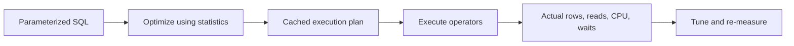

# 1. How do you optimize a slow SQL query?

**Technology:** SQL Server and Data Access

**Source question:** 1. How do you optimize a slow SQL query?

## 1. What problem does it solve?

A slow query increases latency, holds connections and locks longer, consumes CPU and I/O, and reduces database throughput. In a payment system, one inefficient history query can exhaust the connection pool or compete with payment writes.

Optimization means finding the measured bottleneck and reducing work while preserving correctness. Blindly adding indexes or increasing timeouts can raise write cost and blocking while leaving bad estimates, parameter sensitivity, or excess data untouched.

## 2. Explain it in simple language

Think of a filing room: a catalog finds one customer’s recent files directly, but maintaining too many catalogs slows every new filing.

**One-sentence definition:** SQL query optimization is the evidence-driven process of reducing database work and waiting time through better query shape, indexes, statistics, plans, and data-access behavior.

**Memory rule:** Measure, plan, reduce rows, index, verify.

## 3. How does it work internally?

SQL Server parses a statement, then the optimizer considers index access, join order, aggregation, and parallelism. It estimates rows from statistics and chooses the lowest estimated-cost plan. The plan is usually cached; initial parameter values can influence it. SQL Server 2022 Parameter Sensitive Plan optimization permits multiple variants for eligible predicates but does not solve every case.

Actual performance depends on rows, page reads, CPU, memory grants, locks, and waits. A wrong estimate can select nested loops for millions of rows or cause a sort to spill to `tempdb`.



Start with Query Store, an actual plan, duration, CPU, logical reads, and waits. Compare estimated versus actual rows; plan cost percentages are estimates, not timings. `async` calls do not make SQL Server faster or parallel—they avoid blocking an application thread while waiting.

## 4. Realistic payment or banking example

Suppose Angular requests the latest 50 posted transactions for an account and date range. It collects filters and paginates but cannot enforce access. ASP.NET Core authenticates, authorizes, applies limits, and calls a repository with parameters and cancellation. SQL Server is the authoritative source. A broker may distribute transaction events but is not on this read path.

The slow query filters `AccountId`, `Status`, and `BookedAt`, orders newest first, but uses `CAST(BookedAt AS date)` and returns every column. The function makes the predicate non-SARGable—harder to satisfy with an index seek—and wide rows increase reads and network transfer. Rewrite it as a half-open range and project only required columns:

```sql
SELECT TOP (@Take) TransactionId, BookedAt, Amount, Currency, Description
FROM ledger.Transactions
WHERE AccountId = @AccountId
  AND Status = @Posted
  AND BookedAt >= @FromUtc AND BookedAt < @ToUtc
ORDER BY BookedAt DESC, TransactionId DESC;
```

A candidate index is `(AccountId, Status, BookedAt DESC, TransactionId DESC)` with carefully selected `INCLUDE` columns. Validate it against production-like distributions and write workload rather than treating it as universally correct.

## 5. Successful flow and failure flow

### Successful flow

1. Angular sends bounded UTC filters and a continuation key.
2. ASP.NET Core authenticates, authorizes the account, validates limits, and adds a correlation ID.
3. The repository sends one parameterized command and propagates `CancellationToken`.
4. SQL Server seeks into the useful index, reads only the requested rows in order, and returns a narrow projection.
5. Metrics record duration and result count without logging sensitive transaction details.

### Failure flow

A validation or authorization failure returns `ProblemDetails` before querying. On timeout or cancellation the provider attempts command cancellation, but cancellation is not transaction rollback and server work may briefly continue. Retry this read only within a deadline. Writes need an idempotency key and persisted result when the outcome is uncertain; retry protection alone is not idempotency.

A database failure returns a sanitized 503 while restricted logs retain diagnostics. Concurrent changes may shift pages; keyset pagination plus an agreed consistency model beats large `OFFSET` pages. Duplicate reads still consume capacity. Broker failure is irrelevant here; a cached projection must expose freshness. Never retry validation, authorization, or deterministic errors.

## 6. Practical C#/.NET implementation

With .NET 8 LTS or a currently supported later release, keep policy in the application layer and SQL in infrastructure:

```csharp
public sealed record TransactionQuery(
    Guid AccountId, DateTime FromUtc, DateTime ToUtc, int Take);

public interface ITransactionReader
{
    Task<IReadOnlyList<TransactionRow>> GetAsync(
        TransactionQuery query, CancellationToken cancellationToken);
}

public sealed class GetTransactions(
    IAccountAuthorizer authorizer,
    ITransactionReader reader,
    ILogger<GetTransactions> logger)
{
    public async Task<IReadOnlyList<TransactionRow>> ExecuteAsync(
        ClaimsPrincipal user, TransactionQuery query, CancellationToken ct)
    {
        if (query.FromUtc >= query.ToUtc || query.Take is < 1 or > 100)
            throw new ValidationException("Invalid date range or page size.");

        await authorizer.EnsureCanViewAsync(user, query.AccountId, ct);
        using var scope = logger.BeginScope(new { query.AccountId });
        return await reader.GetAsync(query, ct);
    }
}
```

Infrastructure should use `Microsoft.Data.SqlClient`, typed parameters rather than `AddWithValue`, `CommandTimeout`, and `await using`. Typed parameters avoid implicit conversions and unstable inferred lengths. Middleware can map validation, authorization, timeout, and dependency failures to `ProblemDetails`.

Do not add a transaction to one read by default. For a consistent multi-query view, choose snapshot isolation deliberately and understand version-store cost. Integration tests need skewed data, ordering, authorization, cancellation, and read/plan regression checks. Unit tests cover orchestration, not optimizer behavior.

## 7. Important design decisions

**Query rewrite versus index:** First remove unnecessary rows, columns, conversions, and round trips. Then design an index around selective equality predicates, range/order columns, and minimal includes. Indexes speed reads but consume storage and make inserts, updates, statistics, backups, and maintenance more expensive.

**Cached plans versus recompilation:** Reuse reduces compilation CPU. `OPTION (RECOMPILE)` can suit infrequent, highly variable queries but costs CPU. `OPTIMIZE FOR`, Query Store forcing, SQL Server 2022 PSP, or SQL Server 2025 Optional Parameter Plan Optimization may help specific shapes; verify version, compatibility level, and monitoring.

**ORM versus SQL control:** EF Core projections may suffice. Focused SQL through EF Core or Dapper/ADO.NET gives more control but adds mapping burden. Parameterize values; allow-list dynamic identifiers.

**Consistency and pagination:** Offset pagination is simple but becomes expensive and unstable deep into a changing ledger. Keyset pagination is faster and deterministic with a unique tie-breaker, though it cannot jump naturally to arbitrary pages.

## 8. When to use it and when not to use it

Optimize measured latency, resource use, blocking, timeouts, or scalability problems, prioritizing frequent and critical-path queries. A bounded result may beat an elaborate cache.

Do not tune harmless queries aesthetically, cover every query with an index, or hint before understanding the plan. Avoid caching when freshness and authorization cannot be guaranteed. Denormalization, indexed views, and replicas add consistency and operational cost.

## 9. Compare it with related concepts

| Option | Purpose/ownership | Performance and reliability | Complexity/limitations | Typical use |
|---|---|---|---|---|
| Query/index tuning | Database and application teams reduce work | Fresh authoritative reads; write cost may rise | Plan/data dependent | Core transaction query |
| Application cache | Application avoids repeated reads | Very fast; stale data and invalidation risk | Security keys, eviction, stampedes | Stable reference data |
| Read replica | Platform routes read workload | Adds capacity; replication lag/failover concerns | Infrastructure and consistency | Reporting, tolerant reads |
| Precomputed projection | Data/event owners shape reads | Predictable fast lookup; eventually consistent | Rebuilds, ordering, broker reliability | Search/analytics views |

For the account transaction page, I would first tune the authoritative SQL query and index. I would consider a replica or projection only if measured scale demands it and the business accepts visible lag.

## 10. Common production mistakes

- **Guessing without baselines:** averages hide skew and regressions. Use Query Store, percentiles, actual plans, logical reads, waits, and production-like data.
- **Making predicates non-SARGable:** functions, implicit conversions, and leading-wildcard searches cause excess scans. Detect them in plans and rewrite predicates or choose a suitable search design.
- **Trusting one parameter:** skew produces a plan good for one account and poor for another. Test common and extreme values; evaluate statistics and parameter-sensitive alternatives.
- **Over-indexing:** duplicated or wide indexes slow ledger writes. Review usage carefully, but remember restart/reset effects before removing an index.
- **Returning too much:** `SELECT *`, unbounded ranges, N+1 calls, and deep offsets waste every layer’s resources. Project, bound, batch, and paginate.
- **Unsafe diagnostics:** logging SQL parameter values can expose account or payment data. Log query identity, timing, correlation, row count, and approved dimensions; restrict plan access.
- **Retrying blindly:** retries amplify overload and can duplicate writes. Retry only classified transient failures with budgets, backoff, and genuine idempotency where side effects exist.
- **Confusing blocking with query cost:** a fast query may wait behind a long transaction. Inspect waits, blockers, isolation, and transaction scope before changing SQL.

## 11. Interview-ready answer

### 30-second answer

I start with evidence: Query Store, an actual plan, logical reads, CPU, duration, waits, and representative parameters. I determine whether the issue is excess rows, a poor access path, bad estimates, blocking, or application round trips. Then I make the smallest change—usually query shape, projection, or an appropriate index—and verify both read improvement and write/concurrency impact under production-like load.

### Two-minute senior-level answer

I first define the symptom and baseline: percentile latency, frequency, CPU, reads, waits, and when it regressed. Query Store helps compare plans over time, while an actual execution plan shows estimates versus actual rows, scans, lookups, spills, and memory grants. I also check blocking, because changing an index will not fix a transaction holding locks.

Next I reduce work: return only needed columns and rows, eliminate N+1 calls, make predicates SARGable, parameterize with correct types, and use keyset pagination for deep result sets. I then evaluate an index whose key order supports equality filters followed by range and ordering, adding only necessary includes. I test representative and skewed account sizes because parameter sensitivity and stale statistics can change the best plan.

Finally, I load-test the change and compare reads, CPU, duration, write overhead, storage, concurrency, and plan stability. I deploy observably and keep a rollback path. Hints, recompilation, caching, replicas, or projections are targeted options, not first reactions. Correctness, authorization, sensitive-data logging, cancellation semantics, and retry/idempotency behavior remain part of the design.

### Three follow-up questions an interviewer may ask

1. How do you distinguish parameter sensitivity from missing or stale statistics?
2. When would you choose a covering index versus accepting key lookups?
3. How would you diagnose whether latency is caused by blocking rather than execution cost?

### Important keywords I should mention naturally

Query Store, actual execution plan, logical reads, waits, cardinality estimates, statistics, SARGability, parameter sensitivity, keyset pagination, memory grant, spill, blocking, representative data, parameterization, and regression verification.

### Red-flag answers that would make an interviewer question my experience

“Add an index to every filtered column,” “clear the plan cache,” “use `NOLOCK`,” or “increase the timeout” without diagnosis are red flags. So are trusting estimated cost percentages as timings, tuning with one parameter, ignoring write impact, concatenating SQL, or claiming async makes the database query faster.

## 12. Test my understanding interactively

During revision, answer this scenario-based interview question:

> A previously fast transaction-history endpoint now times out only for a few corporate accounts. Its actual plan uses the same cached index-seek-and-key-lookup plan as small accounts, but one corporate account returns 800,000 qualifying rows; payment writes must not be disrupted. How would you diagnose the cause, choose and validate a fix, and deploy it safely?

## Revision card

- **One-sentence definition:** Optimize a slow query by measuring its real bottleneck and reducing SQL Server work without compromising correctness or workload health.
- **Memory rule:** Measure, plan, reduce rows, index, verify.
- **Recommended use:** Prioritize measured, frequent, resource-heavy, or critical-path queries.
- **Main danger:** A local read improvement can destabilize writes, plans, consistency, or security.
- **Interview takeaway:** Explain the evidence, the plan, the smallest justified change, and how you verified production-wide trade-offs.
