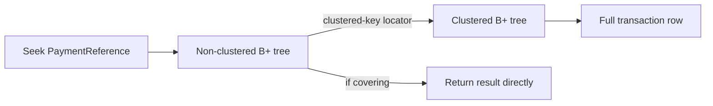

# 2. Explain clustered and non-clustered indexes.

**Technology:** SQL Server and Data Access

**Source question:** 2. Explain clustered and non-clustered indexes.

## 1. What problem does it solve?

Without indexes, SQL Server may scan every data page for a small result. As a ledger grows, that means more I/O, CPU, locks, and latency, so reads compete with payment writes.

Indexes provide ordered access paths. A clustered index defines the data leaf level; non-clustered indexes provide other paths. Poor choices harm reliability: excessive or badly keyed indexes slow writes and maintenance.

## 2. Explain it in simple language

Think of a bank archive. Folders stored in account-and-date order represent the clustered index. Separate catalogs by payment reference represent non-clustered indexes; each contains the answer or points to the folder.

**One-sentence definition:** In SQL Server, a clustered index stores table rows at the index leaf level in key order, while a non-clustered index stores a separate ordered set of keys plus row locators and optional included values.

**Memory rule:** Clustered is the data; non-clustered points to the data.

That rule describes the leaf level, not a promise that rows are physically contiguous or automatically returned in order. Only `ORDER BY` guarantees result order.

## 3. How does it work internally?

Both are usually balanced B+ trees of 8-KB pages. Upper levels guide navigation; linked leaves support ranges.

For a clustered table, leaves are the data rows, logically ordered by clustering key. A table has only one clustered index. A heap has no clustered ordering.

A non-clustered leaf contains its key, `INCLUDE` columns, and a row locator: the clustering key on a clustered table or physical row identifier (RID) on a heap. If it contains all required data, the query is *covered*. Otherwise SQL Server performs lookups that can become costlier than a scan at scale.



The optimizer chooses seeks, scans, or lookups using statistics and cost estimates; an index is not guaranteed to be used. Random inserts can split pages. Changing a clustering key is costly because non-clustered row locators can also change.

Common correction: a primary key is a constraint, not inherently clustered. SQL Server commonly makes it clustered only when no clustered index exists and `NONCLUSTERED` was not specified.

## 4. Realistic payment or banking example

Use `ledger.Transactions`, the authoritative source for posted entries. Angular supplies filters and renders results; ASP.NET Core enforces authentication, authorization, and limits. SQL Server enforces constraints and retrieves rows. A broker publishes events but is not on this read path.

A tested clustered key might be `(AccountId, BookedAt, TransactionId)` for account history. A unique non-clustered index supports reconciliation:

```sql
CREATE UNIQUE NONCLUSTERED INDEX UX_Transactions_PaymentReference
ON ledger.Transactions(PaymentReference)
INCLUDE (AccountId, BookedAt, Amount, Currency, Status);
```

This can answer a narrow lookup without visiting the clustered index, but costs storage and write work.

## 5. Successful flow and failure flow

### Successful flow

1. Angular sends an account, UTC range, and bounded page size.
2. ASP.NET Core authorizes, validates, and passes cancellation and correlation context.
3. A parameterized keyset query uses leading clustered-key columns.
4. SQL Server seeks and scans the small leaf range.
5. Metrics record duration, reads, and row count without payment data.

### Failure flow

Validation and authorization failures return `ProblemDetails` before database access. A duplicate read is safe but consumes capacity. Cancellation requests driver cancellation; it neither proves server work stopped nor rolls back a transaction.

An unexpected scan may result from a non-SARGable predicate, statistics, parameter sensitivity, or a missing leading key. A lookup plan can collapse at scale. Inspect the actual plan and Query Store rather than forcing an index blindly.

Deadlocks or transient connectivity failures may justify a bounded read retry. Writes require persisted idempotency and reconciliation; retry logic alone is not idempotency. Online index behavior depends on SQL Server edition/version and still takes locks during phases; supported versions also offer resumable online creation. Verify capabilities and database state during rollout. Broker failure does not affect this authoritative read, though projections may become stale.

## 6. Practical C#/.NET implementation

Keep index design in reviewed migrations and query behavior in infrastructure. With supported .NET and `Microsoft.Data.SqlClient`, use typed parameters, async I/O, and cancellation:

```csharp
public sealed class SqlTransactionReader(string connectionString)
{
    public async Task<IReadOnlyList<TransactionSummary>> FindAsync(
        Guid accountId, DateTime beforeUtc, int take, CancellationToken ct)
    {
        const string sql = """
            SELECT TOP (@take)
                TransactionId, BookedAt, Amount, Currency, Status
            FROM ledger.Transactions
            WHERE AccountId = @accountId AND BookedAt < @beforeUtc
            ORDER BY BookedAt DESC, TransactionId DESC;
            """;

        await using var connection = new SqlConnection(connectionString);
        await connection.OpenAsync(ct);
        await using var command = new SqlCommand(sql, connection)
        {
            CommandTimeout = 5
        };
        command.Parameters.Add("@accountId", SqlDbType.UniqueIdentifier).Value = accountId;
        command.Parameters.Add("@beforeUtc", SqlDbType.DateTime2).Value = beforeUtc;
        command.Parameters.Add("@take", SqlDbType.Int).Value = Math.Clamp(take, 1, 100);

        var rows = new List<TransactionSummary>();
        await using var reader = await command.ExecuteReaderAsync(ct);
        while (await reader.ReadAsync(ct))
            rows.Add(Map(reader));
        return rows;
    }
}
```

The application authorizes `accountId`; frontend validation is only usability. The keyset predicate matches the clustered-key shape. `async` releases the waiting thread; it does not speed up SQL Server. Middleware maps failures to sanitized `ProblemDetails` and logs correlation IDs.

Integration tests need realistic volume and skew, deterministic pagination, read/plan checks, and authorization coverage. Unit tests cannot prove index use.

## 7. Important design decisions

**Clustered key:** A narrow, stable, unique, generally increasing key reduces locator size and page splits. Identity is write-friendly but may not support account ranges and can create a last-page hotspot. An account/date key improves locality but is wider and distributes inserts. SQL Server adds a uniquifier where a clustered key is not unique.

**Natural versus surrogate:** Natural keys support domain access but may be wide or mutable. Surrogates are compact and stable but need business-key indexes. Still enforce unique `PaymentReference`.

**Keys versus `INCLUDE`:** Keys control ordering and seeking; includes cover output. Wide coverage increases storage, writes, backups, and sensitive-data exposure.

**Filtered index:** `WHERE Status = 'Pending'` can be compact, but queries must match its predicate and parameterized plans need testing.

**Fill factor and maintenance:** Change defaults only from evidence. Lower fill factor reserves space but increases pages. Avoid indiscriminate rebuilds; consider density, workload, log growth, and availability.

## 8. When to use it and when not to use it

Use a clustered index for a valuable stable range/join order. Use non-clustered indexes for selective predicates, joins, uniqueness, or other ordering.

A heap may suit transient staging, but understand forwarded records and scans. Tiny tables may need no extra index. Warning signs are overlapping indexes, wide mutable clustered keys, unused-index writes, and required hints.

## 9. Compare it with related concepts

| Option | Purpose and ownership | Performance/reliability | Complexity and limitations | Typical use |
|---|---|---|---|---|
| Clustered index | DBA/data team chooses the data leaf ordering | Excellent matching ranges; affects every non-clustered locator | One per table; key choice has broad write impact | Account/date ledger retrieval |
| Non-clustered index | Adds an independent access path | Fast selective reads; coverage can avoid lookups | Many possible, but each amplifies writes/storage | Payment-reference lookup |
| Heap | Stores rows without clustered order | Fast in some load patterns; scans/forwarded rows can hurt | No ordered data path; non-clustered locator is RID | Short-lived staging |
| Columnstore index | Stores compressed column segments for analytics | Great scans/aggregation; different write characteristics | Not a replacement for every OLTP B-tree | Ledger reporting/warehouse |

For banking, I would test a clustered key serving account ranges, plus few proven reconciliation indexes. At scale, analytics belongs on a columnstore-backed reporting design, not an ever-wider OLTP index.

## 10. Common production mistakes

- **Assuming clustered guarantees output order:** always specify `ORDER BY`.
- **Using a random, wide, mutable clustered key:** it increases page splits and every non-clustered locator. Detect via write waits, page-split telemetry, size, and plans; select a workload-tested stable key.
- **Ignoring key order:** `(Status, AccountId)` differs from `(AccountId, Status)`. Inspect predicates and selectivity.
- **Over-covering:** large `INCLUDE` lists inflate storage and writes. Return narrow projections.
- **Treating an index seek as automatically good:** a seek plus 800,000 lookups may be worse than a scan. Compare actual rows, logical reads, CPU, and elapsed time.
- **Unsafe production builds:** they consume CPU, I/O, log, and locks. Test headroom; use supported online/resumable options and rollback.
- **Permanent hints:** distributions change. Prefer correct query shape, statistics, and indexes; monitor Query Store.
- **Logging sensitive values:** redact payment data and restrict diagnostic access.

## 11. Interview-ready answer

### 30-second answer

A clustered index is the table data at the B-tree leaf level, logically ordered by its key, so a table can have only one. A non-clustered index is a separate B-tree containing its keys, optional included columns, and a locator to the base row—the clustering key for a clustered table or a RID for a heap. Clustered keys should usually be narrow, stable, unique, and write-friendly; non-clustered indexes should support measured query patterns without excessive write amplification.

### Two-minute senior-level answer

In SQL Server, both indexes are normally B+ trees. With a clustered index, leaf pages contain the complete rows. With a non-clustered index, leaf pages contain indexed values and a row locator. If the index covers a query, SQL Server can return directly from it; otherwise it performs key or RID lookups. A lookup is fine for a few rows but expensive for a large result.

I choose the clustered key carefully because it affects locality, page splits, and every non-clustered index. Narrow, stable, unique, increasing keys are a useful default, but account/date may improve critical ranges while increasing width. I validate with representative read/write load.

For non-clustered indexes, key order should support real equality, range, and ordering needs. I use `INCLUDE` selectively and unique indexes or constraints for business uniqueness. I account for storage, updates, statistics, deployment locks, and sensitive data. An index does not guarantee a seek, a seek does not guarantee a good plan, and only `ORDER BY` guarantees order.

### Three follow-up questions an interviewer may ask

1. Why does the clustered key affect every non-clustered index?
2. When is a key lookup acceptable, and when would you cover the query?
3. How would you choose between an identity clustered key and an account/date composite key?

### Important keywords I should mention naturally

B+ tree, leaf level, clustering key, row locator, RID, key lookup, covering index, `INCLUDE`, selectivity, SARGable, page split, statistics, logical reads, write amplification, and Query Store.

### Red-flag answers that would make an interviewer question my experience

Red flags include saying clustered indexes physically sort and freeze the table, claiming primary keys are always clustered, adding an index per column, treating every seek as efficient, using `SELECT *` with huge covering indexes, or ignoring write cost and deployment locking.

## 12. Test my understanding interactively

During revision, answer this scenario-based interview question:

> `ledger.Transactions` is clustered on random `uniqueidentifier TransactionId`. The critical query retrieves an account's last 90 days, while five non-clustered indexes are large and inserts show page-split pressure. How would you evaluate whether to change the clustered key, what alternative design would you propose, and how would you migrate and validate it without unacceptable payment downtime?

## Revision card

- **One-sentence definition:** A clustered index stores full data rows at its ordered leaf level; a non-clustered index stores another ordered access path with locators and optional included data.
- **Memory rule:** Clustered is the data; non-clustered points to the data.
- **Recommended use:** Choose one workload-tested clustered key and only the non-clustered indexes justified by important measured queries and constraints.
- **Main danger:** Wide, mutable, random, or excessive indexes turn faster reads into storage growth, page splits, blocking, and slower writes.
- **Interview takeaway:** Explain leaf-level storage, row locators and lookups, then discuss key choice, coverage, write cost, and evidence-based validation.
