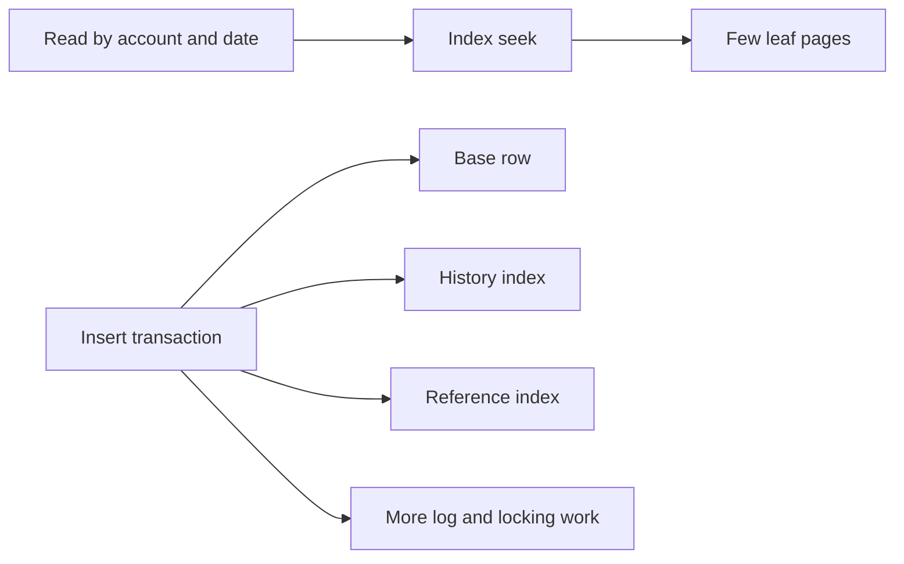

# 3. How do indexes improve reads but affect writes?

**Technology:** SQL Server and Data Access

**Source question:** 3. How do indexes improve reads but affect writes?

## 1. What problem does it solve?

Without a useful index, SQL Server may scan a table or clustered index, reading many pages to find a few rows. On a transaction ledger containing hundreds of millions of records, that consumes I/O, CPU, buffer-cache space, and time. Long reads may also increase contention with payment writes and make latency unpredictable.

An index creates an access path organized around values used for filtering, joining, sorting, or enforcing uniqueness. It can turn “inspect nearly every row” into “navigate to a narrow range.” The trade-off is that SQL Server must store and maintain every index. Inserts, updates, and deletes therefore perform more work, generate more transaction-log records, use more storage, and can acquire more locks. Index design is consequently a workload decision, not a rule that more indexes are always better.

## 2. Explain it in simple language

Think of a bank archive. A catalog sorted by account and booking date lets an employee go directly to one account’s recent transactions. Reading becomes faster, but whenever a new transaction arrives, staff must update the archive and every relevant catalog.

**One-sentence definition:** An index is an additional ordered data structure that reduces read work for matching queries but adds storage and maintenance work to every affected write.

**Memory rule:** Indexes save searches by charging writes.

The important qualification is “matching queries.” An index on `(AccountId, BookedAt)` may help account-history queries; it does not automatically help a search only by `Amount`.

## 3. How does it work internally?

SQL Server rowstore indexes are normally balanced B+ trees built from 8-KB pages. Root and intermediate pages guide navigation. Leaf pages contain either complete rows for a clustered index or non-clustered keys, included columns, and row locators.

For a read, the optimizer estimates the cost of candidate plans using statistics. With a selective, SARGable predicate such as `AccountId = @id AND BookedAt >= @from`, it may seek through the tree, then scan only the matching leaf range. If the index contains every selected column, it is *covering*. Otherwise SQL Server performs key lookups into the clustered index; thousands of random lookups can make a scan cheaper.

For a write, SQL Server changes the base row and every index containing a changed key or included column. It maintains key order, logs the changes atomically, updates uniqueness checks, and may split a full page to make room. Page splits add I/O, log volume, fragmentation, and possible blocking. Updates to indexed columns can behave like delete-plus-insert operations. Deletes also leave space and may create ghost records that background cleanup later removes.



Common misunderstanding: an index does not make every read faster, and an “index seek” is not automatically an efficient plan. Selectivity, key order, coverage, statistics, parameter values, and returned row count all matter.

## 4. Realistic payment or banking example

Assume `ledger.Transactions` is the authoritative source of truth for posted account entries. Customers frequently request their latest transactions:

```sql
CREATE INDEX IX_Transactions_Account_BookedAt
ON ledger.Transactions(AccountId, BookedAt DESC, TransactionId DESC)
INCLUDE (Amount, Currency, Status, Description);
```

This index supports equality on `AccountId`, a date range, stable keyset pagination, and the requested order. Its included columns can avoid base-row lookups. However, every posted transaction now updates this index. Updating `Status` or `Description` also changes its leaf row because those columns are included.

Angular collects filters, performs usability validation, and renders results; it is never trusted for authorization. ASP.NET Core authenticates the user, authorizes access to the account, validates range and page size, and issues a parameterized query. SQL Server enforces constraints and returns authoritative ledger rows. A message broker may distribute `TransactionPosted` events to projections, but it is not authoritative and is not required for this direct read.

## 5. Successful flow and failure flow

### Successful flow

1. Angular requests the next 50 transactions using an opaque continuation value.
2. ASP.NET Core validates the request and confirms that the caller may view the account.
3. The application passes a correlation ID and `CancellationToken` to the data-access layer.
4. A keyset query matches the index’s leading keys; SQL Server seeks to the account and reads a small ordered range.
5. The API returns a narrow DTO and records duration, logical-read telemetry, and row count without logging sensitive descriptions.
6. When a payment posts, the same database transaction writes the ledger row and maintains all affected indexes before commit.

### Failure flow

Invalid ranges return validation `ProblemDetails`; unauthorized accounts return a sanitized 403 or 404 before querying transaction data. A cancelled HTTP request asks the driver to cancel database work, but cancellation does not prove that SQL Server stopped immediately and is not the same as transaction rollback.

A timeout can arise from blocking, a scan, stale estimates, or resource pressure. Diagnose the actual plan, Query Store, waits, and logical reads before adding another index. Blind retry can multiply load. A read retry may be safe when bounded and transient; a payment write requires a persisted idempotency key and reconciliation because retry logic alone is not idempotency and an uncertain timeout may have committed.

Duplicate payment requests should resolve through a unique business constraint, not merely an index intended for performance. Concurrent writes may deadlock as different indexes are touched; keep transactions short and retry only the chosen deadlock victim with idempotent semantics. A database failure rolls back an uncommitted transaction, including its index changes. If event publication fails after commit, use a transactional outbox and publish later; do not roll back an already authoritative ledger entry through an ad hoc compensating update.

## 6. Practical C#/.NET implementation

Keep authorization and orchestration outside the repository, and keep physical index definitions in reviewed database migrations. This focused example uses `Microsoft.Data.SqlClient`, typed parameters, async I/O, keyset pagination, and cancellation on a currently supported .NET release:

```csharp
public sealed record TransactionCursor(DateTime BookedAtUtc, long TransactionId);

public interface ITransactionReader
{
    Task<IReadOnlyList<TransactionSummary>> ReadPageAsync(
        Guid accountId, TransactionCursor before, int take,
        CancellationToken cancellationToken);
}

public sealed class SqlTransactionReader(string connectionString)
    : ITransactionReader
{
    public async Task<IReadOnlyList<TransactionSummary>> ReadPageAsync(
        Guid accountId, TransactionCursor before, int take, CancellationToken ct)
    {
        const string sql = """
            SELECT TOP (@take)
                TransactionId, BookedAt, Amount, Currency, Status, Description
            FROM ledger.Transactions
            WHERE AccountId = @accountId
              AND (BookedAt < @bookedAt
                   OR (BookedAt = @bookedAt AND TransactionId < @transactionId))
            ORDER BY BookedAt DESC, TransactionId DESC;
            """;

        await using var connection = new SqlConnection(connectionString);
        await connection.OpenAsync(ct);
        await using var command = new SqlCommand(sql, connection)
        {
            CommandTimeout = 5
        };
        command.Parameters.Add("@accountId", SqlDbType.UniqueIdentifier).Value = accountId;
        command.Parameters.Add("@bookedAt", SqlDbType.DateTime2).Value = before.BookedAtUtc;
        command.Parameters.Add("@transactionId", SqlDbType.BigInt).Value = before.TransactionId;
        command.Parameters.Add("@take", SqlDbType.Int).Value = Math.Clamp(take, 1, 100);

        var result = new List<TransactionSummary>();
        await using var reader = await command.ExecuteReaderAsync(ct);
        while (await reader.ReadAsync(ct))
            result.Add(Map(reader));
        return result;
    }
}
```

The application service must authorize `accountId` before calling this repository; Angular validation is only convenience. Typed parameters avoid conversion surprises and injection through values. `async` frees the request thread while waiting; it does not make SQL execute in parallel or faster. Keyset pagination avoids the increasing work and shifting pages associated with large `OFFSET` values.

Middleware should map expected failures to RFC 9457-style `ProblemDetails`, preserve cancellation semantics, and log correlation identifiers rather than account data. Integration tests need realistic row counts and skew, deterministic pagination, uniqueness checks, and representative write throughput. Unit tests cannot prove that SQL Server uses an index; inspect actual execution plans and logical reads in database-level performance tests.

## 7. Important design decisions

**Key columns and order:** Put columns that support important equality, range, join, and ordering patterns in a measured order. `(AccountId, BookedAt)` fits account history; reversing it serves a different workload. The default is a narrow index aligned with a high-value query, not one index per filter combination.

**Coverage versus lookups:** `INCLUDE` can remove lookups without affecting seek order. Cover frequent, latency-sensitive, narrow queries when evidence justifies it. Wide includes consume cache, storage, backup bandwidth, and write capacity; including sensitive columns also expands the places where that data exists and who can access it.

**Uniqueness:** Use a unique constraint or unique index for payment references when business correctness requires it. This adds contention and write cost, but database enforcement protects every caller and race. Application pre-checks alone are unsafe.

**Filtered indexes:** A filtered index such as `WHERE Status = 'Pending'` can be small and cheap when pending rows are rare. Parameterized-query matching and changing distributions require plan testing. It is unsuitable if most rows qualify.

**Fill factor and maintenance:** Leave defaults until page-split and density evidence supports a change. Lower fill factor reserves free space, reducing some splits but increasing pages, scans, memory use, and backups. Reorganize or rebuild based on workload benefit, not a universal fragmentation percentage. Online and resumable index operations vary by SQL Server version, edition, index type, and operation; verify current platform support and expect short-duration locks even for online operations.

**Operational rollout:** Creating an index consumes CPU, I/O, transaction log, and possibly blocking time. Test on production-like volume, estimate log and replica impact, deploy during safe capacity, monitor progress, and define an abort path. Maintainability improves when every index has an owner, purpose, and supporting query evidence.

## 8. When to use it and when not to use it

Use indexes for selective, frequent predicates; join keys; stable ordering; and database-enforced uniqueness. They are especially valuable when a query touches a tiny fraction of a large OLTP table or must meet a strict latency target.

Do not add an index solely because one development execution scanned a tiny table. A scan may be correct for analytics returning most rows. Short-lived staging heaps, batch-loaded data, or columnstore-based reporting may need different designs. A single broader, carefully ordered index may be simpler than several overlapping indexes.

Warning signs include dozens of near-duplicate indexes, indexes never read but constantly updated, huge `INCLUDE` lists compensating for `SELECT *`, mutable keys, forced index hints, and write latency that grows with every new read optimization. Indexes create more complexity than value when maintenance and deployment costs exceed the measured read benefit.

## 9. Compare it with related concepts

| Option | Purpose and ownership | Read/write performance | Reliability and lifecycle | Complexity, use, and limits |
|---|---|---|---|---|
| Rowstore index | Data team adds an ordered access path | Fast selective reads; amplifies writes | Transactionally maintained with table | Best for OLTP seeks/ranges; key order matters |
| Table/clustered scan | Optimizer reads many pages | Efficient for large result fractions; costly for selective reads | No extra structure | Simplest plan; scales poorly for narrow lookups |
| Columnstore index | Data team stores compressed column segments | Excellent analytics; different update costs | Maintained by SQL Server with rowgroup lifecycle | Best for scans/aggregates, not every point lookup |
| Cached response/projection | Application or platform stores derived results | Very fast reads; write path/invalidation adds work | May be stale; needs expiry or event recovery | Useful for repeated reads, not authoritative uniqueness |
| Partitioning | Data team divides a large object | Can eliminate partitions and aid maintenance; not a substitute for indexing | Adds operational lifecycle | Useful for retention and large ranges; queries need aligned predicates |

For authoritative account history, I would use a small number of workload-tested rowstore indexes, including the account/date index. I would move broad reporting to a suitable reporting or columnstore design rather than continually widening the OLTP index.

## 10. Common production mistakes

- **Indexing every query independently:** it happens during reactive tuning and creates overlapping structures. Detect it through index definitions, usage DMVs interpreted across a representative uptime, write waits, and storage growth. Consolidate only after plan and load testing.
- **Wrong key order or non-SARGable predicates:** functions or implicit conversions on indexed columns can prevent useful seeks. Check actual plans and parameter types; rewrite predicates and match database types.
- **Over-covering:** developers eliminate every lookup, making leaf rows enormous. Measure lookup count and total I/O; project fewer columns and accept cheap lookups where appropriate.
- **Ignoring write amplification:** read benchmarks pass while payment-posting latency degrades. Load-test the complete index set with realistic concurrency and monitor log bytes, locks, page splits, CPU, and replica lag.
- **Trusting missing-index suggestions blindly:** suggestions consider individual optimization opportunities, not the full write and overlap cost. Treat them as evidence to investigate, not deployment scripts.
- **Using hints as permanent repairs:** forced plans can age badly as distributions change. Prefer correct query shape, statistics, and indexes; use Query Store controls deliberately with monitoring and an exit plan.
- **Unsafe maintenance:** large rebuilds exhaust the log, block writers, or lag replicas. Validate platform capabilities, capacity, lock behavior, and recovery procedures before production rollout.
- **Exposing sensitive data:** broad covering indexes and diagnostic SQL can spread descriptions or account identifiers. Apply least privilege, encrypt appropriately, redact telemetry, and audit access.

## 11. Interview-ready answer

### 30-second answer

Indexes improve reads by giving SQL Server an ordered access path, so it can seek to a small set of pages instead of scanning the table. A covering index can also avoid base-row lookups. The cost is write amplification: every insert, delete, or relevant update must maintain each index, generate log records, and may cause page splits and blocking. I therefore design indexes from measured read and write workloads, not by adding one for every query.

### Two-minute senior-level answer

In SQL Server, a typical rowstore index is a B+ tree. Statistics help the optimizer decide whether to seek, scan, or combine operators. For an account-history query, an index beginning with `AccountId` and then `BookedAt` lets SQL Server navigate to one account and read a narrow date range in order. Included columns may cover the result, although a seek plus many key lookups can still be worse than a scan.

The trade-off appears on writes. SQL Server must update the base row and every affected non-clustered index in the same transaction. That increases CPU, I/O, storage, locking, transaction-log volume, backup size, and replica work. Inserts into full pages may cause splits; updates to keys may relocate index entries. Wider and more numerous indexes increase that cost.

My default is the smallest set of indexes that supports high-value queries and correctness constraints. I choose key order from equality, range, join, and ordering needs; use includes selectively; and enforce business uniqueness in the database. I validate with production-like data distributions and mixed read/write load, using actual plans, Query Store, logical reads, write latency, log generation, and waits. I also plan index creation and maintenance because online does not mean zero locking or zero resource impact.

### Three follow-up questions an interviewer may ask

1. When can a seek with key lookups be worse than a scan?
2. How would you identify and consolidate overlapping indexes safely?
3. What metrics would you compare before and after adding a covering index?

### Important keywords I should mention naturally

B+ tree, seek, scan, selectivity, SARGable, statistics, covering index, key lookup, key order, included columns, page split, transaction log, write amplification, Query Store, logical reads, and idempotency.

### Red-flag answers that would make an interviewer question my experience

Red flags include saying indexes always improve performance, adding an index for every column, judging a plan only by seeing “seek,” ignoring writes and transaction-log cost, using huge covering indexes for `SELECT *`, blindly applying missing-index recommendations, or claiming online index operations cannot block.

## 12. Test my understanding interactively

During revision, answer this scenario-based interview question:

> A new covering index reduces the p95 account-history read from 700 ms to 40 ms, but payment-posting throughput drops 25%, transaction-log generation rises sharply, and a readable secondary begins lagging. How would you determine whether to keep, narrow, replace, or remove the index, and how would you validate and roll out your decision safely?

## Revision card

- **One-sentence definition:** An index is an ordered access path that reduces matching read work while adding storage and transactional maintenance to writes.
- **Memory rule:** Indexes save searches by charging writes.
- **Recommended use:** Maintain the smallest evidence-based set that supports critical predicates, ordering, joins, and uniqueness.
- **Main danger:** Over-indexing converts read gains into write latency, log growth, blocking, storage cost, and operational risk.
- **Interview takeaway:** Explain seeks and coverage, then balance them against write amplification using representative workload measurements.
