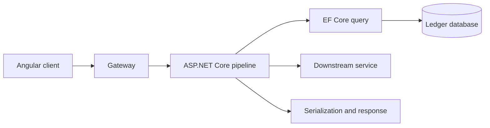

# 6. How would you troubleshoot a slow API endpoint in production?

**Technology:** ASP.NET Core and Web API

**Source question:** 6. How would you troubleshoot a slow API endpoint in production?

## 1. What problem does it solve?

A “slow API” is a symptom, not a diagnosis. Time may be spent in a gateway queue, ASP.NET Core, the thread pool, garbage collection, database locks or queries, a dependency, serialization, or the network. Guessing can move the bottleneck or reduce reliability.

The problem is to identify where latency occurs, under which conditions, and why. High latency consumes connections and memory, triggers retries, and can create an overload loop. In banking it can produce uncertain outcomes: a client times out although a transfer committed, then retries it.

Troubleshooting must therefore protect performance, scalability, reliability, security, and correctness while producing evidence for a safe fix.

## 2. Explain it in simple language

Treat the request like a parcel moving through tracked depots. The delivery being late does not tell us which depot caused the delay; timestamps at each boundary do.

**One-sentence definition:** Troubleshooting a slow endpoint means using correlated latency, trace, runtime, dependency, and database evidence to isolate the bottleneck before changing the system.

**Memory rule:** measure end to end, narrow by span, prove the cause, then fix and verify.

Use percentiles rather than averages: p95 exposes tail pain an average can hide.

## 3. How does it work internally?

For an ASP.NET Core request:

1. A proxy accepts and may queue the connection.
2. Kestrel parses HTTP; middleware authenticates, authorizes, routes, and invokes the endpoint.
3. Application code awaits database or HTTP I/O. `await` releases the thread during I/O; it is neither parallelism nor automatic speed.
4. EF Core obtains a pooled connection, translates LINQ, executes SQL, and materializes results.
5. ASP.NET Core serializes and sends the response.



Distributed traces represent these stages as spans propagated with W3C `traceparent`. Metrics show trends; traces show a request’s critical path; logs explain events; profiles expose CPU, allocation, and lock hotspots.

Low CPU does not mean healthy: pool exhaustion, locks, or slow I/O cause latency with modest CPU. Cancellation does not guarantee database work stopped or a committed transaction rolled back.

## 4. Realistic payment or banking example

Assume `GET /api/accounts/{accountId}/transactions` normally responds in 200 ms but reaches a p95 of four seconds for accounts with years of history.

Angular debounces searches, paginates, cancels obsolete requests, and displays support correlation information. It cannot enforce account access.

ASP.NET Core authenticates, authorizes, validates bounded pagination, propagates cancellation, queries a read model, and emits safe telemetry. The database filters and pages using an index. A broker may update the read model; lag affects freshness. The ledger database is authoritative; the read model is a projection.

Telemetry must not expose account numbers, tokens, SQL parameters, or personal transaction descriptions. Use trace IDs and internal opaque identifiers, and keep metric labels low-cardinality.

## 5. Successful flow and failure flow

### Successful flow

1. Compare p50/p95/p99, throughput, errors, and saturation with the SLO and a known-good period.
2. Slice by route template, deployment version, region, status code, payload/page size, and safe account-size bucket—not raw account ID.
3. Follow a representative slow trace. It shows 3.5 seconds in one database span rather than gateway, application CPU, or serialization.
4. Inspect SQL, its plan, estimates, waits, blocking, reads, and index usage safely.
5. Reproduce with production-shaped data in a safe environment. The query sorts many rows before applying pagination because the composite index is missing.
6. Validate a composite index and keyset pagination, canary them, and confirm latency, load, errors, and correctness improve.

### Failure flow

- **Timeout/cancellation:** propagate `CancellationToken`, but check whether work committed. Query an uncertain write or retry with the same idempotency key.
- **Validation/authorization:** reject before expensive work with `ProblemDetails`; never diagnose by disabling authorization.
- **Duplicate request:** frontend debouncing reduces traffic but is not idempotency. Writes require durable key/result storage and a uniqueness constraint.
- **Concurrency/database failure:** inspect locks and deadlocks; use optimistic concurrency and retry only classified transient failures.
- **Broker lag:** expose projection freshness and investigate consumers; do not silently query an unbounded ledger table as fallback.
- **Partial completion:** for writes, commit state and outbox atomically. Broker publication is retried independently.
- **Bad remediation:** if an index harms writes or plans, stop the rollout and use the rehearsed rollback.

## 6. Practical C#/.NET implementation

Supported ASP.NET Core versions provide OpenTelemetry hooks, `ProblemDetails`, rate limiting, and request-timeout middleware. Keep business logic outside middleware and controllers.

```csharp
builder.Services.AddProblemDetails();
builder.Services.AddOpenTelemetry()
    .WithTracing(t => t
        .AddAspNetCoreInstrumentation()
        .AddHttpClientInstrumentation()
        .AddEntityFrameworkCoreInstrumentation()
        .AddSource(TransactionQuery.ActivitySourceName));

builder.Services.AddRequestTimeouts(o =>
    o.AddPolicy("transactions-read", TimeSpan.FromSeconds(3)));
```

Apply the timeout policy to the endpoint and keep the controller thin:

```csharp
[HttpGet("api/accounts/{accountId:guid}/transactions")]
[Authorize(Policy = "CanReadTransactions")]
[RequestTimeout("transactions-read")]
public async Task<ActionResult<TransactionPage>> Get(
    Guid accountId, DateTimeOffset? cursorDate, Guid? cursorId,
    [Range(1, 200)] int take = 50, CancellationToken ct = default)
{
    var result = await query.ExecuteAsync(
        new(accountId, cursorDate, cursorId, take), User, ct);
    return Ok(result);
}
```

The application service owns authorization-sensitive lookup and a diagnostic span; infrastructure owns EF Core details:

```csharp
public sealed class TransactionQuery(
    ITransactionReader reader, IAccountAccess access,
    ILogger<TransactionQuery> log)
{
    public const string ActivitySourceName = "Banking.Transactions";
    private static readonly ActivitySource Source = new(ActivitySourceName);

    public async Task<TransactionPage> ExecuteAsync(
        TransactionRequest request, ClaimsPrincipal user, CancellationToken ct)
    {
        using var activity = Source.StartActivity("transactions.query");
        activity?.SetTag("page.size", request.Take);

        await access.EnsureAllowedAsync(user, request.AccountId, ct);
        var page = await reader.ReadPageAsync(request, ct);
        log.LogInformation("Transaction page returned {Count} rows", page.Items.Count);
        return page;
    }
}
```

```csharp
public Task<List<TransactionDto>> ReadPageAsync(
    TransactionRequest r, CancellationToken ct) =>
    db.Transactions.AsNoTracking()
      .Where(x => x.AccountId == r.AccountId &&
          (r.CursorDate == null || x.BookingDate < r.CursorDate ||
           (x.BookingDate == r.CursorDate && x.Id.CompareTo(r.CursorId) < 0)))
      .OrderByDescending(x => x.BookingDate).ThenByDescending(x => x.Id)
      .Select(x => new TransactionDto(x.Id, x.BookingDate, x.Amount, x.Currency))
      .Take(r.Take).ToListAsync(ct);
```

Keyset pagination avoids large `OFFSET`s. `AsNoTracking` removes tracking cost; projection avoids unused or sensitive columns. Inspect generated SQL and never put account IDs in metrics or enable sensitive-data logging broadly.

Test authorization, bounds, stable pagination under inserts, cancellation, SQL shape, and query count. Load-test realistic data and compare latency and resource use.

## 7. Important design decisions

**Instrumentation depth.** Start with RED metrics, traces, dependencies, and runtime counters. Profiling helps CPU/allocation cases but has cost and privacy implications. Tail sampling retains slow traces but needs collector capacity.

**Timeouts.** Derive budgets from the caller deadline and SLO. Timeouts limit waiting; they neither repair capacity nor guarantee rollback. Align timeout layers.

**Query remediation.** Indexes consume storage and slow writes. Query reshaping, projection, keyset pagination, or a read model may be better. Validate plans and write impact.

**Caching.** Cache only with acceptable staleness and authorization boundaries; define keys, TTLs, stampede protection, and invalidation ownership.

**Resilience.** Retries amplify overload and tail latency. Use bounded jittered retries within one deadline only for safe operations. Circuit breakers protect failing dependencies, not healthy latency.

**Capacity versus code.** Scaling helps CPU or queue saturation, not a locked database. Use evidence-based mitigation, then fix the cause. Define canary metrics and rollback criteria.

## 8. When to use it and when not to use it

Use this method for an SLO breach, regression, affected cohort, or timeout/retry failures, and proactively for performance testing.

For one slow local request, first exclude cold start, debugger overhead, local networking, and unrealistic data.

Warning signs are optimizing averages, changing several variables, tiny test datasets, premature caching, larger timeouts, or body logging.

## 9. Compare it with related concepts

| Tool/concept | Purpose and ownership | Lifecycle/performance | Reliability and complexity | Limitation |
|---|---|---|---|---|
| Metrics | Operations sees aggregate trends and SLOs | Continuous, low overhead | Best alerting signal | Cannot identify one code path |
| Distributed tracing | Teams follow a request across services | Sampled; moderate cost | Finds critical-path dependency | Sampling may miss rare cases |
| Structured logs | Application records contextual events | Retention-controlled; volume can be high | Explains failures and decisions | Poor for latency aggregation |
| Runtime profiling/counters | Platform team finds CPU, GC, locks, starvation | On-demand or continuous | Strong process-level diagnosis | Does not explain database plans |
| Database plan/waits | DBA/service team diagnoses SQL and contention | Targeted; tooling must be production-safe | Proves data-layer causes | Sees only database time |
| Load testing | Engineering validates capacity before/after | Pre-release or controlled | Reproducible comparison | Model may differ from production |

For the banking endpoint I use metrics to scope the incident, a trace to locate database time, then SQL plans and waits to prove the cause. A production-shaped load test verifies the index and keyset pagination before a canary deployment.

## 10. Common production mistakes

- **Looking only at averages:** tail latency remains invisible. Alert on SLO-based percentiles and error/timeout rates.
- **No correlation:** logs cannot connect gateway, API, and database activity. Propagate trace context and use structured events.
- **Cardinality or data leaks:** account IDs and URLs become metric labels; bodies expose financial data. Use route templates and bounded tags, redact logs, and restrict telemetry access.
- **Sync-over-async:** `.Result`, `.Wait()`, blocking I/O, or unbounded `Task.Run` causes starvation. Detect with runtime counters, dumps, and profiles; use async end to end.
- **N+1 queries/over-fetching:** ORM convenience creates many calls or huge materialization. Trace query counts, project columns, batch appropriately, and review SQL.
- **Blind indexes and retries:** write cost rises or overload multiplies. Validate plans and retry only classified transient failures with budgets.
- **Unlimited responses:** one large account exhausts memory and serialization time. Enforce server-side maximums and stable pagination.
- **Increasing timeouts:** queues grow and users wait longer. Fix capacity or dependency latency and apply bounded deadlines.
- **Testing unlike production:** empty caches and tiny tables give false confidence. Use representative volume, skew, concurrency, and latency.
- **Changing production without a baseline:** causality is lost. Record before/after percentiles, saturation, errors, and correctness; deploy one controlled change.

## 11. Interview-ready answer

**30-second answer:** I start with the SLO and confirm the regression using p50, p95, p99, throughput, errors, and saturation. I slice by route, version, region, and safe workload dimensions, then follow correlated traces from gateway through ASP.NET Core, database, dependencies, and serialization. Once a span identifies the bottleneck, I prove the cause with the appropriate tool—such as an SQL plan, runtime counters, or a profile—reproduce it, apply one controlled fix, canary it, and verify latency, correctness, and resource usage.

**Two-minute senior-level answer:** First I establish scope: when it started, who is affected, whether it correlates with a deployment or traffic change, and whether the problem is latency, queuing, errors, or saturation. I use percentiles rather than averages and compare with a known-good baseline.

Then I use distributed tracing and structured correlation to split time across the gateway, middleware, application, EF Core/database, downstream HTTP calls, and serialization. I choose the next tool from the evidence. Database time means checking generated SQL, execution plans, waits, locks, row estimates, and connection-pool health. Application time means checking CPU profiles, allocations, GC, thread-pool starvation, sync-over-async, and query counts. Dependency time means examining its SLO, deadlines, retries, and circuit state.

I mitigate safely if customers are affected—perhaps rate limiting, scaling a genuinely saturated tier, or disabling a costly optional feature—without hiding the root cause. I reproduce with production-shaped data, then fix one thing: for transaction history that might be a covering index, projection, and keyset pagination. I load-test, canary, compare p95/p99 plus database and write costs, and retain rollback criteria. Throughout, I avoid sensitive telemetry and recognize that cancellation and timeouts do not guarantee rollback; uncertain writes need durable idempotency and status reconciliation.

**Three follow-up questions:**

1. How would you distinguish thread-pool starvation from a slow database?
2. When would caching be safe for account transactions?
3. Why can adding retries make tail latency and an outage worse?

**Keywords:** SLO, p95/p99, RED metrics, saturation, distributed tracing, W3C trace context, critical path, execution plan, waits, thread pool, GC, connection pool, keyset pagination, cancellation, idempotency, canary, rollback.

**Red flags:** “I would increase the timeout,” “I would add caching or indexes first,” “async makes it faster,” “average latency looks fine,” “cancellation rolls back the transaction,” or “enable detailed SQL and body logging for everyone in production.”

## 12. Test my understanding interactively

During revision, answer this scenario-based interview question:

> Immediately after a release, the transaction-history endpoint’s p95 rises from 250 ms to 4 seconds, CPU stays below 35%, database connections approach their pool limit, only large corporate accounts are affected, and clients begin retrying after three seconds. How would you investigate, mitigate, identify the root cause, and verify a safe fix without leaking banking data or creating a retry storm?

## Revision card

- **One-sentence definition:** Troubleshooting a slow endpoint is evidence-driven isolation of where request latency occurs, followed by a controlled fix and measured verification.
- **Memory rule:** measure end to end, narrow by span, prove the cause, then fix and verify.
- **Recommended use:** combine percentiles and saturation metrics, correlated traces, targeted runtime or database evidence, and production-shaped tests.
- **Main danger:** guessing—especially adding retries, caches, indexes, or timeouts that hide symptoms, amplify load, or violate correctness.
- **Interview takeaway:** a senior answer covers scoping, critical-path evidence, safe mitigation, database/runtime diagnosis, privacy, uncertain outcomes, canary rollout, and before/after verification.
