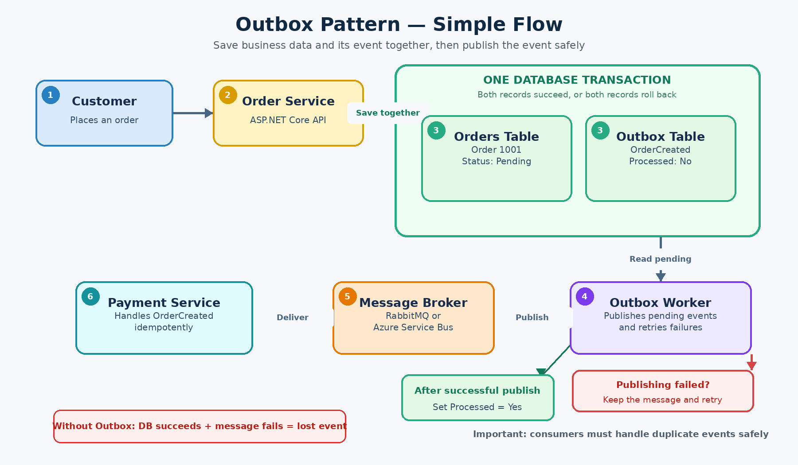

# What Is the Outbox Pattern, and Why Is It Useful?

## Definition

The **Outbox Pattern** is a reliable messaging pattern used in distributed systems. It keeps a database change and the event describing that change together.

It solves this problem:

> What happens if a database update succeeds, but publishing the related message to RabbitMQ, Azure Service Bus or another broker fails?

## Real-world example

Imagine an online shopping application:

1. A customer places an order.
2. Order Service saves the order in SQL Server.
3. Order Service publishes an `OrderCreated` event.
4. Payment Service receives the event and processes the payment.

```text
Customer
   |
   v
Order Service ---> Order Database
   |
   v
Message Broker ---> Payment Service
```

The Order Service needs to perform two independent writes:

```csharp
await database.SaveOrderAsync(order);
await messageBus.PublishAsync(new OrderCreated(order.Id));
```

This is called the **dual-write problem** because the service writes to two separate systems.

## What can go wrong?

Suppose the order is saved successfully:

```text
Database update -> Successful
```

But RabbitMQ is temporarily unavailable:

```text
Message publishing -> Failed
```

The system is now inconsistent:

```text
Order Service:   The order exists
Payment Service: Knows nothing about the order
```

Consequently, the customer has placed an order, but payment is never processed.

Publishing the message first does not solve the problem:

```csharp
await messageBus.PublishAsync(message);
await database.SaveOrderAsync(order);
```

The message might be published, but saving the order could then fail. Payment Service would receive an event for an order that does not exist.

## How the Outbox Pattern solves the problem



*The business data and outbox message are committed together, after which a background worker reliably publishes the message to the broker.*

Instead of immediately publishing the event to the message broker, the application saves two records in the **same database transaction**:

1. The business record, such as the order.
2. An outbox record containing the event that must be published.

```text
Customer places an order
          |
          v
      Order Service
          |
          v
One database transaction
   |                 |
   v                 v
Save Order     Save Outbox Message
                         |
                         v
                  Background Worker
                         |
                         v
                  Message Broker
                         |
                         v
                  Payment Service
```

Because both records are stored in one database transaction, either both operations succeed or both fail.

```text
Order saved + Outbox message saved
                  OR
Neither record is saved
```

## ASP.NET Core and Entity Framework example

```csharp
await using var transaction =
    await dbContext.Database.BeginTransactionAsync();

var order = new Order
{
    Id = Guid.NewGuid(),
    Status = "Pending"
};

dbContext.Orders.Add(order);

dbContext.OutboxMessages.Add(new OutboxMessage
{
    Id = Guid.NewGuid(),
    Type = "OrderCreated",
    Payload = JsonSerializer.Serialize(
        new OrderCreated(order.Id)),
    CreatedAt = DateTime.UtcNow
});

await dbContext.SaveChangesAsync();
await transaction.CommitAsync();
```

If both entities use the same EF Core `DbContext`, a single `SaveChangesAsync()` call is already transactional for supported relational databases. An explicit transaction is useful when the workflow contains multiple database saves or other database operations that must be committed together.

## Example outbox table

```sql
CREATE TABLE OutboxMessages
(
    Id UNIQUEIDENTIFIER PRIMARY KEY,
    Type NVARCHAR(200) NOT NULL,
    Payload NVARCHAR(MAX) NOT NULL,
    CreatedAt DATETIME2 NOT NULL,
    ProcessedAt DATETIME2 NULL,
    RetryCount INT NOT NULL DEFAULT 0
);
```

Example record:

| Id | Type | Payload | ProcessedAt |
| --- | --- | --- | --- |
| `abc-123` | `OrderCreated` | `{"orderId":1001}` | `NULL` |

`ProcessedAt = NULL` means that the message has not yet been successfully published.

## How is the message published?

A background worker regularly reads unpublished outbox messages:

```csharp
public async Task PublishOutboxMessages()
{
    var messages = await dbContext.OutboxMessages
        .Where(x => x.ProcessedAt == null)
        .OrderBy(x => x.CreatedAt)
        .Take(100)
        .ToListAsync();

    foreach (var message in messages)
    {
        await messageBus.PublishAsync(
            message.Type,
            message.Payload);

        message.ProcessedAt = DateTime.UtcNow;
    }

    await dbContext.SaveChangesAsync();
}
```

The publishing flow is:

1. Find messages where `ProcessedAt` is `NULL`.
2. Publish each message.
3. Mark successfully published messages as processed.
4. Retry failed messages later.

The publisher could be:

- An ASP.NET Core hosted service
- A separate worker service
- A scheduled job
- A change-data-capture process

## Pizza-shop analogy

Imagine a pizza restaurant:

| Technical component | Pizza-shop analogy |
| --- | --- |
| Order database | Restaurant order book |
| Message broker | Driver communication system |
| Outbox table | Tray containing delivery instructions |
| Background worker | Employee who checks the tray |
| Consumer | Delivery driver |

When the restaurant accepts an order, it performs two actions together:

```text
1. Write the pizza order in the order book
2. Place its delivery instruction in the outbox tray
```

If the driver's phone is temporarily unavailable, the instruction stays in the tray. The employee retries until the driver receives it.

The order is therefore not forgotten when the communication system is temporarily unavailable.

## Important: duplicate messages are possible

Consider this sequence:

```text
1. The worker publishes OrderCreated successfully
2. Payment Service receives the event
3. The worker crashes before setting ProcessedAt
4. The worker restarts
5. The same event is published again
```

The Outbox Pattern usually provides **at-least-once delivery**, not exactly-once delivery. Consumers must therefore be **idempotent**.

For example, Payment Service can store processed message IDs:

```csharp
if (await dbContext.ProcessedMessages
    .AnyAsync(x => x.MessageId == message.Id))
{
    return;
}

await ProcessPayment(message.OrderId);

dbContext.ProcessedMessages.Add(
    new ProcessedMessage(message.Id));

await dbContext.SaveChangesAsync();
```

Receiving the same message twice must not charge the customer twice.

## Why is the Outbox Pattern useful?

- Prevents events from being lost after a database update
- Avoids distributed transactions between the database and message broker
- Supports retries when the broker is temporarily unavailable
- Improves consistency between microservices
- Provides an audit record of messages waiting to be published
- Supports eventual consistency
- Makes failures recoverable

## Limitations and considerations

- An outbox table must be maintained.
- A background publisher is required.
- Processed records need cleanup or archiving.
- There may be a short delay before an event is published.
- Duplicate delivery is possible.
- Consumers must be idempotent.
- Multiple workers require safe locking or message-claiming logic.
- Poison messages need retry limits and failure handling.
- Monitoring should detect old, repeatedly failing outbox records.

## Outbox Pattern versus distributed transaction

| Outbox Pattern | Distributed transaction |
| --- | --- |
| Uses a local database transaction | Coordinates multiple systems in one transaction |
| Supports eventual consistency | Tries to provide immediate consistency |
| Works well with microservices | Adds tighter coupling between systems |
| Requires idempotent consumers | May depend on two-phase commit support |
| Usually simpler and more resilient | Can be complex and difficult to scale |

## Short interview answer

> The Outbox Pattern solves the dual-write problem in distributed systems. For example, when creating an order, a service must update its database and publish an `OrderCreated` event. If the database update succeeds but publishing fails, the system becomes inconsistent. With the Outbox Pattern, the order and its event are saved to the same database in one transaction. A background worker later reads the outbox record and publishes it to the message broker, retrying when necessary. This prevents lost events without requiring a distributed transaction. Because the event might be delivered more than once, consumers must be idempotent.

## One-line memory trick

```text
Save business data + save event together -> publish later -> retry safely
```
