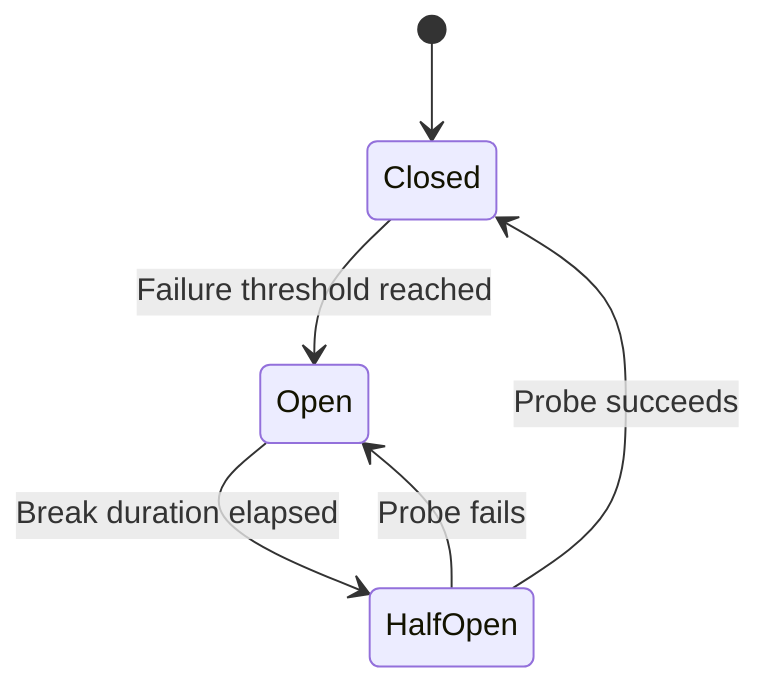
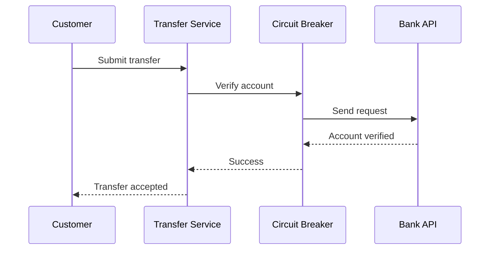
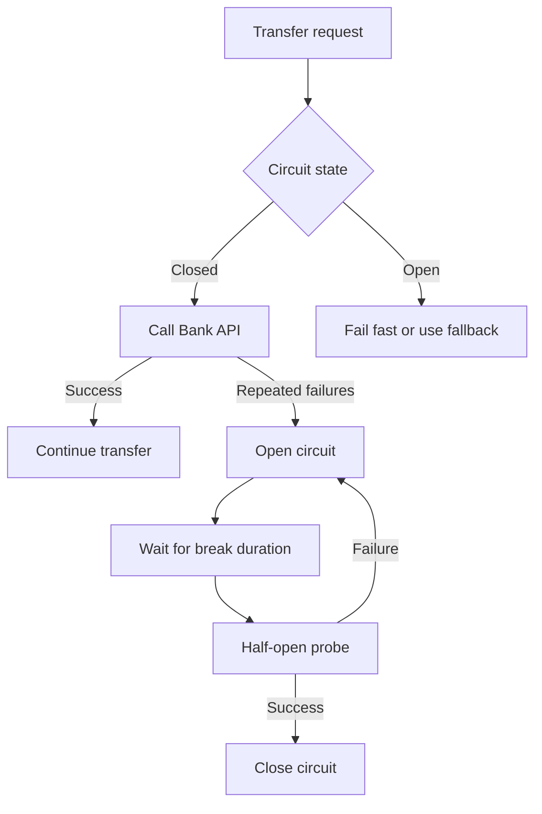
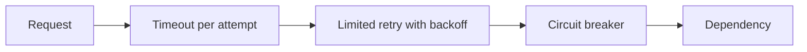

# Circuit Breaker Pattern — Revision Guide

## 1. What problem does it solve?

In a distributed system, one service often depends on another service.

```text
Order API -> Payment API -> Bank API
```

If the Payment API becomes slow or unavailable, continuously sending requests to it can cause:

- Long response times
- Exhausted threads, sockets, and connection pools
- More load on the failing service
- Failure spreading to healthy services
- A cascading system failure

A **circuit breaker** protects the caller by temporarily stopping requests to a dependency that appears unhealthy.

## 2. Simple explanation

It works like an electrical circuit breaker.

- Everything healthy: allow calls.
- Too many calls fail: open the circuit and block calls.
- Wait for a cooling period.
- Send a small number of test calls.
- If they succeed, resume normal traffic; otherwise, block calls again.

The main purpose is to **fail fast and give the dependency time to recover**.

## 3. The three states

| State | Meaning | Behaviour |
|---|---|---|
| **Closed** | Dependency appears healthy | Calls are allowed; results are monitored. |
| **Open** | Dependency appears unhealthy | Calls fail immediately without contacting it. |
| **Half-open** | Recovery is being tested | A limited number of probe calls are allowed. |



> **Important:** Closed does not mean blocked. A closed electrical circuit allows traffic to flow. Open means calls are blocked.

## 4. How it works internally

The circuit breaker records outcomes during a configured sampling window.

Example configuration:

- Sampling duration: 30 seconds
- Minimum throughput: 10 calls
- Failure ratio: 50%
- Break duration: 20 seconds

If at least 10 calls occur within 30 seconds and 50% or more fail, the circuit opens for 20 seconds.

The **minimum throughput** matters. Without it, one failure out of one request would produce a 100% failure rate and could open the circuit too aggressively.

## 5. Banking example

Assume a Transfer Service calls an external Bank Verification API before processing a transfer.

### Successful flow



### Failure and recovery flow



When the circuit is open, the service should return a controlled response, for example:

```http
HTTP/1.1 503 Service Unavailable
Retry-After: 20
```

For a financial operation, do not report the transfer as successful unless its actual state is known. A safe alternative may be to mark it as `Pending` and process it asynchronously, using idempotency to prevent duplicate transfers.

## 6. Practical .NET example

Modern .NET applications can use the resilience handler provided by `Microsoft.Extensions.Http.Resilience`.

```bash
dotnet add package Microsoft.Extensions.Http.Resilience
```

### Register the HTTP client

```csharp
using System.Net;

builder.Services
    .AddHttpClient<PaymentClient>(client =>
    {
        client.BaseAddress = new Uri("https://payment-api");
        client.Timeout = TimeSpan.FromSeconds(5);
    })
    .AddStandardResilienceHandler(options =>
    {
        options.CircuitBreaker.SamplingDuration =
            TimeSpan.FromSeconds(30);

        options.CircuitBreaker.MinimumThroughput = 10;
        options.CircuitBreaker.FailureRatio = 0.5;
        options.CircuitBreaker.BreakDuration =
            TimeSpan.FromSeconds(20);

        options.CircuitBreaker.ShouldHandle = new PredicateBuilder<HttpResponseMessage>()
            .Handle<HttpRequestException>()
            .HandleResult(response =>
                response.StatusCode == HttpStatusCode.RequestTimeout ||
                response.StatusCode == HttpStatusCode.TooManyRequests ||
                (int)response.StatusCode >= 500);
    });
```

### Typed client

```csharp
public sealed class PaymentClient(HttpClient httpClient)
{
    public async Task<HttpResponseMessage> AuthorizeAsync(
        PaymentRequest request,
        CancellationToken cancellationToken)
    {
        return await httpClient.PostAsJsonAsync(
            "/payments/authorize",
            request,
            cancellationToken);
    }
}
```

The handler tracks eligible failures. Once the configured threshold is reached, subsequent requests fail fast until the break duration ends.

## 7. Important design decisions

### Which failures should be counted?

Count failures that may indicate an unhealthy dependency:

- Network failures
- Timeouts
- `408 Request Timeout`
- `429 Too Many Requests`, when appropriate
- `5xx` server errors

Normally do not count permanent client errors such as:

- `400 Bad Request`
- `401 Unauthorized`
- `403 Forbidden`
- `404 Not Found`

Opening a circuit will not repair invalid input or incorrect authorization.

### Where should the breaker be placed?

Usually configure a circuit breaker per downstream dependency or logical endpoint. Do not use one global breaker for unrelated services, because failure of one dependency could block healthy ones.

### What should happen while it is open?

Choose behaviour based on the operation:

- Return `503 Service Unavailable`
- Use safe cached data for read operations
- Queue work for later processing
- Return a limited response
- Mark a business operation as pending

Never use stale or invented data for sensitive financial decisions.

### How should thresholds be selected?

Base them on production traffic, latency targets, dependency behaviour, and service-level objectives. Monitor openings, half-open probes, rejected calls, dependency latency, and recovery time.

## 8. When to use it

Use a circuit breaker when:

- Calling a remote API or microservice
- Calling an external provider
- A failure could consume limited resources
- Repeated calls would make recovery harder
- The caller can fail fast, queue work, or provide a safe fallback

Do not normally use it:

- For in-memory method calls
- To hide coding or validation errors
- As a replacement for proper timeouts
- When every individual call must always be attempted regardless of dependency health
- Around unrelated operations using one shared breaker

## 9. Circuit breaker vs related patterns

| Pattern | Purpose |
|---|---|
| **Timeout** | Stops one call from waiting too long. |
| **Retry** | Repeats a transiently failed operation. |
| **Circuit breaker** | Temporarily stops calls to an unhealthy dependency. |
| **Rate limiting** | Controls how many requests are accepted. |
| **Bulkhead** | Isolates resources so failure in one area does not exhaust everything. |
| **Fallback** | Provides an alternative result or action after failure. |

A typical order is conceptually:



The exact policy order must be chosen carefully because it changes what the circuit breaker observes and how many attempts reach the dependency.

## 10. Retry and circuit breaker together

Retries handle brief transient failures. The circuit breaker handles sustained failure.

Use:

- A small retry count
- Exponential backoff
- Jitter
- Retries only for transient failures
- Idempotency for retried write operations

Avoid retrying validation, authentication, or other permanent errors. Aggressive retries can create a **retry storm**, increasing pressure on an already failing service.

## 11. Common production mistakes

1. Opening after a single failure without sufficient traffic.
2. Counting all `4xx` responses as dependency failures.
3. Using one circuit breaker for unrelated downstream services.
4. Setting the break duration so long that recovery is detected late.
5. Allowing too many half-open test calls.
6. Adding retries without backoff or jitter.
7. Retrying non-idempotent payment requests without an idempotency key.
8. Returning fake success through an unsafe fallback.
9. Omitting timeouts, metrics, logs, and alerts.
10. Using the circuit breaker as a substitute for fixing the underlying service.

## 12. Interview-ready answer

> A circuit breaker is a resilience pattern that prevents cascading failures when a downstream dependency becomes unhealthy. It starts in the closed state and monitors calls. When eligible failures cross a configured threshold, it opens and fails new calls immediately without contacting the dependency. After a cooling period, it becomes half-open and permits limited probe calls. If they succeed, it closes; if they fail, it opens again. I normally combine it with timeouts, carefully limited retries, monitoring, and idempotency for financial writes.

## 13. Quick revision

```text
Closed    = calls flow normally
Open      = calls are blocked and fail fast
Half-open = limited calls test recovery

Retry           = try again
Circuit breaker = stop trying temporarily

Primary goal = prevent cascading failures and allow recovery
```

## 14. Scenario-based practice question

Your Payment Service calls a third-party bank API. During peak traffic, the bank API starts returning `503` errors for 60% of requests. Your application currently retries every failure three times immediately.

**Question:** How would you redesign this flow using timeout, retry, circuit breaker, and idempotency? Explain the order of the policies and what the customer should see while the circuit is open.

