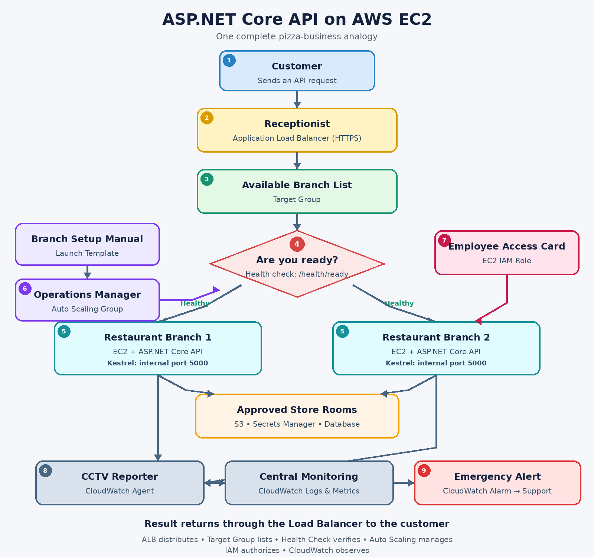

# Deploying an ASP.NET Core API to AWS EC2

## Simple real-world analogy

Imagine you run a popular pizza business. Your **ASP.NET Core API is the kitchen** that processes customer orders.

| AWS component | Pizza-business analogy | Actual responsibility |
| --- | --- | --- |
| ASP.NET Core API | Kitchen | Processes API requests |
| EC2 instance | Restaurant branch | Server on which the API runs |
| Application Load Balancer | Central receptionist | Distributes requests between branches |
| Target group | List of available branches | Lists EC2 instances that can receive traffic |
| Health check | “Are you open?” phone call | Checks whether the API is ready |
| Auto Scaling Group | Operations manager | Adds, removes, and replaces EC2 instances |
| Launch template | Branch setup manual | Describes how to create an identical instance |
| IAM role | Employee access card | Grants limited access to AWS services |
| CloudWatch Agent | CCTV and reporting system | Collects logs and server metrics |
| CloudWatch alarm | Emergency alert | Notifies the team when something is wrong |

## Architecture



*ASP.NET Core API traffic flow through an Application Load Balancer to EC2 instances managed by Auto Scaling, with CloudWatch observability.*

```text
Client
  |
  v
Application Load Balancer (HTTPS)
  |
  v
Target Group
  |------------------|
  v                  v
EC2 Instance 1     EC2 Instance 2
ASP.NET API        ASP.NET API
  |                  |
  |------------------|
          |
          v
CloudWatch Logs, Metrics and Alarms
```

The EC2 instances are managed by an Auto Scaling Group. It can add more instances when traffic increases and replace instances that become unhealthy.

## 1. EC2 instance: the restaurant branch

The API needs a computer on which to run. In AWS, that computer is an **EC2 instance**.

For high availability, we run the same API on at least two EC2 instances:

```text
EC2 instance 1 -> ASP.NET Core API
EC2 instance 2 -> ASP.NET Core API
```

This is like having two branches that use the same pizza recipe. If one branch becomes unavailable, the other can continue accepting orders.

The application can run through Kestrel on a port such as `5000`:

```text
http://EC2-private-address:5000
```

Customers do not use this private address directly. They connect through the load balancer.

## 2. Application Load Balancer: the receptionist

Customers call one central number instead of contacting an individual branch. The receptionist sends each order to an available branch.

Similarly, customers call one API address:

```text
https://api.mycompany.com
```

The Application Load Balancer distributes requests:

```text
Request 1 -> Load Balancer -> EC2 instance 1
Request 2 -> Load Balancer -> EC2 instance 2
Request 3 -> Load Balancer -> EC2 instance 1
```

The load balancer normally receives HTTPS traffic on port `443`. It can terminate HTTPS and forward HTTP traffic to the EC2 instances on port `5000`.

## 3. Target group: the branch list

The receptionist needs a list of branches that are permitted to receive orders. This list is the **target group**.

```text
Target group
|- EC2 instance 1
|- EC2 instance 2
`- EC2 instance 3
```

The load balancer forwards traffic only to healthy EC2 instances registered in this target group.

## 4. Health check: “Are you ready?”

The load balancer regularly asks every instance whether it is ready to accept traffic.

We expose a health-check endpoint in ASP.NET Core:

```csharp
builder.Services.AddHealthChecks();

var app = builder.Build();

app.MapHealthChecks("/health");
app.MapControllers();

app.Run();
```

The load balancer calls:

```http
GET /health
```

If the API returns `200 OK`, the target is healthy:

```text
EC2 instance 1 -> /health -> 200 OK  -> Receive traffic
EC2 instance 2 -> /health -> Timeout -> Stop receiving traffic
```

In a mature application, we can use two checks:

- `/health/live`: confirms that the application process is alive.
- `/health/ready`: confirms that the application is ready to receive requests.

The target group should normally call `/health/ready`.

## 5. Auto Scaling Group: the operations manager

An operations manager opens more branches when order volume increases and closes unnecessary branches when demand falls.

An Auto Scaling Group does the same with EC2 instances:

```text
Normal traffic: 2 instances
High traffic:   2 -> 3 -> 4 instances
Low traffic:    4 -> 3 -> 2 instances
```

Example capacity settings:

```text
Minimum: 2
Desired: 2
Maximum: 6
```

A scaling rule might say:

```text
If average CPU remains above 70%, add an instance.
If average CPU remains low, remove an instance.
```

Scaling can also use request count per target, which may represent API demand better than CPU usage.

The Auto Scaling Group should use load-balancer health checks. If an instance repeatedly fails its health check:

```text
Instance becomes unhealthy
        |
Load Balancer stops sending it requests
        |
Auto Scaling terminates it
        |
Auto Scaling launches a replacement
        |
New instance passes /health/ready
        |
Load Balancer begins using it
```

A health-check grace period gives a new instance time to start before Auto Scaling judges its health.

## 6. Launch template: the setup manual

Auto Scaling needs instructions for creating a new EC2 instance. These instructions are stored in a **launch template**.

The launch template defines:

- Machine image (AMI)
- Instance type
- Storage
- Network security group
- IAM instance role
- Startup configuration or user-data script
- Monitoring settings

It is like a manual that ensures every newly opened restaurant has the same kitchen, equipment and recipe.

## 7. IAM role: the access card

An employee receives an access card that opens only the rooms required for their job. An **IAM role** works like that access card for an EC2 instance.

The role might allow the API to:

```text
Allowed:
- Read a particular secret from Secrets Manager
- Download an application package from a particular S3 bucket
- Send logs and metrics to CloudWatch
- Communicate with Systems Manager

Not allowed:
- Delete an S3 bucket
- Access unrelated secrets
- Create arbitrary EC2 instances
```

The EC2 instance receives temporary credentials automatically. We therefore do not store permanent AWS access keys in the application or configuration files.

## 8. Security groups: the security guards

Security groups control who can enter each part of the system.

### Load balancer security group

- Accept HTTPS traffic on port `443` from approved clients or the internet.
- Optionally accept HTTP on port `80` only to redirect it to HTTPS.

### EC2 security group

- Accept port `5000` only from the load balancer security group.
- Do not expose the API port directly to the internet.

The load balancer can sit in public subnets while EC2 instances remain in private subnets.

## 9. CloudWatch Agent: CCTV and reporting

The CloudWatch Agent runs on each EC2 instance and collects information such as:

- Application logs
- Memory usage
- Disk usage
- CPU and network metrics
- Operating-system logs

All server logs are sent to one central place:

```text
EC2 instance 1 --\
EC2 instance 2 ----> CloudWatch Logs
EC2 instance 3 --/
```

Without centralized logging, an engineer would need to connect to each instance separately to investigate a problem.

Example application messages might be:

```text
Payment completed for order 123
Payment failed for order 456
Database connection timed out
```

## 10. CloudWatch alarms: emergency alerts

CloudWatch alarms notify the support team when something goes wrong.

Examples:

```text
If unhealthy target count is greater than zero -> Notify the team
If API 5xx errors are too high                 -> Notify the team
If memory usage exceeds 85%                    -> Notify the team
If response time becomes too slow              -> Notify the team
```

Notifications can be sent through SNS to email or an incident-management system.

## Complete request flow

Suppose a customer submits a payment:

```http
POST https://api.mycompany.com/api/payments
```

The request follows this path:

1. The request reaches the Application Load Balancer.
2. The load balancer checks the target group for healthy instances.
3. It chooses one healthy EC2 instance.
4. The ASP.NET Core API processes the payment.
5. The API uses its IAM role if it needs an AWS service such as Secrets Manager.
6. The API writes the result to its application log.
7. The CloudWatch Agent sends the log to CloudWatch.
8. The API response returns to the customer through the load balancer.

## What happens if one server crashes?

1. The instance's health endpoint stops responding.
2. The load balancer marks the instance unhealthy.
3. The load balancer stops sending new requests to it.
4. Traffic continues to the remaining healthy instance.
5. Auto Scaling creates a replacement instance.
6. The new instance starts the ASP.NET Core API.
7. It passes the health check.
8. The load balancer begins sending traffic to it.

The customer may not notice that a server failed.

## Deployment steps in simple order

1. Build and publish the ASP.NET Core API.
2. Prepare an AMI or startup script that installs and runs it.
3. Create an IAM role with least-privilege permissions.
4. Create the EC2 and load-balancer security groups.
5. Create a launch template.
6. Create a target group with a `/health/ready` health check.
7. Create the Application Load Balancer and HTTPS listener.
8. Create the Auto Scaling Group and attach the target group.
9. Enable load-balancer health checks in Auto Scaling.
10. Install and configure the CloudWatch Agent.
11. Add CloudWatch dashboards and alarms.
12. Deploy new releases through an Auto Scaling instance refresh or blue-green deployment.

## Short interview answer

> I think of the API as a pizza kitchen running inside an EC2 restaurant branch. The Application Load Balancer acts as a receptionist and distributes customer orders across the branches registered in its target group. It regularly calls an endpoint such as `/health/ready` and sends traffic only to healthy instances. The Auto Scaling Group acts as an operations manager: it adds instances when demand increases and replaces unhealthy instances. A launch template contains the instructions for creating identical servers. The EC2 IAM role works like an access card, allowing the application to use CloudWatch, S3 or Secrets Manager without storing access keys. Finally, the CloudWatch Agent collects application logs, memory and disk metrics, while CloudWatch alarms notify the team when something goes wrong.

## One-line memory trick

```text
ALB distributes -> Target group lists -> Health check verifies ->
Auto Scaling manages -> IAM authorizes -> CloudWatch observes
```
